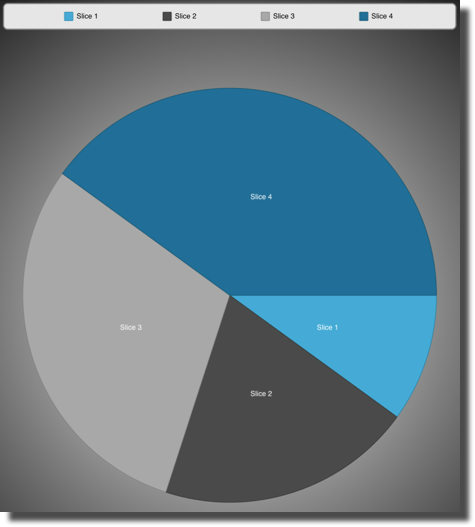

////

|metadata|
{
    "name": "-igpiechartview-adding-the-igpiechartview-uiview",
    "controlName": ["IGPieChartView"],
    "tags": ["Charting","Getting Started","How Do I"],
    "guid": "79747b57-3294-473f-b621-6565016ab1e0",  
    "buildFlags": [],
    "createdOn": "2012-12-03T15:20:56.5328117Z"
}
|metadata|
////

= Adding the IGPieChartView to a UIView

== Topic Overview

=== Purpose

To help you get up and running with the  _IGPieChartView™_   control this topic provides basic information about creating an instance of the control to display a pie chart.

=== Required background

The following table lists the prerequisite topic required to understanding this topic.

[options="header", cols="a,a"]
|====
|Topic|Purpose

| link:igchartview-adding-the-chart-framework-file.html[Adding the Chart Framework File]
|This topic explains how to add the chart framework file to a project.

|====

=== In this topic

This topic contains the following sections:

* <<_Ref323111244, Code Examples >>
* <<_Ref328621638, Displaying a chart with IGPieChartView – Code Example >>

** <<_Ref323199287,Description>>
** <<_Ref323199293,Code>>
** <<_Ref323214731,Code: Complete Listing>>

* <<_Ref323199323, Related Content >>

[[_Ref323111244]]
== Code Examples

=== Code examples summary

The code example included in this topic.

[options="header", cols="a,a"]
|====
|Example|Description

|<<_Ref323199279,Displaying a pie chart with _IGPieChartView_ >>
|The starting point for beginning to use the _IGPieChartView_ is creating an instance of it and adding it to your view. The code in this example overrides the `viewDidLoad` method on a _UIViewController_ to create the _IGPieChartView_ instance.

|====

[[_Ref323199279]]
[[_Ref328621638]]
== Displaying a pie chart with  _IGPieChartView_   – Code Example

[[_Ref323199287]]

=== Description

The provided data source powers the  _IGPieChartView_   data visualization. In this code example, you will:

* Generate a data source
* Assign your data source to the  _IGPieChartView_  
* View the displayed pie chart

=== Preview

The following screen shot illustrates how  _IGPieChartView_   previews the result.

[[_Ref323199293]]

=== Code

The data source for this example uses an  _NSMutableArray,_   which creates a specific number of pie slices with a custom  _NSObject_   containing a double value and label string.

*In C#:*

[source,csharp]
----
List<NSObject> CreateSimpleData(int recordCount)
{
      List<NSObject> retValue = new List<NSObject>();
      for (int i = 0; i < recordCount; i++) {
            SimpleData data = new SimpleData(i, string.Format("Slice {0}", i));
            retValue.Add(data);
      }
      return retValue;
}
----

*In Objective-C:*

[source,csharp]
----
-(NSMutableArray*) createSimpleData:(int)recordCount
{
    NSMutableArray * retValue = [[NSMutableArray alloc]init ];
    for (int i = 0 ; i < recordCount ; i++)
    {
        SimpleData *data = [[SimpleData alloc]initWithValue:i andLabel: [NSString stringWithFormat:@"Slice %d", i]];
        [retValue addObject:data];
    }
    return retValue;
}
----

Using the  _IGPieChartViewDataSourceHelper_   simplifies the process of creating an  _IGPieChartView_  . With the generated data assigned to the data source helper, the  _IGPieChartView_   instantiates and assigns the  _IGPieChartViewDataSourceHelper’s_   data to the instance.

*In C#:*

[source,csharp]
----
_data = this.CreateSimpleData(5);
_source = new IGPieChartViewDataSourceHelper(_data, "value", "label");
_infraPieChart = new IGPieChartView();
_infraPieChart.Frame = new RectangleF(0, 50, this.View.Frame.Size.Width, this.View.Frame.Size.Height - 50);
_infraPieChart.AutoresizingMask = UIViewAutoresizing.FlexibleWidth|UIViewAutoresizing.FlexibleHeight;
_infraPieChart.DataSource = _source;
----

*In Objective-C:*

[source,csharp]
----
_data = [[NSMutableArray alloc] init];
    _data = (NSMutableArray*)[self createSimpleData:5];
    _source = [[IGPieChartViewDataSourceHelper alloc] initWithData:_data valuePath:@"value" labelPath:@"label"];
    _infraPieChart = [[IGPieChartView alloc] init];
    _infraPieChart.frame = CGRectMake(0, 50, self.view.frame.size.width, self.view.frame.size.height - 50);
    _infraPieChart.autoresizingMask = UIViewAutoresizingFlexibleWidth|UIViewAutoresizingFlexibleHeight;
    _infraPieChart.dataSource = _source;
----

Now configured, the  _IGPieChartView_   is ready to add to the  _UIViewController_   as a subview.

*In C#:*

[source,csharp]
----
this.View.AddSubview(_infraPieChart);
----

*In Objective-C:*

[source,csharp]
----
 [self.view addSubview:infraChart];
----

[[_Ref323214731]]

=== Code: Complete Listing

*In C#:*

[source,csharp]
----
namespace PieChartView
{
      public class SimpleData : NSObject
      {
            [Export("value")]
            public double value { get; set;}
            [Export("label")]
            public string label { get; set; }
            public SimpleData (double data_value, string data_label)
            {
                  value = data_value;
                  label = data_label;
            }
      }
      public partial class igPieChartViewController: UIViewController
      {
            IGPieChartView _infraPieChart;
            IGPieChartViewDataSourceHelper _source;
            IGLegend _legend;
            List<NSObject> _data;
            public igPieChartViewController ()
            {
            }
            public override void ViewDidLoad ()
            {
                  base.ViewDidLoad ();
                  _data = this.CreateSimpleData(5);
                  _source = new IGPieChartViewDataSourceHelper(_data, "value", "label");
                  _infraPieChart = new IGPieChartView();
                  _infraPieChart.Frame = new RectangleF(0, 50, this.View.Frame.Size.Width, this.View.Frame.Size.Height - 50);
                  _infraPieChart.AutoresizingMask = UIViewAutoresizing.FlexibleWidth|UIViewAutoresizing.FlexibleHeight;
                  _infraPieChart.DataSource = _source;
                  _infraPieChart.Theme = IGPieChartDefaultThemes.IGThemeDark();
                  _infraPieChart.BackgroundColor = UIColor.Clear;
                  this.View.AddSubview(_infraPieChart);
                  IGLegend legend = new IGLegend(IGChartLegendType.IGChartLegendTypeItem);
                  legend.Layer.BorderColor = UIColor.Gray.CGColor;
                  legend.Layer.BorderWidth = 2;
                  legend.Frame = new RectangleF(5, 5, this.View.Frame.Size.Width - 10, 45);
                  legend.AutoresizingMask = UIViewAutoresizing.FlexibleWidth|UIViewAutoresizing.FlexibleBottomMargin;
                  legend.HorizontalAlignment = IGHorizontalAlign.IGHorizontalAlignStretch;
                  legend.VerticalAlignment = IGVerticalAlign.IGVerticalAlignCenter;
                  legend.Orientation = IGOrientation.IGOrientationHorizontal;
                  legend.Layer.CornerRadius = 8;
                  legend.Layer.MasksToBounds = true;
                  _infraPieChart.Legend = legend;
                  this.View.AddSubview(legend);
            }
            List<NSObject> CreateSimpleData(int recordCount)
            {
                  List<NSObject> retValue = new List<NSObject>();
                  for (int i = 0; i < recordCount; i++) {
                        SimpleData data = new SimpleData(i, string.Format("Slice {0}", i));
                        retValue.Add(data);
                  }
                  return retValue;
            }            
      }
}
----

*In Objective-C (igPieChartViewController.m):*

[source,csharp]
----
#import "igPieChartViewController.h"
@implementation igPieChartViewController
-(void)viewDidLoad
{
    [super viewDidLoad];
    _data = [[NSMutableArray alloc] init];
    _data = (NSMutableArray*)[self createSimpleData:5];
    _source = [[IGPieChartViewDataSourceHelper alloc] initWithData:_data valuePath:@"value" labelPath:@"label"];
    _infraPieChart = [[IGPieChartView alloc] init];
    _infraPieChart.frame = CGRectMake(0, 50, self.view.frame.size.width, self.view.frame.size.height - 50);
    _infraPieChart.autoresizingMask = UIViewAutoresizingFlexibleWidth|UIViewAutoresizingFlexibleHeight;
    _infraPieChart.dataSource = _source;
    _infraPieChart.theme = [IGPieChartDefaultThemes IGThemeDark];
    _infraPieChart.backgroundColor = [UIColor clearColor];
    [self.view addSubview:_infraPieChart];
    IGLegend *legend = [[IGLegend alloc] initWithLegendType:IGChartLegendTypeItem];
    legend.layer.borderColor = [UIColor grayColor].CGColor;
    legend.layer.borderWidth = 2;
    legend.frame = CGRectMake(5, 5, self.view.frame.size.width - 10, 45);
    legend.autoresizingMask = UIViewAutoresizingFlexibleWidth|UIViewAutoresizingFlexibleBottomMargin;
    legend.horizontalAlignment = IGHorizontalAlignStretch;
    legend.verticalAlignment = IGVerticalAlignCenter;
    legend.orientation = IGOrientationHorizontal;
    legend.layer.cornerRadius = 8;
    legend.layer.masksToBounds = YES;
    _infraPieChart.legend = legend;
    [self.view addSubview:legend];
}
-(NSArray*) createSimpleData:(int)recordCount
{
    NSMutableArray * retValue = [[NSMutableArray alloc]init ];
    for (int i = 0 ; i < recordCount ; i++)
    {
        SimpleData *data = [[SimpleData alloc]initWithValue:i andLabel: [NSString stringWithFormat:@"Slice %d", i]];
        [retValue addObject:data];
    }
    return retValue;
}
@end
@implementation SimpleData
@synthesize value, label;
-(id)initWithValue:(double)_value andLabel:(NSString *)_label
{
    self = [super init];
    if (self)
    {
        self.value = _value;
        self.label = _label;
    }
    return self;
}
@end
----

*In Objective-C (igPieChartViewController.h):*

[source,csharp]
----
#import <Foundation/Foundation.h>
#import <QuartzCore/QuartzCore.h>
#import <IGChart/IGChart.h>
@interface igPieChartViewController : UIViewController <IGPieChartViewDelegate>
{
    IGPieChartView *_infraPieChart;
    IGPieChartViewDataSourceHelper *_source;
    NSMutableArray *_data;
}
@end
@interface SimpleData : NSObject
@property (nonatomic) double value;
@property (nonatomic, retain) NSString * label;
-(id)initWithValue:(double)value andLabel:(NSString *)label;
@end
----

[[_Ref323199323]]
== Related Content

=== Topics

The following topics provide additional information related to this topic.

[options="header", cols="a,a"]
|====
|Topic|Purpose

| link:igpiechartview.html[IGPieChartView]
|This section serves as an introduction to the _IGPieChartView’s_ key features and functions.

|====