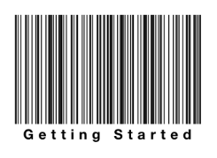

////

|metadata|
{
    "name": "igbarcodeview-adding-the-barcode-view-to-a-view",
    "tags": ["Getting Started","How Do I"],
    "controlName": ["IGBarcodeView"],
    "guid": "8eaca7e2-f1a5-48f7-b750-625537eedafe",  
    "buildFlags": [],
    "createdOn": "2014-03-18T14:42:13.109516Z"
}
|metadata|
////

= Adding the Barcode View to a View

== Topic Overview

=== Purpose

This topic explains, with a code example how to create a basic instance of the  _IGBarcodeView_™ control and display it on a view.

=== Required background

The following table lists the prerequisite topic required to understanding this topic.

[options="header", cols="a,a"]
|====
|Topic|Purpose

| link:iggridview-adding-the-ig-framework-file.html[Adding the IG Framework File]
|This topic explains how to add the IG framework file to a project.

|====

=== In this topic

This topic contains the following sections:

* <<_Ref328621638, Displaying the IGBarcodeView – Code Example >>

** <<_Ref323199287,Description>>
** <<_Ref357071611,Preview>>
** <<_Ref323199293,Code>>

* <<_Ref323199323, Related Content >>

[[_Ref328621638]]

== Displaying the  _IGBarcodeView_   – Code Example

[[_Ref323199287]]

=== Description

This code example illustrates the creation of a Code 128 barcode with its frame size set to 300x200.

[[_Ref357071611]]

=== Preview

[[_Ref323199293]]

=== Code

To start, the background color of the view controller’s view is set to white.

*In Objective-C:*

[source,csharp]
----
self.view.backgroundColor = [UIColor whiteColor];
----

*In C#:*

[source,csharp]
----
this.View.BackgroundColor = UIColor.White;
----

Next, create an instance of the  _IGBarcodeView_   with the `IGBarcodeTypeCode128` type and has a 300x200 size.

*In Objective-C:*

[source,csharp]
----
CGRect barcodeRect = CGRectMake(0, 0, 300, 200);
IGBarcodeView *barcode = [[IGBarcodeView alloc] initWithFrame:barcodeRect barcodeType:IGBarcodeTypeCode128];
----

*In C#:*

[source,csharp]
----
RectangleF barcodeRect = new RectangleF(0, 0, 300, 200);
IGBarcodeView barcode = IGBarcodeView.CreateBarcodeFrame(IGBarcodeType.IGBarcodeTypeCode128, barcodeRect);
----

Set the auto-resizing mask for height, width and all sides of the barcode.

*In Objective-C:*

[source,csharp]
----
barcode.autoresizingMask = UIViewAutoresizingFlexibleWidth|UIViewAutoresizingFlexibleHeight|
            UIViewAutoresizingFlexibleLeftMargin|UIViewAutoresizingFlexibleBottomMargin|
            UIViewAutoresizingFlexibleRightMargin|UIViewAutoresizingFlexibleTopMargin;
----

*In C#:*

[source,csharp]
----
barcode.AutoresizingMask = UIViewAutoresizing.FlexibleWidth|UIViewAutoresizing.FlexibleHeight|
                                      UIViewAutoresizing.FlexibleLeftMargin|UIViewAutoresizing.FlexibleBottomMargin|
                                      UIViewAutoresizing.FlexibleRightMargin|UIViewAutoresizing.FlexibleTopMargin;
----

Set the barcode value to “Getting Started.”

*In Objective-C:*

[source,csharp]
----
[barcode setValue:@"Getting Started"];
----

*In C#:*

[source,csharp]
----
barcode.SetValue ("Getting Started");
----

Place the barcode in the center of the view controller’s view.

*In Objective-C:*

[source,csharp]
----
barcode.center = self.view.center;
----

*In C#:*

[source,csharp]
----
barcode.Center = this.View.Center;
----

Finally, add the barcode to the view controller’s view.

*In Objective-C:*

[source,csharp]
----
[self.view addSubview:barcode];
----

*In C#:*

[source,csharp]
----
this.View.Add (barcode);
----

[[_Ref323199323]]
== Related Content

=== Topics

The following topic provides additional information related to this topic.

[options="header", cols="a,a"]
|====
|Topic|Purpose

| link:igbarcodeview.html[IGBarcodeView]
|This topic provides a conceptual overview of the _IGBarcodeView_ control and its key features.

|====