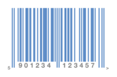

////

|metadata|
{
    "name": "igbarcodeview-configuring-the-barcode-color",
    "tags": ["Getting Started","How Do I","Styling"],
    "controlName": ["IGBarcodeView"],
    "guid": "9f41bd58-d212-4115-9b60-2f77ea564424",  
    "buildFlags": [],
    "createdOn": "2014-03-18T15:31:41.5783027Z"
}
|metadata|
////

= Configuring the Barcode Color

== Topic Overview

=== Purpose

This topic provides a conceptual overview of configuring the barcode color on the  _IGBarcodeView_™ control and demonstrates the procedure using a code example.

=== In this topic

This topic contains the following sections:

* <<_Ref324841248, Introduction >>
* <<_Ref248895787, Configuring the Barcode Color – Code Example >>

** <<_Ref327344209,Description>>
** <<_Ref252521837,Preview>>
** <<_Ref327523606,Prerequisites>>
** <<_Ref327344217,Code>>

* <<_Ref215823716, Related Content >>

[[_Ref324841248]]
== Introduction

=== Barcode color summary

The  _IGBarcodeView_   control exposes properties for separately configuring the display color of both the barcode and its text. By default, the _IGBarcodeView_ displays the barcode and text in black; however, each of these elements can have different colors independent of one another through properties exposed on the _IGBarcodeView_. To change the barcode color, set the `barcodeColor` property using a _UIColor_ and to change the text color set the `textColor` property using a  _UIColor_ .

[[_Ref248895787]]
[[_Ref324841253]]
== Configuring the Barcode Color – Code Example

[[_Ref327344209]]

=== Description

The code example below creates an instance of the  _IGBarcodeView_   and changes the barcode and text color.

[[_Ref252521837]]

=== Preview

Following is a preview of the results.

[[_Ref327523606]]

=== Prerequisites

This code example requires the inclusion of the  __IG__  framework; details about how to add this framework are available in the link:iggridview-adding-the-ig-framework-file.html[Adding the IG Framework File] topic.

[[_Ref327344217]]

=== Code

*In Objective-C:*

[source,csharp]
----
CGRect barcodeRect = CGRectMake(0, 0, 275, 175);
IGBarcodeView *barcodeEAN13 = [[IGBarcodeView alloc] initWithFrame:barcodeRect barcodeType:IGBarcodeTypeEAN13];
[barcodeEAN13 setValue:@"5901234123457"];
barcodeEAN13.autoresizingMask = UIViewAutoresizingFlexibleWidth|UIViewAutoresizingFlexibleHeight|
        UIViewAutoresizingFlexibleLeftMargin|UIViewAutoresizingFlexibleBottomMargin|
        UIViewAutoresizingFlexibleRightMargin|UIViewAutoresizingFlexibleTopMargin;
barcodeEAN13.barcodeColor = [UIColor colorWithRed:84/255.0f green:134/255.0f blue:196/255.0f alpha:1.0f];
barcodeEAN13.textColor = [UIColor grayColor];
barcodeEAN13.center = self.view.center;
[self.view addSubview:barcodeEAN13];
----

*In C#:*

[source,csharp]
----
RectangleF barcodeRect = new RectangleF(0, 0, 275, 175);
IGBarcodeView barcodeEAN13 = IGBarcodeView.CreateBarcodeFrame(IGBarcodeType.IGBarcodeTypeEAN13, barcodeRect);
barcodeEAN13.AutoresizingMask = UIViewAutoresizing.FlexibleWidth|UIViewAutoresizing.FlexibleHeight|
                    UIViewAutoresizing.FlexibleLeftMargin|UIViewAutoresizing.FlexibleBottomMargin|
                    UIViewAutoresizing.FlexibleRightMargin|UIViewAutoresizing.FlexibleTopMargin;
barcodeEAN13.SetValue ("5901234123457");
barcodeEAN13.BarcodeColor = new UIColor (84 / 255.0f, 134 / 255.0f, 196 / 255.0f, 1.0f);
barcodeEAN13.TextColor = UIColor.Gray;
barcodeEAN13.Center = this.View.Center;
this.View.Add (barcodeEAN13);
----

[[_Ref215823716]]
== Related Content

=== Topics

The following topic provides additional information related to this topic.

[options="header", cols="a,a"]
|====
|Topic|Purpose

| link:igbarcodeview.html[IGBarcodeView]
|The topics in this group cover enabling, configuring, and using the _IGBarcodeView_ control’s supported features.

|====