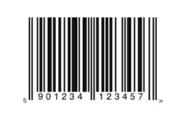

////

|metadata|
{
    "name": "igbarcodeview-configuring-the-barcode-text",
    "tags": ["Getting Started","How Do I","Styling"],
    "controlName": ["IGBarcodeView"],
    "guid": "5327032d-4a0b-4003-957b-62bd8ee6d995",  
    "buildFlags": [],
    "createdOn": "2014-03-18T15:33:53.9148719Z"
}
|metadata|
////

= Configuring the Barcode Text

== Topic Overview

=== Purpose

This topic provides a conceptual overview of configuring the barcode text on the  _IGBarcodeView_™ control and demonstrates the procedure using a code example.

=== In this topic

This topic contains the following sections:

* <<_Ref324841248, Introduction >>
* <<_Ref248895787, Configuring the Barcode Text – Code Example >>

** <<_Ref327344209,Description>>
** <<_Ref252521837,Preview>>
** <<_Ref327523606,Prerequisites>>
** <<_Ref327344217,Code>>

* <<_Ref215823716, Related Content >>

[[_Ref324841248]]
== Introduction

=== Barcode text summary

The  _IGBarcodeView,_   by default, displays the barcode text under the barcode and by setting the `showText` property to `YES` or `NO` can toggle its visibility. All barcode types support text, except the following.

* `IGBarcodeTypePlanet`
* `IGBarcodeTypePostNet`

.Note:
[NOTE]
====
More information about the supported barcode types can be found in the link:igbarcodeview-barcode-types.html[Barcode Types] topic.
====

By default, the text shown under the barcodes uses the  _HelveticaNeue_   _-Bold_   font. The size of the font is calculated at runtime based off the bounds of the  _IGBarcodeView_  . To change the font used, set the `fontName` property to the  _NSString_   name of the font.

[[_Ref248895787]]
[[_Ref324841253]]
== Configuring the Barcode Text – Code Example

[[_Ref327344209]]

=== Description

The code example below creates an instance of the IGBarcodeView and changes the default font.

[[_Ref252521837]]

=== Preview

[[_Ref327523606]]

=== Prerequisites

This code example requires the inclusion of the  __IG__  framework; details about how to add this framework are available in the link:iggridview-adding-the-ig-framework-file.html[Adding the IG Framework File] topic.

[[_Ref327344217]]

=== Code

*In Objective-C:*

[source,csharp]
----
CGRect barcodeRect = CGRectMake(0, 0, 275, 175);
IGBarcodeView *barcodeEAN13 = [[IGBarcodeView alloc] initWithFrame:barcodeRect barcodeType:IGBarcodeTypeEAN13];
[barcodeEAN13 setValue:@"5901234123457"];
barcodeEAN13.autoresizingMask = UIViewAutoresizingFlexibleWidth|UIViewAutoresizingFlexibleHeight|
        UIViewAutoresizingFlexibleLeftMargin|UIViewAutoresizingFlexibleBottomMargin|
        UIViewAutoresizingFlexibleRightMargin|UIViewAutoresizingFlexibleTopMargin;
barcodeEAN13.fontName = [UIFont fontWithName:@"MarkerFelt-Wide" size:0].fontName;
barcodeEAN13.center = self.view.center;
[self.view addSubview:barcodeEAN13];
----

*In C#:*

[source,csharp]
----
RectangleF barcodeRect = new RectangleF(0, 0, 275, 175);
IGBarcodeView barcodeEAN13 = IGBarcodeView.CreateBarcodeFrame(IGBarcodeType.IGBarcodeTypeEAN13, barcodeRect);
barcodeEAN13.AutoresizingMask = UIViewAutoresizing.FlexibleWidth|UIViewAutoresizing.FlexibleHeight|
                                UIViewAutoresizing.FlexibleLeftMargin|UIViewAutoresizing.FlexibleBottomMargin|
                                UIViewAutoresizing.FlexibleRightMargin|UIViewAutoresizing.FlexibleTopMargin;
barcodeEAN13.SetValue ("5901234123457");
barcodeEAN13.FontName = UIFont.FromName ("MarkerFelt-Wide", 0).Name;
barcodeEAN13.Center = this.View.Center;
this.View.Add (barcodeEAN13);
----

[[_Ref215823716]]
== Related Content

=== Topics

The following topic provides additional information related to this topic.

[options="header", cols="a,a"]
|====
|Topic|Purpose

| link:igbarcodeview.html[IGBarcodeView]
|The topics in this group cover enabling, configuring, and using the _IGBarcodeView_ control’s supported features.

|====