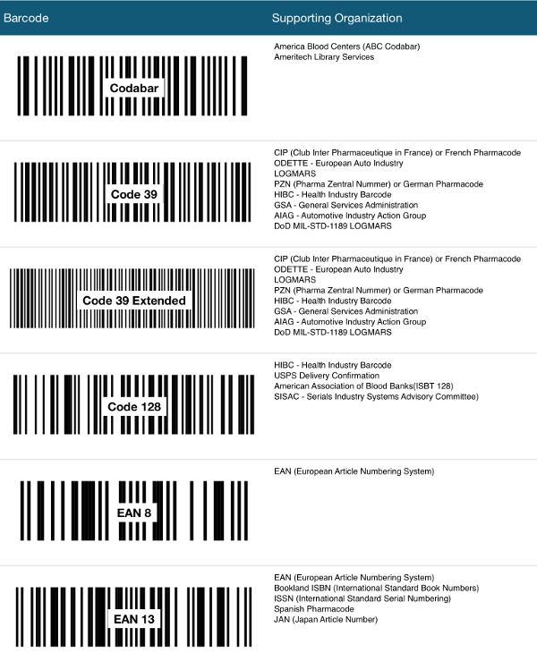

////

|metadata|
{
    "name": "igbarcodeview",
    "tags": ["Getting Started"],
    "controlName": ["IGBarcodeView"],
    "guid": "553ec9da-8978-4a87-ac01-20f4b960b1f9",  
    "buildFlags": [],
    "createdOn": "2014-03-18T14:40:37.8230659Z"
}
|metadata|
////

= IGBarcodeView

This section gives you an overview of the use of the  _IGBarcodeView_   control. It contains information ranging from what the control does to the step-by-step procedures on how to accomplish common tasks using the control. Click the links below to access important information about the  _IGBarcodeView_   control.

== About IGBarcodeView

The  _IGBarcodeView_   is a flexible control capable of displaying one of the 12 supported barcode types.

* Codabar
* Code 39
* Code 39 Extended
* Code 128
* EAN-8
* EAN-13
* Interleaved 2 Of 5
* Planet
* PostNet
* Standard 2 Of 5
* UPC-A
* UPC-E

Barcodes with the exception of Planet and PostNet can display their set value under the barcode using any font set through the `fontName` property. The barcode bar color and text color are controllable through the `barcodeColor` and `textColor` properties.

== link:iggridview-adding-the-ig-framework-file.html[Adding the IG Framework File]

This topic demonstrates how to add the IG framework file to a project.

== link:igbarcodeview-adding-the-barcode-view-to-a-view.html[Adding the Barcode View to a View]

This topic provides basic information about creating an instance of the  _IGBarcodeView_   to help you get up and running with this control.

== link:igbarcodeview-barcode-types.html[Barcode Types]

This topic provides a conceptual overview of the barcode types available with the  _IGBarcodeView_   control.

== link:igbarcodeview-configuring-igbarcodeview.html[Configuring IGBarcodeView]

The topics in this group cover enabling configuring, and using the  _IGBarcodeView_   control’s supported features.