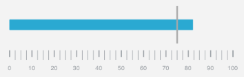

////

|metadata|
{
    "name": "igbulletgraphview-adding-bullet-graph-view",
    "tags": ["Getting Started","How Do I"],
    "controlName": ["IGBulletGraphView"],
    "guid": "1f8f14f0-2614-427f-a290-0333adac2d32",  
    "buildFlags": [],
    "createdOn": "2013-09-11T12:45:27.427561Z"
}
|metadata|
////

= Adding the Bullet Graph to a View

== Topic Overview

=== Purpose

This topic explains, with a code example how to create a basic instance of the  _IGBulletGraphView_™ control and display it on a view.

=== Required background

The following table lists the prerequisite topic required to understanding this topic.

[options="header", cols="a,a"]
|====
|Topic|Purpose

| link:igchartview-adding-the-chart-framework-file.html[Adding the Chart Framework File]
|This topic explains how to add the Chart framework file to a project.

|====

=== In this topic

This topic contains the following sections:

* <<_Ref238790440, Displaying an IGBulletGraphView – Code Example >>

** <<_Ref323199287,Description>>
** <<_Ref357071611,Preview>>
** <<_Ref323199293,Code>>

* <<_Ref323199323, Related Content >>

[[_Ref323199279]]
[[_Ref328621638]]
[[_Ref238790440]]
[[_Ref323111244]]
== Displaying an  _IG_  _BulletGraphView_  – Code Example

[[_Ref323199287]]

=== Description

This code example illustrates how to create a linear gauge in the default horizontal orientation with the properties of the `targetValue` set to 75 and the `value` set to 82 and adds it to a view.

[[_Ref357071611]]

=== Preview

[[_Ref323199293]]

=== Code

To start, initialize a frame to serve as the bullet graph’s dimensions and position.

*In Objective-C:*

[source,csharp]
----
CGRect bulletGraphRect = self.view.bounds;
bulletGraphRect.size.height = 250;
bulletGraphRect.origin.y = (self.view.bounds.size.height / 2) - 125;
----

*In C#:*

[source,csharp]
----
RectangleF bulletGraphRect = this.View.Bounds;
bulletGraphRect.Height = 250;
bulletGraphRect.Y = (this.View.Bounds.Height / 2) - 125;
----

Next, create an instance of the bullet graph that uses the same dimensions as the frame.

*In Objective-C:*

[source,csharp]
----
IGBulletGraphView *bulletGraph = [[IGBulletGraphView alloc] initWithFrame:bulletGraphRect];
----

*In C#:*

[source,csharp]
----
IGBulletGraphView bulletGraph = new IGBulletGraphView ();
bulletGraph.Frame = bulletGraphRect;
----

Next, set the auto-resizing mask to allow the bullet graph to float in the center of the current device orientation without requiring a size adjustment.

*In Objective-C:*

[source,csharp]
----
bulletGraph.autoresizingMask = UIViewAutoresizingFlexibleHeight|UIViewAutoresizingFlexibleWidth|UIViewAutoresizingFlexibleTopMargin|UIViewAutoresizingFlexibleBottomMargin;
----

*In C#:*

[source,csharp]
----
bulletGraph.AutoresizingMask = UIViewAutoresizing.FlexibleHeight | UIViewAutoresizing.FlexibleWidth | UIViewAutoresizing.FlexibleTopMargin | UIViewAutoresizing.FlexibleBottomMargin;
----

Set the `targetValue` property of the bullet graph to 75.

*In Objective-C:*

[source,csharp]
----
bulletGraph.targetValue = 75;
----

*In C#:*

[source,csharp]
----
bulletGraph.TargetValue = 75;
----

Set the `value` property of the bullet graph to 82.

*In Objective-C:*

[source,csharp]
----
bulletGraph.value = 82;
----

*In C#:*

[source,csharp]
----
bulletGraph.Value = 82;
----

Finally, add the bullet graph to the view.

*In Objective-C:*

[source,csharp]
----
 [self.view addSubview:bulletGraph];
----

*In C#:*

[source,csharp]
----
this.View.Add(bulletGraph);
----

[[_Ref323199323]]
== Related Content

=== Topics

The following topic provides additional information related to this topic.

[options="header", cols="a,a"]
|====
|Topic|Purpose

| link:igbulletgraphview.html[IGBulletGraphView]
|This topic provides a conceptual overview of the _IGBulletGraphView_ control and its key features.

|====