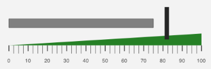

////

|metadata|
{
    "name": "igbulletgraphview-configuring-ranges",
    "tags": ["Getting Started","How Do I"],
    "controlName": ["IGBulletGraphView"],
    "guid": "80a5c2c4-7fa2-4e5b-a93a-702d6bc48df8",  
    "buildFlags": [],
    "createdOn": "2013-09-11T12:47:03.9302103Z"
}
|metadata|
////

= Configuring Ranges

== Topic Overview

=== Purpose

This topic provides a conceptual overview of ranges with the  _IGBulletGraphView_™ control and demonstrates how to configure them using a code example.

=== In this topic

This topic contains the following sections:

* <<_Ref324841248, Introduction >>
* <<_Ref327936206, Configuring Ranges – Code Example >>

** <<_Ref327344209,Description>>
** <<_Ref327523606,Prerequisites>>
** <<_Ref223063339,Preview>>
** <<_Ref327344217,Code>>

* <<_Ref215823716, Related Content >>

[[_Ref324841248]]
== Introduction

[[_Ref215796828]]

=== Ranges summary

A range highlights a set of continuous values bound by a specified minimum and maximum Value on a scale. To add a range to the  _IGBulletGraphView_  , create an  _IGLinearGaugeRange_   object and assign values to the following properties:

* `brush`
* `startValue`
* `endValue`

With the brush, start, and end values defined, the linear gauge range needs a width of the area to fill. The  _IGLinearGaugeRange_   has four properties.

* `innerStartExtent` - The start position of the inner part of the range measured from the center of the gauge. The value of this property should be between 0 and 1.
* `innerEndExtent` - The end position of the inner part of the range measured from the center of the gauge. The value of this property should be between 0 and 1.
* `outerStartExtent` - The start position of the outer part of the range measured from the center of the gauge. The value of this property should be between 0 and 1.
* `outerEndExtend` - The end position of the outer part of the range measured from the center of the gauge. The value of this property should be between 0 and 1.

Use the  _IGBulletGraphView_   control’s `addRange``:` method to add the  _IGLinearGaugeRange_  .

[[_Ref327936206]]
[[_Ref324841253]]
== Configuring Ranges – Code Example

[[_Ref327344209]]

=== Description

The code below creates an instance of the  _IGBulletGraphView_   with a value of 75, a target value of 82, and adds a range to the  _IGBulletGraphView_   represented by the color green.

[[_Ref327523606]]

=== Prerequisites

This code example requires the inclusion of the  _Chart_   framework; details about how to add this framework are available in the link:igchartview-adding-the-chart-framework-file.html[Adding the Chart Framework File] topic.

[[_Ref223063339]]

=== Preview

The following image previews the  _IGBulletGraphView_   as rendered using the following code snippet.

[[_Ref327344217]]

=== Code

*In Objective-C:*

[source,csharp]
----
CGRect bulletGraphRect = self.view.bounds;
bulletGraphRect.size.height = 250;
bulletGraphRect.origin.y = (self.view.bounds.size.height / 2) - 125;
IGBulletGraphView *bulletGraph = [[IGBulletGraphView alloc] initWithFrame:bulletGraphRect];
bulletGraph.autoresizingMask = UIViewAutoresizingFlexibleHeight|UIViewAutoresizingFlexibleWidth|UIViewAutoresizingFlexibleTopMargin|UIViewAutoresizingFlexibleBottomMargin;
bulletGraph.minorTickBrush = bulletGraph.tickBrush = bulletGraph.fontBrush = [[IGBrush alloc] initWithR:0.33 andG:0.33 andB:0.33 andA:1];
bulletGraph.targetValueBrush = [[IGBrush alloc] initWithR:0.15 andG:0.15 andB:0.15 andA:1];
bulletGraph.targetValueBreadth = 10;
bulletGraph.targetValue = 82;
bulletGraph.valueBrush = [[IGBrush alloc] initWithColor:[UIColor grayColor]];
bulletGraph.valueOutline = [[IGBrush alloc] initWithColor:[UIColor darkGrayColor]];
bulletGraph.value = 75;
[self.view addSubview:bulletGraph];
IGLinearGaugeRange *range1 = [[IGLinearGaugeRange alloc] init];
range1.brush = [[IGBrush alloc] initWithR:0.15 andG:0.5 andB:0.15 andA:1.0];
range1.startValue = 0;
range1.endValue = 100;
range1.outerStartExtent = 0.2;
range1.outerEndExtent = 0.4;
[bulletGraph addRange:range1];
----

*In C#:*

[source,csharp]
----
RectangleF bulletGraphRect = this.View.Bounds;
bulletGraphRect.Height = 250;
bulletGraphRect.Y = (this.View.Bounds.Height / 2) - 125;
IGBulletGraphView bulletGraph = new IGBulletGraphView ();
bulletGraph.Frame = bulletGraphRect;
bulletGraph.AutoresizingMask = UIViewAutoresizing.FlexibleHeight | UIViewAutoresizing.FlexibleWidth | UIViewAutoresizing.FlexibleTopMargin | UIViewAutoresizing.FlexibleBottomMargin;
bulletGraph.MinorTickBrush = bulletGraph.TickBrush = bulletGraph.FontBrush = new IGBrush (0.33f, 0.33f, 0.33f, 1.0f);
bulletGraph.TargetValueBrush = new IGBrush (0.15f, 0.15f, 0.15f, 1.0f);
bulletGraph.TargetValueBreadth = 10;
bulletGraph.TargetValue = 82;
bulletGraph.ValueBrush = new IGBrush (UIColor.Gray);
bulletGraph.ValueOutline = new IGBrush (UIColor.DarkGray);
bulletGraph.Value = 75;
this.View.Add (bulletGraph);
IGLinearGaugeRange range1 = new IGLinearGaugeRange();
range1.Brush = new IGBrush(0.15f, 0.5f, 0.15f, 1.0f);
range1.StartValue = 0;
range1.EndValue = 100;
range1.OuterStartExtent = 0.2f;
range1.OuterEndExtent = 0.4f;
bulletGraph.AddRange(range1);
----

[[_Ref215823716]]
== Related Content

=== Topics

The following topic provides additional information related to this topic.

[options="header", cols="a,a"]
|====
|Topic|Purpose

| link:igbulletgraphview.html[IGBulletGraphView]
|The topics in this group cover enabling, configuring, and using the _IGBulletGraphView_ control’s supported features.

|====