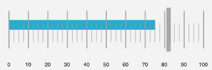
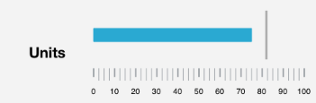

////

|metadata|
{
    "name": "igbulletgraphview-configuring-the-scale",
    "tags": ["Getting Started","How Do I"],
    "controlName": ["IGBulletGraphView"],
    "guid": "fb6d8615-ba89-4251-861b-cf049a493cc9",  
    "buildFlags": [],
    "createdOn": "2013-09-11T12:47:23.1331304Z"
}
|metadata|
////

= Configuring the Scale

== Topic Overview

=== Purpose

This topic explains, with examples, how to customize the scale of the  _IGBulletGraphView_™ control.

=== In this topic

This topic contains the following sections:

* <<_Ref324841248, Introduction >>

** <<_Ref215796828,Scale summary>>
** <<_Ref238701892,Scale configuration chart>>

* <<_Ref238704210, Customizing Tick Marks – Code Example >>

** <<_Ref327344209,Description>>
** <<_Ref327523606,Prerequisites>>
** <<_Ref327344217,Code>>

* <<_Ref238712516, Customizing the Scale – Code Example >>

** <<_Ref238712529,Description>>
** <<_Ref238712549,Prerequisites>>
** <<_Ref238712556,Preview>>
** <<_Ref238712563,Code>>

* <<_Ref215823716, Related Content >>

[[_Ref324841248]]
== Introduction

[[_Ref215796828]]

=== Scale summary

The scale of the  _IGBulletGraphView_   control is a logical entity formed by the tick marks and the (numbering) labels. The tick marks of the  _IGBulletGraphView_   control identify equal intervals of measure along the gauge. Two types of tick marks are supported – major and minor. Both can be positioned along the scale by adjusting the values of the respective extent-related properties, which are measured against the gauge area. The tick marks’ exact count, position, look, and frequency of occurrence can be customized via property settings.

[[_Ref238701892]]

=== Scale configuration chart

The following table contains the properties for configuring the  _IGBulletGraphView’s_   scale and provides a brief description of the property.

[options="header", cols="a,a"]
|====
|Property|Description

|`font`
|Font used by the scale labels.

|`fontBrush`
|Font brush (color) used by the scale labels.

|`interval`
|Number of major tick marks.

|`labelExtent`
|Position where to place the labels, as a value from 0 to 1, measured from the font/bottom of the scale.

|`labelInterval`
|Size of the space or gap inserted between labels.

|`labelsPostInitial`
|Starting from the minimum value, where to start rendering labels.

|`labelsPreTerminal`
|Starting from the maximum value, where to stop rendering labels.

|`maximumValue`
|The highest value represented on the linear scale.

|`minimumValue`
|The lowest value represented on the linear scale.

|`minorTickBrush`
|Brush (color) used for the minor tick marks.

|`minorTickCount`
|Number of tick marks between major tick marks.

|`minorTickEndExtent`
|Position where the minor tick marks stop rendering, measured from the front/bottom of the linear gauge.

|`minorTickStartExtent`
|Position where the minor tick marks start rendering, measured from the front/bottom of the linear gauge.

|`minorTickStrokeThickness`
|Stroke thickness of the minor tick marks.

|`scaleEndExtent`
|Position where the scale stops rendering, as a value from 0 to 1, measured from the front/bottom of the linear gauge.

|`scaleStartExtent`
|Position where the scale starts rendering, as a value from 0 to 1, measured from the front/bottom of the linear gauge.

|`tickBrush`
|Brush (color) of major tick marks.

|`tickEndExtent`
|Position where the major tick mark stop rendering, , measured from the side of the linear gauge containing the `maximumValue`.

|`ticksPostInitial`
|A value to start adding tick marks, added to the scale's `minimumValue`.

|`ticksPreTerminal`
|A value to stop adding tick marks, subtracted from the scale's `maximumValue`.

|`tickStartExtent`
|Position where major tick marks start, measured from the side of the linear gauge containing the `minimumValue`.

|`tickStrokeThickness`
|Stroke thickness of the major tick marks.

|====

[[_Ref238704210]]
[[_Ref324841253]]
== Customizing Tick Marks – Code Example

[[_Ref327344209]]

=== Description

The code example configures the major and minor tick marks centered within the  _IGBulletGraphView_   and displays the scale labels using the  _HelveticaNeue_   font in a black brush color.

[[_Ref327523606]]

=== Prerequisites

This code example requires the inclusion of the  _Chart_   framework, detail about how to add this framework can be found in the link:igchartview-adding-the-chart-framework-file.html[Adding the Chart Framework File] topic.

=== Preview

The image below illustrates the code example when ran on a device.

[[_Ref327344217]]

=== Code

*In Objective-C:*

[source,csharp]
----
CGRect bulletGraphRect = self.view.bounds;
bulletGraphRect.size.height = 250;
bulletGraphRect.origin.y = (self.view.bounds.size.height / 2) - 125;
IGBulletGraphView *bulletGraph = [[IGBulletGraphView alloc] initWithFrame:bulletGraphRect];
bulletGraph.autoresizingMask = UIViewAutoresizingFlexibleHeight|UIViewAutoresizingFlexibleWidth|UIViewAutoresizingFlexibleTopMargin|UIViewAutoresizingFlexibleBottomMargin;
bulletGraph.font = [UIFont fontWithName:@"HelveticaNeue" size:17.0];
bulletGraph.fontBrush = [[IGBrush alloc] initWithR:0 andG:0 andB:0 andA:1];
bulletGraph.minorTickStartExtent = 0.3;
bulletGraph.minorTickEndExtent = 0.6;
bulletGraph.tickStartExtent = 0.2;
bulletGraph.tickEndExtent = 0.8;
bulletGraph.targetValueBreadth = 10;
bulletGraph.targetValueInnerExtent = 0.15;
bulletGraph.targetValueOuterExtent = 0.85;
bulletGraph.targetValue = 82;
bulletGraph.value = 75;
[self.view addSubview:bulletGraph];
----

*In C#:*

[source,csharp]
----
RectangleF bulletGraphRect = this.View.Bounds;
bulletGraphRect.Height = 250;
bulletGraphRect.Y = (this.View.Bounds.Height / 2) - 125;
IGBulletGraphView bulletGraph = new IGBulletGraphView ();
bulletGraph.Frame = bulletGraphRect;
bulletGraph.AutoresizingMask = UIViewAutoresizing.FlexibleHeight | UIViewAutoresizing.FlexibleWidth | UIViewAutoresizing.FlexibleTopMargin | UIViewAutoresizing.FlexibleBottomMargin;
bulletGraph.Font = UIFont.FromName ("HelveticaNeue", 17.0f);
bulletGraph.FontBrush = new IGBrush (0, 0, 0, 1); 
bulletGraph.MinorTickStartExtent = 0.3f;
bulletGraph.MinorTickEndExtent = 0.6f;
bulletGraph.TickStartExtent = 0.2f;
bulletGraph.TickEndExtent = 0.8f;
bulletGraph.TargetValueBreadth = 10;
bulletGraph.TargetValueInnerExtent = 0.15f;
bulletGraph.TargetValueOuterExtent = 0.85f;
bulletGraph.TargetValue = 82;
bulletGraph.Value = 75;
this.View.Add (bulletGraph);
----

[[_Ref238712516]]
[[_Ref215823716]]
== Customizing the Scale – Code Example

[[_Ref238712529]]

=== Description

The code example uses the `scaleStartExtent` and `scaleEndExtent` properties of the  _IGBulletGraphView_   to adjust the scale’s position to make space for the label.

[[_Ref238712549]]

=== Prerequisites

This code example requires the inclusion of the  _Chart_   framework, detail about how to add this framework can be found in the link:igchartview-adding-the-chart-framework-file.html[Adding the Chart Framework File] topic.

[[_Ref238712556]]

=== Preview

The image below illustrates the code example when ran on a device.

[[_Ref238712563]]

=== Code

*In Objective-C:*

[source,csharp]
----
CGRect bulletGraphRect = self.view.bounds;
bulletGraphRect.size.height = 250;
bulletGraphRect.origin.y = (self.view.bounds.size.height / 2) - 125;
IGBulletGraphView *bulletGraph = [[IGBulletGraphView alloc] initWithFrame:bulletGraphRect];
bulletGraph.autoresizingMask = UIViewAutoresizingFlexibleHeight|UIViewAutoresizingFlexibleWidth|UIViewAutoresizingFlexibleTopMargin|UIViewAutoresizingFlexibleBottomMargin;
bulletGraph.fontBrush = [[IGBrush alloc] initWithR:0 andG:0 andB:0 andA:1];
bulletGraph.scaleStartExtent = 0.3;
bulletGraph.scaleEndExtent = 0.95;
bulletGraph.targetValue = 82;
bulletGraph.value = 75;
[self.view addSubview:bulletGraph];
UILabel *label = [[UILabel alloc] init];
label.frame = CGRectMake(0, 0, 100, bulletGraph.bounds.size.height);
label.autoresizingMask = UIViewAutoresizingFlexibleHeight|UIViewAutoresizingFlexibleWidth|UIViewAutoresizingFlexibleRightMargin;
label.backgroundColor = [UIColor clearColor];
label.font = [UIFont fontWithName:@"HelveticaNeue-Bold" size:22.0];
label.textAlignment = NSTextAlignmentCenter;
label.text = @"Units";
[bulletGraph addSubview:label];
----

*In C#:*

[source,csharp]
----
RectangleF bulletGraphRect = this.View.Bounds;
bulletGraphRect.Height = 250;
bulletGraphRect.Y = (this.View.Bounds.Height / 2) - 125;
IGBulletGraphView bulletGraph = new IGBulletGraphView ();
bulletGraph.Frame = bulletGraphRect;
bulletGraph.AutoresizingMask = UIViewAutoresizing.FlexibleHeight | UIViewAutoresizing.FlexibleWidth | UIViewAutoresizing.FlexibleTopMargin | UIViewAutoresizing.FlexibleBottomMargin;
bulletGraph.FontBrush = new IGBrush (0, 0, 0, 1);
bulletGraph.ScaleStartExtent = 0.3f;
bulletGraph.ScaleEndExtent = 0.95f;
bulletGraph.TargetValue = 82;
bulletGraph.Value = 75;
this.View.Add (bulletGraph);
UILabel label = new UILabel ();
label.Frame = new RectangleF(0, 0, 100, bulletGraph.Bounds.Height);
label.AutoresizingMask = UIViewAutoresizing.FlexibleHeight | UIViewAutoresizing.FlexibleWidth | UIViewAutoresizing.FlexibleRightMargin;
label.BackgroundColor = UIColor.Clear;
label.Font = UIFont.FromName ("HelveticaNeue-Bold", 22.0f);
label.TextAlignment = UITextAlignment.Center;
label.Text = @"Units";
bulletGraph.Add (label);
----

== Related Content

=== Topics

The following topic provides additional information related to this topic.

[options="header", cols="a,a"]
|====
|Topic|Purpose

| link:igbulletgraphview-configuring-igbulletgraphview.html[Configuring IGBulletGraphView]
|The topics in this group cover enabling, configuring, and using the _IGBulletGraphView_ control’s supported features.

|====