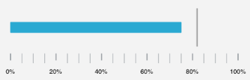

////

|metadata|
{
    "name": "igbulletgraphview-customizing-scale-labels",
    "tags": ["Getting Started","How Do I"],
    "controlName": ["IGBulletGraphView"],
    "guid": "d14fafe4-b274-4742-95f1-3765bbdf03cf",  
    "buildFlags": [],
    "createdOn": "2013-09-11T12:47:47.5005669Z"
}
|metadata|
////

= Customizing Scale Labels

== Topic Overview

=== Purpose

This topic provides a conceptual overview of customizing scale labels on the  _IGBulletGraphView_™ control and demonstrates how to configure them using a code example.

=== In this topic

This topic contains the following sections:

* <<_Ref324841248, Introduction >>
* <<_Ref238777569, Customizing Scale Labels – Code Example >>

** <<_Ref327344209,Description>>
** <<_Ref327523606,Prerequisites>>
** <<_Ref238777592,Preview>>
** <<_Ref327344217,Code>>

* <<_Ref215823716, Related Content >>

[[_Ref324841248]]
== Introduction

[[_Ref215796828]]

=== Custom labels summary

The scale labels allows you to apply identifying tags to various IGBulletGraphView control elements that are customizable via the  _IGBulletGraphViewDelegate_   using the `bulletGraphView:formatStringForValue:` delegate method. The method provides the  _IGBulletGraphView_   calling the method and the label value for formatting and returns an  _NSString_   of the new label text.

[[_Ref327936206]]
[[_Ref238777569]]
[[_Ref324841253]]
== Customizing Scale Labels – Code Example

[[_Ref327344209]]

=== Description

The code example uses the  _IGBulletGraphViewDelegate_   to implement the `bulletGraphView:formatStringForValue:` delegate method for formatting the label value to contain a percent symbol.

[[_Ref327523606]]

=== Prerequisites

This code example requires the inclusion of the  _Chart_   framework; details about how to add this framework are available in the link:igchartview-adding-the-chart-framework-file.html[Adding the Chart Framework File] topic.

[[_Ref238777592]]

=== Preview

[[_Ref327344217]]

=== Code

*In Objective-C:*

[source,csharp]
----
@interface igViewController () <IGBulletGraphViewDelegate>
@end
@implementation igViewController
- (void)viewDidLoad
{
    [super viewDidLoad];
    CGRect bulletGraphRect = self.view.bounds;
    bulletGraphRect.size.height = 250;
    bulletGraphRect.origin.y = (self.view.bounds.size.height / 2) - 125;
    IGBulletGraphView *bulletGraph = [[IGBulletGraphView alloc] initWithFrame:bulletGraphRect];
    bulletGraph.autoresizingMask = UIViewAutoresizingFlexibleHeight|UIViewAutoresizingFlexibleWidth|UIViewAutoresizingFlexibleTopMargin|UIViewAutoresizingFlexibleBottomMargin;
    bulletGraph.fontBrush = [[IGBrush alloc] initWithR:0 andG:0 andB:0 andA:1];
    bulletGraph.interval = 20;
    bulletGraph.targetValue = 82;
    bulletGraph.value = 75;
    bulletGraph.delegate = self;
    [self.view addSubview:bulletGraph];
}
- (NSString *)bulletGraphView:(IGBulletGraphView * )bulletGraphView formatStringForValue:(double)labelValue
{
    return [NSString stringWithFormat:@"%.0f%%", labelValue];
}
@end
----

*In C#:*

[source,csharp]
----
public partial class BulletGraphScaleLabels_CSViewController : UIViewController
{
      public BulletGraphScaleLabels_CSViewController ()
      {
      }
      public override void ViewDidLoad ()
      {
            base.ViewDidLoad ();
            RectangleF bulletGraphRect = this.View.Bounds;
            bulletGraphRect.Height = 250;
            bulletGraphRect.Y = (this.View.Bounds.Height / 2) - 125;
            IGBulletGraphView bulletGraph = new IGBulletGraphView ();
            bulletGraph.Frame = bulletGraphRect;
            bulletGraph.AutoresizingMask = UIViewAutoresizing.FlexibleHeight | UIViewAutoresizing.FlexibleWidth | UIViewAutoresizing.FlexibleTopMargin | UIViewAutoresizing.FlexibleBottomMargin;
            bulletGraph.FontBrush = new IGBrush (UIColor.Black);
            bulletGraph.Interval = 20;
            bulletGraph.TargetValue = 82;
            bulletGraph.Value = 75;
            bulletGraph.Delegate = new BulletGraphDelegate ();
            this.View.Add (bulletGraph);
      }
}
public class BulletGraphDelegate : IGBulletGraphViewDelegate
{
      public override string ResolveFormatString (IGBulletGraphView bulletGraphView, double labelValue)
      {
            return String.Format ("{0}%", labelValue);
      }
}
----

[[_Ref215823716]]
== Related Content

=== Topics

The following topic provides additional information related to this topic.

[options="header", cols="a,a"]
|====
|Topic|Purpose

| link:igbulletgraphview-configuring-igbulletgraphview.html[Configuring IGBulletGraphView]
|The topics in this group cover enabling, configuring, and using the _IGBulletGraphView_ control’s supported features.

|====