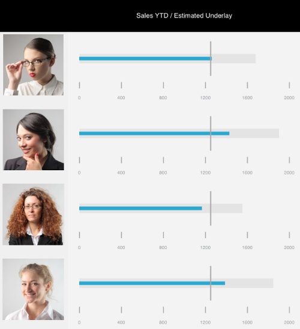

////

|metadata|
{
    "name": "igbulletgraphview",
    "tags": ["Getting Started"],
    "controlName": ["IGBulletGraphView"],
    "guid": "63669e88-1a9b-40ad-a2dd-e7be5dd12275",  
    "buildFlags": [],
    "createdOn": "2013-09-11T12:44:37.2515439Z"
}
|metadata|
////

= IGBulletGraphView

This section gives you an overview of the use of the  _IGBulletGraphView_   control. It contains information ranging from what the control does to the step-by-step procedures on how to accomplish common tasks using the control. Click the links below to access important information about the  _IGBulletGraphView_   control.

== About IGBulletGraphView

The  _IGBulletGraphView_   is a simple single column/bar graph used to display data in a simple manner. It is designed to set up quickly with just a minimum value, a maximum value, and a value to display.

== link:igchartview-adding-the-chart-framework-file.html[Adding the Chart Framework File]

This topic demonstrates how to add the chart framework file to a project.

== link:igbulletgraphview-adding-bullet-graph-view.html[Adding the Bullet Graph to a View]

This topic provides basic information about creating an instance of the  _IGBulletGraphView_   to help you get up and running with this control.

== link:igbulletgraphview-configuring-igbulletgraphview.html[Configuring IGBulletGraphView]

The topics in this group cover enabling configuring, and using the  _IGBulletGraphView_   control’s supported features.

== link:igbulletgraphview-themes.html[Themes]

This topic provides a conceptual overview of the supported themes available in the  _IGBulletGraphView_   control.