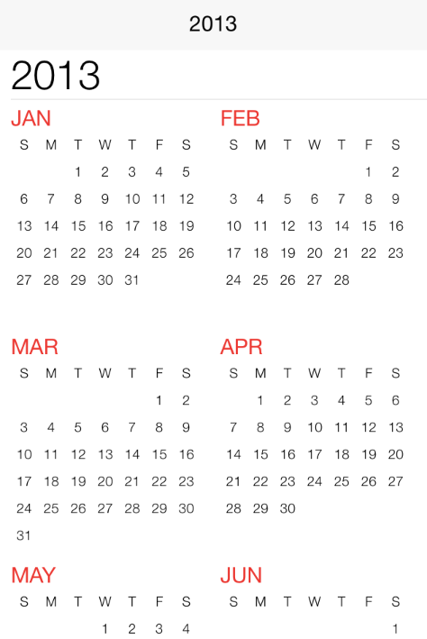

////

|metadata|
{
    "name": "igcalendarview-adding-calendar-view",
    "tags": ["Getting Started","How Do I"],
    "controlName": ["IGCalendarView"],
    "guid": "f481fcef-4074-4bb1-a87e-28c930c5eb4e",  
    "buildFlags": [],
    "createdOn": "2013-09-25T13:07:20.8757434Z"
}
|metadata|
////

= Adding the Calendar to a View

== Topic Overview

=== Purpose

This topic explains, with a code example how to create a basic instance of the  _IGCalendarView_™ control and display it on a view.

=== Required background

The following table lists the prerequisite topic required to understanding this topic.

[options="header", cols="a,a"]
|====
|Topic|Purpose

| link:iggridview-adding-the-ig-framework-file.html[Adding the IG Framework File]
|This topic explains how to add the IG framework file to a project.

|====

=== In this topic

This topic contains the following sections:

* <<_Ref238790440, Displaying an IGCalendarView – Code Example >>

** <<_Ref323199287,Description>>
** <<_Ref357071611,Preview>>
** <<_Ref323199293,Code>>

* <<_Ref323199323, Related Content >>

[[_Ref323199279]]
[[_Ref328621638]]
[[_Ref238790440]]
[[_Ref323111244]]
== Displaying an  _IGCalendarView_  – Code Example

[[_Ref323199287]]

=== Description

This code example illustrates how to create and subsequently add an instance of the  _IGCalendarView_   to a view.

[[_Ref357071611]]

=== Preview

[[_Ref323199293]]

=== Code

To start, initialize the  _IGCalendarView_   instance with its frame size and position.

*In Objective-C:*

[source,csharp]
----
IGCalendarView *calendar = [[IGCalendarView alloc] initWithFrame:self.view.bounds];
----

*In C#:*

[source,csharp]
----
IGCalendarView calendar = new IGCalendarView ();
calendar.Frame = this.View.Bounds;
----

Next, set the auto-resizing mask to allow the calendar to take the full height and width in both landscape and portrait orientations.

*In Objective-C:*

[source,csharp]
----
calendar.autoresizingMask = UIViewAutoresizingFlexibleWidth|UIViewAutoresizingFlexibleHeight;
----

*In C#:*

[source,csharp]
----
calendar.AutoresizingMask = UIViewAutoresizing.FlexibleHeight | UIViewAutoresizing.FlexibleWidth;
----

Finally, add the calendar to the view.

*In Objective-C:*

[source,csharp]
----
 [self.view addSubview:calendar];
----

*In C#:*

[source,csharp]
----
this.View.Add (calendar);
----

[[_Ref323199323]]
== Related Content

=== Topics

The following topic provides additional information related to this topic.

[options="header", cols="a,a"]
|====
|Topic|Purpose

| link:igcalendarview.html[IGCalendarView]
|This topic provides a conceptual overview of the _IGCalendarView_ control and its key features.

|====