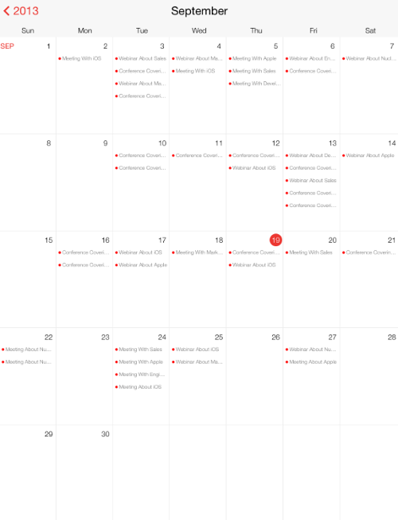

////

|metadata|
{
    "name": "igcalendarview-configuring-appointments",
    "tags": ["Appointments","Getting Started","How Do I"],
    "controlName": ["IGCalendarView"],
    "guid": "3a029e4d-5ea0-4169-8a3b-20825f58cd74",  
    "buildFlags": [],
    "createdOn": "2013-09-25T13:09:33.8257434Z"
}
|metadata|
////

= Configuring Appointments

== Topic Overview

=== Purpose

This topic provides an introductory overview of configuring appointments on the  _IGCalendarView_™ control and demonstrates how to configure it using a code example.

=== In this topic

This topic contains the following sections:

* <<_Ref324841248, Introduction >>
* <<_Ref241201875, Configuring Appointments Using Asynchronous Loading – Code Example >>

** <<_Ref327344209,Description>>
** <<_Ref241136394,Preview>>
** <<_Ref327523606,Prerequisites>>
** <<_Ref327344217,Code>>

* <<_Ref215823716, Related Content >>

[[_Ref324841248]]
== Introduction

[[_Ref215796828]]

=== Appointments summary

The  _IGCalendarView_   can display calendar appointments; however, you must provide it with a class that implements the  _IGCalendarAppointmentDataSource_   protocol. The  _IGCalendarAppointmentDataSource_   protocol requires the `colorForAppointmentsInIGCalendarView``:` method to provide the color to use with the appointments. Selected appointments can use a custom text color by returning a  _UIColor_   from the `colorForSelectedAppointmentTextInIGCalendarView:` method.

To provide appointments for a range of dates, the  _IGCalendarAppointmentData_   provides two methods for returning appointments.

* `calendarView:appointmentsForStart:end:ofType``:`
* `calendarView:asyncAppointmentRequest:ofType``:`

The `calendarView``:appointmentsForStart:end:ofType``:` method synchronously loads appointments by providing the data range and expects an array of  _IGCalendarAppointment_   objects in return. The `calendarView:asyncAppointmentRequest:ofType``:` method asynchronously loads appointments by using an  _IGCalendarRequestObject_   _,_   used to call the `provideAppointments``:` method for returning appointments.

[[_Ref241123382]]
[[_Ref241201875]]
[[_Ref324841253]]
== Configuring Appointments Using Asynchronous Loading – Code Example

[[_Ref327344209]]

=== Description

The code below creates an instance of the  _IGCalendarView_   and generates random appointments that are loaded asynchronously.

[[_Ref241136394]]

=== Preview

The following image is a preview of the code example.

[[_Ref327523606]]

=== Prerequisites

This code example requires the inclusion of the  _IG_   framework, detail about how to add this framework can be found in the link:iggridview-adding-the-ig-framework-file.html[Adding the IG Framework File] topic.

[[_Ref327344217]]

=== Code

*In Objective-C:*

[source,csharp]
----
@interface igViewController () <IGCalendarAppointmentDataSource>
{
    NSMutableArray *_appts;
    IGCalendarView *_calendar;
    NSMutableArray *_dataSources;
}
@end
@implementation igViewController
- (void)viewDidLoad
{
    [super viewDidLoad];
    _appts = [self generateAppointments:500];
    _calendar = [[IGCalendarView alloc] initWithFrame:self.view.bounds];
    _calendar.autoresizingMask = UIViewAutoresizingFlexibleWidth|UIViewAutoresizingFlexibleHeight;
    _calendar.minYear = 2013;
    _calendar.maxYear = 2013;
    [self.view addSubview:_calendar];
    _dataSources = [[NSMutableArray alloc]init];
    [_dataSources addObject:self];
    _calendar.appointmentDataSources = _dataSources;
}
-(void)calendarView:(IGCalendarView *)calView asyncAppointmentRequest:(IGCalendarAppointmentRequest * )request ofType:(IGCalendarAppointmentRequestType)requestType
{
    [[[NSOperationQueue alloc]init] addOperation:[NSBlockOperation blockOperationWithBlock:^(void)
    {
        NSTimeInterval min = [request.start timeIntervalSince1970];
        NSTimeInterval max = [request.end timeIntervalSince1970];
        NSMutableArray* returnAppts = [[NSMutableArray alloc]init];
        for(NSDictionary* appt in _appts)
        {
            NSDate* startTime = appt[@"start"];
            NSTimeInterval current = [startTime timeIntervalSince1970];
            if(current >= min && current <= max)="" temp_line_break="" {="" igcalendarappointment*="" calappt="[[IGCalendarAppointment" alloc]init];="" calappt.starttime="startTime;" calappt.endtime="appt[<SPAN" class="string">@"end"];
                calAppt.location = appt[@"location"];
                calAppt.title = appt[@"title"];
                [returnAppts addObject:calAppt];
            }
        }
        [[NSOperationQueue mainQueue] addOperation: [NSBlockOperation blockOperationWithBlock:^(void)
        {
            NSArray* appts = [NSArray arrayWithArray:returnAppts];
            [request provideAppointments:appts];
        }]];
    }]];
}
- (UIColor *)colorForAppointmentsInIGCalendarView:(IGCalendarView * )calView
{
    return [UIColor redColor];
}
-(NSMutableArray *)generateAppointments:(int)count
{
    NSString *dateString, *month, *day, *year, *time, *location, * title;
    NSArray *titles = @[@"Webinar About", @"Conference Covering", @"Meeting About", @"Meeting With"];
    NSArray *subjects = @[@"Apple", @"Development", @"Engineering", @"iOS", @"Marketing", @"NucliOS", @"Sales"];
    NSArray *locations = @[@"Head Quarters", @"London, UK", @"Montevideo, UY", @"Tokoyo, JP"];
    NSMutableArray *appointments = [[NSMutableArray alloc] init];
    for (int j = 0; j < count; j++)
    {
        NSMutableDictionary *appointment = [[NSMutableDictionary alloc] init];
        month = [NSString stringWithFormat:@"%d", arc4random_uniform(12) + 1];
        day = [NSString stringWithFormat:@"%d", arc4random_uniform(27) + 1];
        year = @"2013";
        time = [NSString stringWithFormat:@"%c%c:%c%c PM",
                        arc4random_uniform(1) + 48,
                        arc4random_uniform(9) + 48,
                        arc4random_uniform(5) + 48,
                        arc4random_uniform(9) + 48];
        location = [NSString stringWithFormat:@"%@",
                        [locations objectAtIndex:arc4random_uniform(locations.count)]];
        title = [NSString stringWithFormat:@"%@ %@",
                        [titles objectAtIndex:arc4random_uniform(titles.count)],
                        [subjects objectAtIndex:arc4random_uniform(subjects.count)]];
        NSDateFormatter *df = [[NSDateFormatter alloc] init];
        [df setDateFormat:@"MM-dd-yyyy hh:mm a"];
        dateString = [NSString stringWithFormat:@"%@-%@-%@ %@", month, day, year, time];
        NSDate *startDate = [df dateFromString: dateString];
        NSDate *endDate = [startDate dateByAddingTimeInterval:(60 * (arc4random_uniform(180) + 60))];
        [appointment setObject:startDate forKey:@"start"];
        [appointment setObject:endDate forKey:@"end"];
        [appointment setObject:title forKey:@"title"];
        [appointment setObject:location forKey:@"location"];
        [appointments addObject:appointment];
    }
    return appointments;
}
@end
----

*In C#:*

[source,csharp]
----
public class CalendarDataSource : IGCalendarAppointmentDataSource
{
      NSObject[] _appts;
      public CalendarDataSource(NSObject[] appointments)
      {
            _appts = appointments;
      }
      public override void GetAppointmentsAsync (IGCalendarView calView, IGCalendarAppointmentRequest request, IGCalendarAppointmentRequestType requestType)
      {
            List<NSObject> returnAppts = new List<NSObject>();
            new NSOperationQueue ().AddOperation(NSBlockOperation.Create(()=> {
                  double min = request.Start.SecondsSinceReferenceDate;
                  double max = request.End.SecondsSinceReferenceDate;
                  foreach(NSDictionary appt in _appts)
                  {
                        NSDate startTime = appt["start"] as NSDate;
                        double current = startTime.SecondsSinceReferenceDate;
                        if(current >= min && current <= max)="" temp_line_break="" {="" igcalendarappointment="" calappt="<SPAN" class="keyword">new IGCalendarAppointment();
                              calAppt.StartTime = startTime;
                              calAppt.EndTime = appt[@"end"] as NSDate;
                              calAppt.Location = appt[@"location"].ToString();
                              calAppt.Title = appt[@"title"].ToString();
                              returnAppts.Add(calAppt);
                        }
                  }
                  NSOperationQueue.MainQueue.AddOperation(NSBlockOperation.Create(()=> {
                        request.ProvideAppointments(returnAppts.ToArray());
                  }));
            }));
      }
      public override UIColor ResolveAppointmentColor (IGCalendarView calView)
      {
            return UIColor.Red;
      }
}
public partial class CalendarAppointmentsAsync_CSViewController : UIViewController
{
      NSObject[] _appts;
      IGCalendarView _calendar;
      CalendarDataSource _dataSource;
      NSObject[] _dataSources;
      public CalendarAppointmentsAsync_CSViewController () {}
      public override void ViewDidLoad ()
      {
            base.ViewDidLoad ();
            _appts = GenerateAppointments (500);
            _calendar = new IGCalendarView ();
            _calendar.Frame = this.View.Bounds;
            _calendar.AutoresizingMask = UIViewAutoresizing.FlexibleWidth|UIViewAutoresizing.FlexibleHeight;
            _calendar.MinYear = 2013;
            _calendar.MaxYear = 2013;
            this.View.Add (_calendar);
            _dataSource = new CalendarDataSource (_appts);
            _dataSources = new NSObject[] { _dataSource };
            _calendar.AppointmentDataSources = _dataSources;
      }
      public NSObject[] GenerateAppointments(int count)
      {
            Random rnd = new Random (DateTime.Now.Millisecond);
            string dateString, month, day, year, time, location, title;
            string[] titles = new string[] { "Webinar About", "Conference Covering", "Meeting About", "Meeting With" };
            string[] subjects = new string[] { "Apple", "Development", "Engineering", "iOS", "Marketing", "NucliOS", "Sales" };
            string[] locations = new string[] { "Head Quarters", "London, UK", "Montevideo, UY", "Tokoyo, JP" };
          List<NSObject> appointments = new List<NSObject>();
            for (int j = 0; j < count; j++)
            {
                  NSMutableDictionary appointment = new NSMutableDictionary();
                  month = string.Format ("{0}", rnd.Next (11) + 1);
                  day = string.Format ("{0}", rnd.Next (27) + 1);
                  year = "2013";
                  time = string.Format ("{0}:{1}{2}", rnd.Next (23), rnd.Next (5), 0);
                  location = string.Format ("{0}", locations [rnd.Next (locations.Length)]);
                  title = string.Format("{0} {1}", titles[rnd.Next(titles.Length)], subjects[rnd.Next(subjects.Length)]);
                  dateString = string.Format("{0}-{1}-{2} {3}", month, day, year, time);
                  DateTime parsedDate = DateTime.Parse (dateString);
                  NSDate startDate = parsedDate;
                  NSDate endDate = parsedDate.AddMinutes (rnd.Next (15, 90));
                  appointment.SetValueForKey (startDate, new NSString("start"));
                  appointment.SetValueForKey (endDate, new NSString("end"));
                  appointment.SetValueForKey (new NSString(title), new NSString("title"));
                  appointment.SetValueForKey (new NSString(location), new NSString("location"));
                  appointments.Add (appointment);
            }
            return appointments.ToArray();
      }
}
----

[[_Ref215823716]]
== Related Content

=== Topics

The following topic provides additional information related to this topic.

[options="header", cols="a,a"]
|====
|Topic|Purpose

| link:igcalendarview-configuring-igcalendarview.html[Configuring IGCalendarView]
|The topics in this group cover enabling, configuring, and using the _IGCalendarView_ control’s supported features.

|====