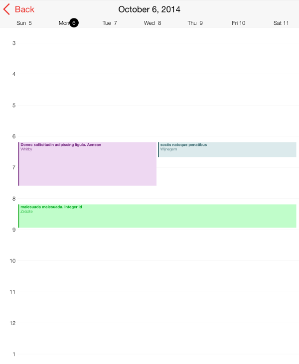

////

|metadata|
{
    "name": "igcalendarview-configuring-custom-appointment-color",
    "tags": ["Appointments","Getting Started","How Do I","Styling"],
    "controlName": ["IGCalendarView"],
    "guid": "e2c52009-4c8b-4a17-9ff8-8718b872cc08",  
    "buildFlags": [],
    "createdOn": "2014-09-12T13:35:23.8453708Z"
}
|metadata|
////

= Configuring a Custom Appointment Color

== Topic Overview

=== Purpose

This topic provides a conceptual overview of configuring custom appointment color on the  _IGCalendarView_™ control and demonstrates the configuration using a code example.

=== In this topic

This topic contains the following sections:

* <<_Ref324841248, Introduction >>
* <<_Ref248895787, Configuring a Custom Appointment Color – Code Example >>

** <<_Ref327344209,Description>>
** <<_Ref252521837,Preview>>
** <<_Ref327523606,Prerequisites>>
** <<_Ref327344217,Code>>

* <<_Ref215823716, Related Content >>

[[_Ref324841248]]
== Introduction

=== Custom appointment color summary

_IGCalendarAppointment_   objects by default get their appointment color from the data source, but it is also possible to dynamically color each appointment by setting the `color` property. The best time to set this property is during the creation of the  _IGCalendarAppointment_   object in one of the following  _IGCalendarAppointmentDataSource_   methods.

* `calendarView:appointmentsForStart:end:ofType:`
* `calendarView:asyncAppointmentRequest:ofType:`

To learn more about creating appointments refer to the link:igcalendarview-configuring-appointments.html[Configuring Appointments] topic.

[[_Ref248895787]]
[[_Ref324841253]]
== Configuring a Custom Appointment Color – Code Example

[[_Ref327344209]]

=== Description

The code example below demonstrates changing an appointments color on the  _IGCalendarView_   from the `calendarView``:appointmentsForStart:end:ofType``:` method when adopting the  _IGCalendarAppointmentDataSource_   protocol.

[[_Ref252521837]]

=== Preview

[[_Ref327523606]]

=== Prerequisites

This code example requires the inclusion of the  __IG__  framework; details about how to add this framework are available in the link:iggridview-adding-the-ig-framework-file.html[Adding the IG Framework File] topic.

[[_Ref327344217]]

=== Code

*In Objective-C:*

[source,csharp]
----
- (NSArray *)calendarView:(IGCalendarView *)calView appointmentsForStart:(NSDate *)start end:(NSDate * )end ofType:(IGCalendarAppointmentRequestType)requestType
{
    NSTimeInterval min = [start timeIntervalSince1970];
    NSTimeInterval max = [end timeIntervalSince1970];
    NSMutableArray *returnAppts = [[NSMutableArray alloc] init];
    for (NSDictionary *appt in _appts)
    {
        NSDate *startTime = appt[@"start"];
        NSTimeInterval current = [startTime timeIntervalSince1970];
        if (current >= min && current <= max)="" temp_line_break="" {="" igcalendarappointment="" *calappt="[[IGCalendarAppointment" alloc]="" init];="" calappt.starttime="startTime;" calappt.endtime="appt[<SPAN" class="string">@"end"];
            calAppt.location = appt[@"location"];
            calAppt.title = appt[@"title"];
            calAppt.color = [UIColor colorWithRed:arc4random_uniform(256) / 255.0f
                                            green:arc4random_uniform(256) / 255.0f
                                             blue:arc4random_uniform(256) / 255.0f
                                            alpha:1];
            [returnAppts addObject:calAppt];
        }
    }
    return returnAppts;
}
----

*In C#:*

[source,csharp]
----
public override NSObject[] GetAppointments (IGCalendarView calView, NSDate start, NSDate end, IGCalendarAppointmentRequestType requestType)
{ 
 Double min = start.SecondsSinceReferenceDate;
 Double max = end.SecondsSinceReferenceDate;
 List<IGCalendarAppointment> returnAppts = new List<IGCalendarAppointment>();
 foreach (NSDictionary appt in _appts) {
 NSDate startTime = appt ["start"];
 Double current = startTime.SecondsSinceReferenceDate;
 if (current >= min && current <= max)="" {<="" span="">
 IGCalendarAppointment calAppt = new IGCalendarAppointment ();
 calAppt.StartTime = startTime;
 calAppt.EndTime = appt ["end"];
 calAppt.Location = appt ["location"];
 calAppt.Title = appt ["title"];
 calAppt.Color = new UIColor (new Random ().Next (255) / 255.0f, new Random ().Next (255) / 255.0f, new Random ().Next (255) / 255.0f, 1.0f);
 returnAppts.Add (calAppt);
 }
 }
 return returnAppts;
}
----

[[_Ref215823716]]
== Related Content

=== Topics

The following topic provides additional information related to this topic.

[options="header", cols="a,a"]
|====
|Topic|Purpose

| link:igcalendarview.html[IGCalendarView]
|The topics in this group cover enabling, configuring, and using the _IGCalendarView_ control’s supported features.

|====