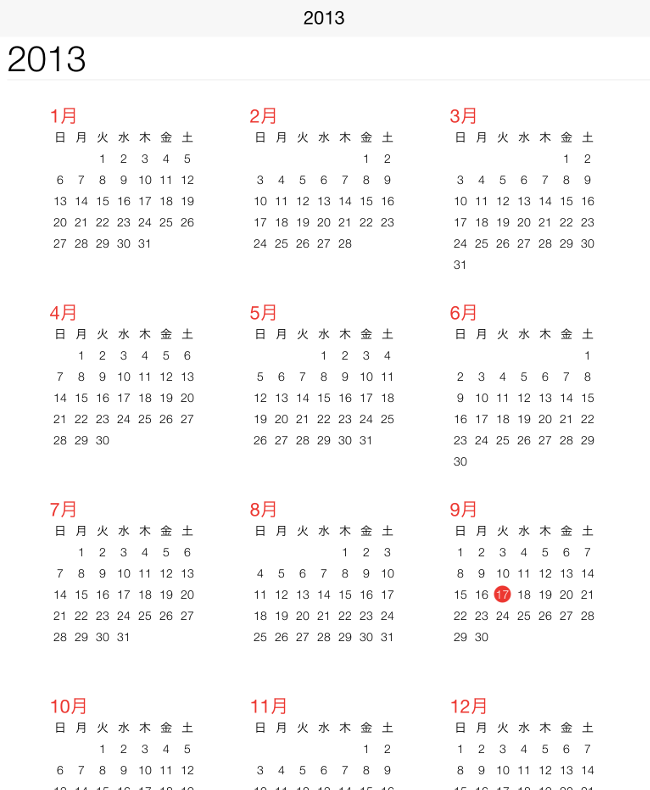

////

|metadata|
{
    "name": "igcalendarview-configuring-localization",
    "tags": ["Getting Started","How Do I","Localization"],
    "controlName": ["IGCalendarView"],
    "guid": "90b211ba-2d89-4d03-97aa-518c19ce040c",  
    "buildFlags": [],
    "createdOn": "2013-09-25T13:10:22.1407434Z"
}
|metadata|
////

= Configuring Localization

== Topic Overview

=== Purpose

This topic provides an introductory overview of localization on the  _IGCalendarView_   _™_   control.

=== In this topic

This topic contains the following sections:

* <<_Ref324841248, Introduction >>
* <<_Ref215823716, Related Content >>

[[_Ref324841248]]
== Introduction

[[_Ref215796828]]

=== Weighted slices summary

The  _IGCalendarView_   uses the settings for the current user’s chosen system locale when displaying the calendar. To switch to a locale other than the device’s default, use `localeIdentifier` property. The `localeIdentifier` property takes a locale identifier string such as “ja-JP” (Japan). Setting the identifier tells the calendar control to use the set locale for displaying things such as the first day of the week and month names.

The  _IGCalendarView_   using a set locale is illustrated below.

[[_Ref324841253]]
[[_Ref215823716]]
== Related Content

=== Topics

The following topic provides additional information related to this topic.

[options="header", cols="a,a"]
|====
|Topic|Purpose

| link:igcalendarview-configuring-igcalendarview.html[Configuring IGCalendarView]
|The topics in this group cover enabling, configuring, and using the _IGCalendarView_ control’s supported features.

|====