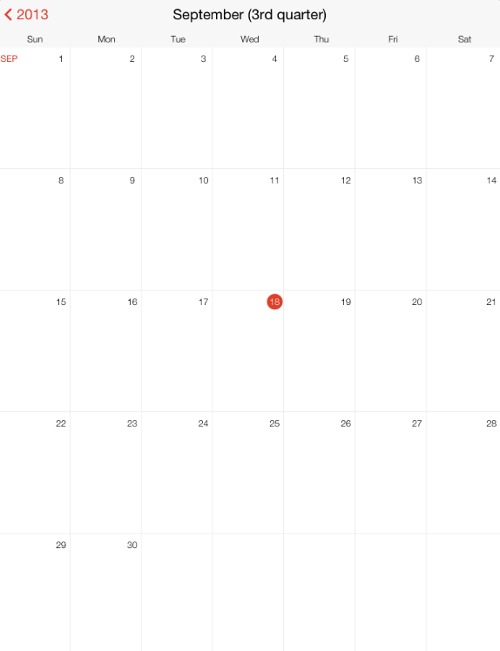

////

|metadata|
{
    "name": "igcalendarview-configuring-title-bar",
    "tags": ["Getting Started","How Do I"],
    "controlName": ["IGCalendarView"],
    "guid": "89599276-3c0e-4b7c-9d17-f1a89e0e91c5",  
    "buildFlags": [],
    "createdOn": "2013-09-25T13:11:14.1047434Z"
}
|metadata|
////

= Configuring the Title Bar

== Topic Overview

=== Purpose

This topic provides an introductory overview of customizing the title bar on the  _IGCalendarView™_   control and demonstrates its configuration using a code example.

=== In this topic

This topic contains the following sections:

* <<_Ref324841248, Introduction >>
* <<_Ref241123382, Customizing the Title Bar – Code Example >>

** <<_Ref327344209,Description>>
** <<_Ref241136394,Preview>>
** <<_Ref327523606,Prerequisites>>
** <<_Ref327344217,Code>>

* <<_Ref215823716, Related Content >>

[[_Ref324841248]]
== Introduction

[[_Ref215796828]]

=== Title bar summary

The  _IGCalendarView_   provides an optional title bar that is customizable for each view:

* Year
* Month
* Day

To adjust the visibility of the title bar, set the `displayTitleBar` property to `YES` or `NO`. The back button on the title bar is also optional; to adjust the visibility of the back button on the title bar, set the `displayBackButton` to `YES` or `NO`.

Implement the  _IGCalendarViewDelegate_   and use the `calendarView:titleLabelForDate:forDisplayType:` method to return a custom string to customize the title bar label. Additionally, you can customize the back button label using the `calendarView:titleForBackButtonForDate:forDisplayType:` method to return a custom string.

Implement  _IGCalendarViewDelegate_   using the right button, reserved for this purpose; customize its text using the `calendarView:titleForRightTitleBarButtonFor:` method; and handle the button tapped event using the `calendarView:rightTitleBarButtonTappedFor:`.

[[_Ref241123382]]
[[_Ref324841253]]
== Customizing the Title Bar – Code Example

[[_Ref327344209]]

=== Description

The code below creates an instance of the  _IGCalendarView_   and customizes the title bar label.

[[_Ref241136394]]

=== Preview

The following image is a preview of the code example.

[[_Ref327523606]]

=== Prerequisites

This code example requires the inclusion of the  _IG_   framework, detail about how to add this framework can be found in the link:iggridview-adding-the-ig-framework-file.html[Adding the IG Framework File] topic.

[[_Ref327344217]]

=== Code

*In Objective-C:*

[source,csharp]
----
@interface igViewController () <IGCalendarViewDelegate>
@end
@implementation igViewController
- (void)viewDidLoad
{
    [super viewDidLoad];
    IGCalendarView *calendar = [[IGCalendarView alloc] initWithFrame:self.view.bounds];
    calendar.autoresizingMask = UIViewAutoresizingFlexibleHeight|UIViewAutoresizingFlexibleWidth;
    calendar.delegate = self;
    [self.view addSubview:calendar];
}
- (NSString *)calendarView:(IGCalendarView *)calView titleLabelForDate:(NSDate * )date forDisplayType:(IGCalendarViewDisplayType)displayType
{
    NSDateFormatter *dateFormatter = [[NSDateFormatter alloc] init];
    switch(displayType)
    {
        case IGCalendarViewDisplayTypeYear:
            dateFormatter.dateFormat = @"yyyy";
            break;
        case IGCalendarViewDisplayTypeMonth:
            dateFormatter.dateFormat = @"MMMM (QQQQ)";
            break;
        case IGCalendarViewDisplayTypeDay:
            dateFormatter.dateFormat = @"MMMM d, yyyy (QQQQ)";
            break;
    }
    return [dateFormatter stringFromDate:date];
}
@end
----

*In C#:*

[source,csharp]
----
public class CalendarDelegate : IGCalendarViewDelegate
{
      public override string ResolveTitleLabel (IGCalendarView calView, NSDate date, IGCalendarViewDisplayType displayType)
      {
            NSDateFormatter dateFormatter = new NSDateFormatter();
            switch(displayType)
            {
                  case IGCalendarViewDisplayType.IGCalendarViewDisplayTypeYear:
                  dateFormatter.DateFormat = @"yyyy";
                  break;
                  case IGCalendarViewDisplayType.IGCalendarViewDisplayTypeMonth:
                  dateFormatter.DateFormat = @"MMMM (QQQQ)";
                  break;
                  case IGCalendarViewDisplayType.IGCalendarViewDisplayTypeDay:
                  dateFormatter.DateFormat = @"MMMM d, yyyy (QQQQ)";
                  break;
            }
            return dateFormatter.StringFor(date);
      }
}
public partial class CalendarTitleBar_CSViewController : UIViewController
{
      public CalendarTitleBar_CSViewController ()
      {
      }
      public override void ViewDidLoad ()
      {
            base.ViewDidLoad ();
            IGCalendarView calendar = new IGCalendarView ();
            calendar.Frame = this.View.Bounds;
            calendar.Delegate = new CalendarDelegate ();
            this.View.Add (calendar);
      }
}
----

[[_Ref215823716]]
== Related Content

=== Topics

The following topic provides additional information related to this topic.

[options="header", cols="a,a"]
|====
|Topic|Purpose

| link:igcalendarview-configuring-igcalendarview.html[Configuring IGCalendarView]
|The topics in this group cover enabling, configuring, and using the _IGCalendarView_ control’s supported features.

|====