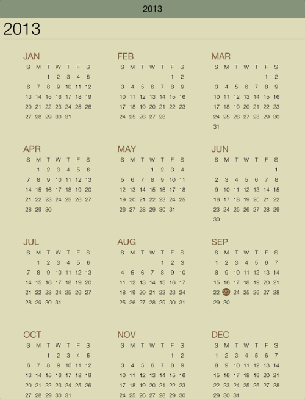

////

|metadata|
{
    "name": "igcalendarview-themes",
    "tags": ["Getting Started","How Do I","Styling","Theming"],
    "controlName": ["IGCalendarView"],
    "guid": "421720e3-f439-416c-bd1c-d75428adedbc",  
    "buildFlags": [],
    "createdOn": "2013-09-25T13:13:25.7877434Z"
}
|metadata|
////

= Themes

== Topic Overview

=== Purpose

This topic provides a conceptual overview of the supported themes available in the  _IGCalendarView_™ control.

=== In this topic

This topic contains the following sections:

* <<_Ref324841248, Introduction >>

** <<_Ref327859845,Theme summary>>
** <<_Ref327864136,Theme types>>

* <<_Ref241543920, Custom Theme – Code Example >>

** <<_Ref327344209,Description>>
** <<_Ref241543946,Preview>>
** <<_Ref327523606,Prerequisites>>
** <<_Ref327344217,Code>>

* <<_Ref324841253, Related Content >>

[[_Ref324841248]]
== Introduction

[[_Ref327859845]]

=== Theme summary

Calendar themes allow you to give the gauge a consistent, color coordinated look and feel. Simply set the  _IGCalendarView_   `theme` property to one of the predefined themes.

*  _IGCalendarViewDefaultTheme_  
*  _IGCalendarViewLightTheme1_  
*  _IGCalendarViewLightTheme2_  
*  _IGCalendarViewLightTheme3_  

.Note:
[NOTE]
====
Store the theme instance as a class variable, the `theme` property on the  _IGCalendarView_   is weak; it does not retain the reference.
====

To create a custom theme, create a class that inherits from  _IGCalendarThemeDefinition_  . The theme definition provides the following overrides.

* `fontNameNormal`
* `fontNameHeavy`
* `fontNameLight`
* `fontSizeYearLabel`
* `fontSizeMax`
* `fontSizeMin`
* `yearViewMonthSpacing`
* `highlightColor`
* `majorColor`
* `minorColor`
* `backingColor`
* `outLineColor`
* `lightTextColor`
* `weekDayDisplayType`

[[_Ref327864136]]

=== Theme names

The following table contains the supported themes and their associated theme names.

[options="header", cols="a,a"]
|====
|Theme Name|Preview

| _IGCalendarDefaultTheme_ 
|image::images/IGCalendarView_-_Themes_1.png[]

| _IGCalendarTheme1_ 
|image::images/IGCalendarView_-_Themes_2.png[]

| _IGCalendarTheme2_ 
|image::images/IGCalendarView_-_Themes_3.png[]

| _IGCalendarTheme3_ 
|image::images/IGCalendarView_-_Themes_4.png[]

|====

[[_Ref327936206]]
[[_Ref241543920]]
[[_Ref324841253]]
== Custom Theme – Code Example

[[_Ref327344209]]

=== Description

The code below creates an instance of the  _IGGridView_   and configures it to use a custom theme.

[[_Ref241543946]]

=== Preview

The following image illustrates the code example when ran.

[[_Ref327523606]]

=== Prerequisites

This code example requires the inclusion of the  __IG__  framework; details about how to add this framework are available in the link:iggridview-adding-the-ig-framework-file.html[Adding the IG Framework File] topic.

[[_Ref327344217]]

=== Code

*In Objective-C:*

[source,csharp]
----
@interface CalendarThemes1 : NSObject <IGCalendarThemeDefinition>
@end
@implementation CalendarThemes1
//Month Title and Back Button Color
- (UIColor *)highlightColor
{
    return [UIColor colorWithRed:123/255.0 green:87/255.0 blue:56/255.0 alpha:1.0];
}
//Text Color - Year, day, week name
- (UIColor *)majorColor
{
    return [UIColor blackColor];
}
//Header Background Title Area
- (UIColor *)minorColor
{
    return [UIColor colorWithRed:0.522 green:0.576 blue:0.478 alpha:1.0];
}
//Background Color
- (UIColor *)backingColor
{
    return [UIColor colorWithRed:0.871 green:0.863 blue:0.722 alpha:1.0];
}
//Subtle lines, as separators
- (UIColor *)outLineColor
{
    return [UIColor colorWithRed:0.811 green:0.803 blue:0.662 alpha:1.0];
}
//Appointments
- (UIColor *)lightTextColor
{
    return [UIColor colorWithRed:0.129 green:0.180 blue:0.196 alpha:1.0];
}
@end
@interface igViewController ()
{
    CalendarThemes1 *_theme;
}
@end
@implementation igViewController
- (void)viewDidLoad
{
    [super viewDidLoad];
    IGCalendarView *calendar = [[IGCalendarView alloc] initWithFrame:self.view.bounds];
    calendar.autoresizingMask = UIViewAutoresizingFlexibleHeight|UIViewAutoresizingFlexibleWidth;
    calendar.theme = _theme = [[CalendarThemes1 alloc] init];
    [self.view addSubview:calendar];
}
@end
----

*In C#:*

[source,csharp]
----
public class CalendarThemes1 : IGCalendarThemeDefinition
{
      //Month Title and Back Button Color
      public override UIColor HighlightColor {
            get {
                  return new UIColor (0.482f, 0.341f, 0.22f, 1.0f);
            }
      }
      //Text Color - Year, day, week name
      public override UIColor MajorColor {
            get {
                  return UIColor.Black;
            }
      }
      //Header Background Title Area
      public override UIColor MinorColor {
            get {
                  return new UIColor (0.522f, 0.576f, 0.478f, 1.0f);
            }
      }
      //Background Color
      public override UIColor BackingColor {
            get {
                  return new UIColor (0.871f, 0.863f, 0.722f, 1.0f);
            }
      }
      //Subtle lines, as separators
      public override UIColor OutLineColor {
            get {
                  return new UIColor (0.811f, 0.803f, 0.662f, 1.0f);
            }
      }
      //Appointments
      public override UIColor LightTextColor {
            get {
                  return new UIColor (0.129f, 0.180f, 0.196f, 1.0f);
            }
      }
}
public partial class CalendarThemes_CSViewController : UIViewController
{
      CalendarThemes1 _theme;
      public CalendarThemes_CSViewController ()
      {
      }
      public override void ViewDidLoad ()
      {
            base.ViewDidLoad ();
            IGCalendarView calendar = new IGCalendarView();
            calendar.Frame = this.View.Bounds;
            calendar.AutoresizingMask = UIViewAutoresizing.FlexibleHeight|UIViewAutoresizing.FlexibleWidth;
            calendar.Theme = _theme = new CalendarThemes1();
            this.View.Add (calendar);
      }
}
----

== Related Content

=== Topics

The following topic provides additional information related to this topic.

[options="header", cols="a,a"]
|====
|Topic|Purpose

| link:igcalendarview.html[IGCalendarView]
|This topic serves as a gateway to the features and functionality of the _IGCalendarView_ control.

|====