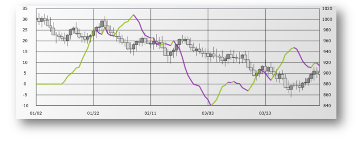

////

|metadata|
{
    "name": "igchartview-absolute-volume-oscillator-indicator",
    "controlName": ["IGChartView"],
    "tags": ["Charting","How Do I"],
    "guid": "1813ea6b-004a-4e2a-88a2-d6efe42b26d9",  
    "buildFlags": [],
    "createdOn": "2012-05-24T18:22:05.6430648Z"
}
|metadata|
////

= Absolute Volume Oscillator Indicator

== Topic Overview

=== Purpose

This topic provides a conceptual overview of the Absolute Volume Oscillator indicator in the  _IGChartView_™ control and uses a code sample to demonstrate how to add it to the chart view.

=== In this topic

This topic contains the following sections:

* <<_Ref324841248, Introduction >>

** <<_Ref326220605,Absolute Volume Oscillator indicator summary>>
** <<_Ref326220610,Data requirements>>

* <<_Ref327935154, Adding an Absolute Volume Oscillator Indicator to the  _IGChartView_   – Code Example >>

** <<_Ref326220621,Description>>
** <<_Ref327935193,Prerequisites>>
** <<_Ref326220625,Code>>

* <<_Ref324841253, Related Content >>

[[_Ref324841248]]
== Introduction

[[_Ref326220605]]

=== Absolute Volume Oscillator indicator summary

The absolute volume oscillator indicator is an indicator whose calculated value is the difference between two average volume measures, and scores range from -100% to +100%. This indicator is used to identify whether volume trends are increasing or decreasing.

[[_Ref326220610]]

=== Data requirements

While the  _IGChartView_   control allows easy binding to your own data model, make sure to supply the appropriate amounts and types of data required by the series. If the data does not meet the minimum requirements, based on the type of series that you are using, the  _IGChartView_   will appear blank.

*Required –*  the data model must contain a numeric field, for volume, for rendering data.

[[_Ref324842387]]
[[_Ref327935154]]
== Adding an Absolute Volume Oscillator Indicator to the  _IGChartView_   – Code Example

[[_Ref326220621]]

=== Description

The code below uses the link:igchartview-data-source-helpers.html[IGOHLCSeriesDataSourceHelper] to supply randomly generated data to a financial price series that first gets added to the IGChartView instance, next the financial indicator is added to the  _IGChartView_   instance as a series, and then the IGChartView is added as a subview of the current UIView.

[[_Ref327935193]]

=== Prerequisites

This code example requires the inclusion of the  _IGChartView_   framework, detail about how to add this framework can be found in the link:igchartview-adding-the-chart-framework-file.html[Adding the Chart Framework File] topic.

[[_Ref326220625]]

=== Code

*In Objective-C:*

[source,csharp]
----
 NSMutableArray *open = [[NSMutableArray alloc] init];
    for (int i = 0; i < 25; i++) {
        [open addObject:[[NSNumber alloc] initWithDouble:(arc4random() % 100)]];
    }
    NSMutableArray *high = [[NSMutableArray alloc] init];
    for (int i = 0; i < 25; i++) {
        [high addObject:[[NSNumber alloc] initWithDouble:(arc4random() % 100 + 30)]];
    }
    NSMutableArray *low = [[NSMutableArray alloc] init];
    for (int i = 0; i < 25; i++) {
        [low addObject:[[NSNumber alloc] initWithDouble:(arc4random() % 100)]];
    }
    NSMutableArray *close = [[NSMutableArray alloc] init];
    for (int i = 0; i < 25; i++) {
        [close addObject:[[NSNumber alloc] initWithDouble:(arc4random() % 100 + 10)]];
    }
    NSMutableArray *volume = [[NSMutableArray alloc] init];
    for (int i = 0; i < 25; i++)
    {
        [volume addObject:[[NSNumber alloc] initWithDouble:(arc4random() % 1000000 + 100000)]];
    }
    IGOHLCSeriesDataSourceHelper *source = [[IGOHLCSeriesDataSourceHelper alloc] init];
    source.openValues = open;
    source.highValues = high;
    source.lowValues = low;
    source.closeValues = close;
    source.volumeValues = volume;
    IGChartView *infraChart = [[IGChartView alloc] initWithFrame:self.view.frame];
    [infraChart setAutoresizingMask:UIViewAutoresizingFlexibleWidth|UIViewAutoresizingFlexibleHeight];
    IGCategoryXAxis *xAxis = [[IGCategoryXAxis alloc] initWithKey:@"xAxis"];
    IGNumericYAxis *yAxis = [[IGNumericYAxis alloc] initWithKey:@"yAxis"];
    [infraChart addAxis:xAxis];
    [infraChart addAxis:yAxis];
    IGFinancialPriceSeries *financialPriceSeries = [[IGFinancialPriceSeries alloc] initWithKey:@"financialPriceSeries"];
    financialPriceSeries.xAxis = xAxis;
    financialPriceSeries.yAxis = yAxis;
    financialPriceSeries.dataSource = source;
    financialPriceSeries.displayType = IGPriceDisplayTypeCandlestick;
    IGAbsoluteVolumeOscillatorIndicator *financialIndicator = [[IGAbsoluteVolumeOscillatorIndicator alloc] initWithKey:@"financialIndicator"];
    financialIndicator.xAxis = xAxis;
    financialIndicator.yAxis = yAxis;
    financialIndicator.dataSource = source;
    financialIndicator.thickness = 3.0f;
    financialIndicator.trendLineThickness = 3.0f;
    financialIndicator.trendLineType = IGTrendLineTypeModifiedAverage;
    financialIndicator.trendLinePeriod = 5;
    [infraChart addSeries:financialPriceSeries];
    [infraChart addSeries:financialIndicator];
    [self.view addSubview:infraChart];
----

*In C#:*

[source,csharp]
----
Random r = new Random();
   List<NSObject> open = new List<NSObject>();
   List<NSObject> high = new List<NSObject>();
   List<NSObject> low = new List<NSObject>();
   List<NSObject> volumes = new List<NSObject>();
   List<NSObject> close = new List<NSObject>();
   for(int i = 0;i <25; i++)
   {
    open.Add(new NSNumber(r.Next() % 100));
    high.Add(new NSNumber(r.Next() % 100 + 30));
    low.Add(new NSNumber(r.Next() % 100));
    close.Add(new NSNumber(r.Next() % 100 + 10));
    volumes.Add(new NSNumber(r.Next() % 1000000 + 100000));
   }
IGOHLCSeriesDataSourceHelper source = new IGOHLCSeriesDataSourceHelper();
   source.OpenValues = open.ToArray();
   source.HighValues = high.ToArray();
   source.LowValues = low.ToArray();
   source.CloseValues = close.ToArray();
source.VolumeValues= volumes.ToArray();
IGChartView chart = new IGChartView(this.View.Frame);
   chart.AutoresizingMask = UIViewAutoresizing.FlexibleHeight | UIViewAutoresizing.FlexibleWidth;
   this.View.AddSubview(chart);
IGCategoryXAxis xAxis = new IGCategoryXAxis("xAxis");
   IGNumericYAxis yAxis = new IGNumericYAxis("yAxis");
   chart.AddAxis(xAxis);
   chart.AddAxis(yAxis);
IGFinancialPriceSeries series = new IGFinancialPriceSeries("series");
   series.XAxis = xAxis;
   series.YAxis = yAxis;
   series.DataSource = source;
   series.DisplayType = IGPriceDisplayType.IGPriceDisplayTypeOHLC;
chart.AddSeries(series);
IGAbsoluteVolumeOscillatorIndicator indicator = new IGAbsoluteVolumeOscillatorIndicator ("indicator");
   indicator.XAxis = xAxis;
   indicator.YAxis = yAxis;
   indicator.DataSource = source;
   indicator.TrendLineType = IGTrendLineType.IGTrendLineTypeModifiedAverage;
   indicator.TrendLinePeriod = 5;
   chart.AddSeries(indicator);
----

[[_Ref324841253]]
== Related Content

=== Topics

The following topics provide additional information related to this topic.

[options="header", cols="a,a"]
|====
|Topic|Purpose

| link:igchartview-financial-indicators.html[Financial Indicators]
|This is a group of topics explaining the various types of chart series, supported by the _IGChartView_ control, that are classified as financial indicators.

|====