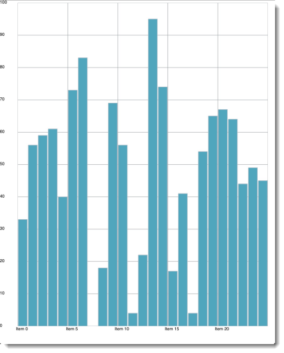

////

|metadata|
{
    "name": "igchartview-adding-igchartview-uiview",
    "controlName": ["IGChartView"],
    "tags": ["Charting","Getting Started"],
    "guid": "8a7fa6d4-e630-47c3-a71a-8c22c89158ac",  
    "buildFlags": [],
    "createdOn": "2012-04-25T13:24:00.8079832Z"
}
|metadata|
////

= Adding the IGChartView to a UIView

== Topic Overview

=== Purpose

This topic provides basic information about creating an instance of the  _IGChartView™_   and displaying a chart to help you get up and running with this control.

=== Required background

The following table lists the prerequisite topics required to understanding this topic.

[options="header", cols="a,a"]
|====
|Topic|Purpose

| link:igchartview-adding-the-chart-framework-file.html[Adding the Chart Framework File]
|This topic explains how to add the chart framework file to a project.

|====

=== In this topic

This topic contains the following sections:

* <<_Ref323111244, Code Examples >>
* <<_Ref328621638, Displaying a chart with   _IGChartView_    – Code Example >>

** <<_Ref323199287,Description>>
** <<_Ref323199293,Code>>
** <<_Ref323214731,Code: Complete Listing>>

* <<_Ref323199323, Related Content >>

[[_Ref323111244]]
== Code Examples

=== Code examples summary

The following table lists the code examples, included in this topic.

[options="header", cols="a,a"]
|====
|Example|Description

|<<_Ref323199279,Code Example: Displaying a chart with IGChartView>>
|The starting point for beginning to use the _IGChartView_ is creating an instance of it and adding it to your view. The code in this example overrides the `viewDidLoad` method on a _UIViewController_ to create the instance of a column series chart.

|====

[[_Ref323199279]]
[[_Ref328621638]]
== Displaying a chart with  _IGChartView_   – Code Example

[[_Ref323199287]]

=== Description

The  _IGChartView_   powers its data visualization by the provided data source. In this code example you will:

* Generate a data source
* Assign your data source to the  _IGChartView_  
* View the displayed column series chart.

=== Preview

The following screen shot illustrates how  _IGChartView_   renders the result’s preview.

[[_Ref323199293]]

=== Code

The data source for this example uses an  _NSMutableArray_   that contains 25 random numbers. Used to handle the data array, the  _IGCategorySeriesDataSourceHelper_   simplifies creating an  _IGChartView_  .

*In Objective-C:*

[source,csharp]
----
 NSMutableArray *data = [[NSMutableArray alloc] init];
    for (int i = 0; i < 25; i++) {
        double value = arc4random() % 100;
        [data addObject:[[NSNumber alloc] initWithDouble:value]];
    }
    IGCategorySeriesDataSourceHelper *source = [[IGCategorySeriesDataSourceHelper alloc] init];
    source.values = data;
----

*In C#:*

[source,csharp]
----
List<NSObject> data = new List<NSObject>();
   Random r = new Random();
   for(int i = 0;i <25; i++)
   {
       double val = r.Next() % 100; 
       data.Add(new NSNumber(val));
   }
IGCategoryDateSeriesDataSourceHelper source = new IGCategoryDateSeriesDataSourceHelper();
   source.Values = data.ToArray();
----

With the generated data assigned to the data source helper, the  _IGChartView_   can be instantiated.

*In Objective-C:*

[source,csharp]
----
 IGChartView *infraChart = [[IGChartView alloc] initWithFrame:self.view.frame];
    [infraChart setAutoresizingMask:UIViewAutoresizingFlexibleWidth|UIViewAutoresizingFlexibleHeight];
----

*In C#:*

[source,csharp]
----
 IGChartView chart = new IGChartView(this.View.Frame);
   chart.AutoresizingMask = UIViewAutoresizing.FlexibleHeight | UIViewAutoresizing.FlexibleWidth;
----

Axes can generally be categorized as either category or numeric. Category axes display string labels that describe data points. Numeric axes display numbers. For this code example, the x axis consists of string labels while the y axis displays numbers.

*In Objective-C:*

[source,csharp]
----
 IGCategoryXAxis *xAxis = [[IGCategoryXAxis alloc] initWithKey:@"xAxis"];
    IGNumericYAxis *yAxis = [[IGNumericYAxis alloc] initWithKey:@"yAxis"];
    [infraChart addAxis:xAxis];
    [infraChart addAxis:yAxis];
----

*In C#:*

[source,csharp]
----
 IGCategoryXAxis xAxis = new IGCategoryXAxis("xAxis");
   IGNumericYAxis yAxis = new IGNumericYAxis("yAxis");
   chart.AddAxis(xAxis);
   chart.AddAxis(yAxis);
----

Using a column series chart type, references both the x and y axis on the series, sets the data source to generate an array, and adds the column series to the  _IGChartView_  .

*In Objective-C:*

[source,csharp]
----
 IGColumnSeries *columnSeries = [[IGColumnSeries alloc] initWithKey:@"columnSeries"];
    columnSeries.xAxis = xAxis;
    columnSeries.yAxis = yAxis;
    columnSeries.dataSource = source;
    [infraChart addSeries:columnSeries];
----

*In C#:*

[source,csharp]
----
 IGColumnSeries columnSeries = new IGColumnSeries("columnSeries");
   columnSeries.XAxis = xAxis;
   columnSeries.YAxis = yAxis;
   columnSeries.DataSource = source;
   chart.AddSeries(columnSeries);
----

The  _IGChartView_   is now configured and ready to be added on to our  _UIViewController_   as a subview.

*In Objective-C:*

[source,csharp]
----
 [self.view addSubview:infraChart];
----

*In C#:*

[source,csharp]
----
 this.View.AddSubview(chart);
----

[[_Ref323214731]]

=== Code: Complete Listing

*In Objective-C:*

[source,csharp]
----
- (void)viewDidLoad
{
    [super viewDidLoad];
    NSMutableArray *data = [[NSMutableArray alloc] init];
    for (int i = 0; i < 25; i++) {
        double value = arc4random() % 100;
        [data addObject:[[NSNumber alloc] initWithDouble:value]];
    }
    IGCategorySeriesDataSourceHelper *source = [[IGCategorySeriesDataSourceHelper alloc] init];
    source.values = data;
    IGChartView *infraChart = [[IGChartView alloc] initWithFrame:self.view.frame];
    [infraChart setAutoresizingMask:UIViewAutoresizingFlexibleWidth|UIViewAutoresizingFlexibleHeight];
    IGCategoryXAxis *xAxis = [[IGCategoryXAxis alloc] initWithKey:@"xAxis"];
    IGNumericYAxis *yAxis = [[IGNumericYAxis alloc] initWithKey:@"yAxis"];
    [infraChart addAxis:xAxis];
    [infraChart addAxis:yAxis];
    IGColumnSeries *columnSeries = [[IGColumnSeries alloc] initWithKey:@"columnSeries"];
    columnSeries.xAxis = xAxis;
    columnSeries.yAxis = yAxis;
    columnSeries.dataSource = source;
    [infraChart addSeries:columnSeries];
    [self.view addSubview:infraChart];
}
----

*In C#:*

[source,csharp]
----
public override void ViewDidLoad ()
{
   base.ViewDidLoad ();
List<NSObject> data = new List<NSObject>();
   Random r = new Random();
   for(int i = 0;i <25; i++)
   {
      double val = r.Next() % 100; 
      data.Add(new NSNumber(val));
   }
IGCategoryDateSeriesDataSourceHelper source = new IGCategoryDateSeriesDataSourceHelper();
   source.Values = data.ToArray();
IGChartView chart = new IGChartView(this.View.Frame);
   chart.AutoresizingMask = UIViewAutoresizing.FlexibleHeight | UIViewAutoresizing.FlexibleWidth;
IGCategoryXAxis xAxis = new IGCategoryXAxis("xAxis");
   IGNumericYAxis yAxis = new IGNumericYAxis("yAxis");
   chart.AddAxis(xAxis);
   chart.AddAxis(yAxis);
IGColumnSeries columnSeries = new IGColumnSeries("columnSeries");
   columnSeries.XAxis = xAxis;
   columnSeries.YAxis = yAxis;
   columnSeries.DataSource = source;
   chart.AddSeries(columnSeries);
this.View.AddSubview(chart);
}
----

[[_Ref323199323]]
== Related Content

=== Topics

The following topics provide additional information related to this topic.

[options="header", cols="a,a"]
|====
|Topic|Purpose

| link:igchartview.html[IGChartView]
|This section serves as an introduction to the _IGChartView’s_ key features and functions.

| link:igchartview-adding-the-chart-framework-file.html[Adding the Chart Framework File]
|This topic explains how to add the chart framework file to a project.

|====