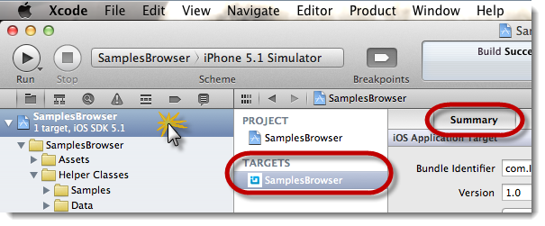
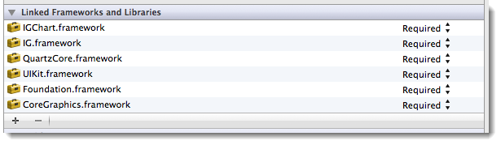

////

|metadata|
{
    "name": "igchartview-adding-the-chart-framework-file",
    "controlName": ["IGChartView"],
    "tags": ["Charting","Getting Started"],
    "guid": "61ec135d-39ba-4db3-b5a1-d79f95b593e5",  
    "buildFlags": [],
    "createdOn": "2012-04-25T13:23:15.1574186Z"
}
|metadata|
////

= Adding the Chart Framework File

== Topic Overview

=== Purpose

This topic demonstrates how to add the chart framework file to a project.

=== In this topic

This topic contains the following sections:

* <<_Ref323111235, Add the Chart Framework File >>
** <<_Ref323111357,Introduction>>
** <<_Ref323111426,Requirements>>
** <<_Ref323111435,Steps>>

* <<_Ref323111244, Related Content >>

[[_Ref323111235]]
== Add the Chart Framework File

[[_Ref323111357]]

=== Introduction

This procedure provides step-by-step directions for adding the chart framework and if applicable the QuartzCore framework, both of which are required for using the  _IGChartView_™ control in your application.

[[_Ref323111426]]

=== Requirements

* To complete this procedure, you need the following:
** A new or existing Xcode iOS project
** The  _IGChart.framework_   folder stored locally on your machine

[[_Ref323111435]]

=== Steps

=== 1. Adding the Chart Framework File

a. Open or create an Xcode iOS project that will use the  _IGChartView_  .

b. On the  _Project Navigator_   pane, left click on the project name, which is the parent item visible in the  _Project Navigator’s_   tree view.

.Note:
[NOTE]
====
Make sure to select the project name under the  _TARGETS_   heading, and select the  _Summary_   tab. You should see the settings panel that lets you configure different project attributes.
====

c. Scroll down the  _Summary_   tab page until coming to the section titled, “Linked Frameworks and Libraries.”

d. Click the  *+*  (plus) button, located in the lower left-hand corner directly below the Linked Frameworks and Libraries listing.

e. Click the  *Add Other*  button, and navigate to the saved location of the  _IGChart.framework_   folder, click to select the folder and then click the  *Open*  button.

f. Repeat steps  *d*  and  *e*  to add the  _QuartzCore.framework_   if this is not already included in your project.

=== 2. Adding the Header File

a. Navigate and select the  _UIViewController’s_   header (.h) file that will use the  _IGChartView_  .

b. Add the import statement at the top of the source file:

*In Objective-C:*

[source,csharp]
----
#import <IGChart/IGChart.h>
----

c. The  _IGChartView_   is now available for use in your  _UIViewController_  .

[[_Ref323111244]]
== Related Content

=== Topics

The following topics provide additional information related to this topic.

[options="header", cols="a,a"]
|====
|Topic|Purpose

| link:igchartview-adding-igchartview-uiview.html[Adding the IGChartView to a UIView]
|This topic provides basic information about creating an instance of the _IGChartView_ and displaying a chart to help you get up and running with this control.

| link:igchartview.html[IGChartView]
|This topic serves as an introduction to the _IGChartView’s_ key features and functionalities.

|====