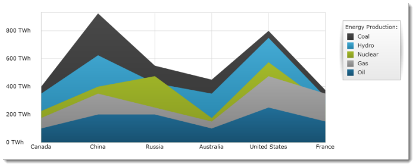

////

|metadata|
{
    "name": "igchartview-area-series",
    "controlName": ["IGChartView"],
    "tags": ["Charting","How Do I"],
    "guid": "58fd493d-8a69-4ede-bd91-ee2a467ddcfc",  
    "buildFlags": [],
    "createdOn": "2012-05-11T19:40:55.6869248Z"
}
|metadata|
////

= Area Series

== Topic Overview

=== Purpose

This topic provides a conceptual overview of the Area series in the  _IGChartView_™ control and provides a code example showing you how to add it to the chart view.

=== In this topic

This topic contains the following sections:

* <<_Ref324841248, Introduction >>

** <<_Ref328138212,Area series summary>>
** <<_Ref326147494,Data requirements>>

* <<_Ref328138244,Adding an Area Series to  _IGChartView_   – Code Example>>

** <<_Ref326147531,Description>>
** <<_Ref328138256,Prerequisites>>
** <<_Ref326147537,Code>>

* <<_Ref324841253, Related Content >>

[[_Ref324841248]]
== Introduction

[[_Ref326147484]]

=== Area series summary

The Area series, a member of the Category Series group, uses a collection of points, connected by a line segment with the area beneath the line shaded when rendered. Values are plotted along the y-axis ( _IGNumericYAxis_  ) and categories are plotted along the x-axis ( _IGCategoryXAxis_   or  _IGCategoryDateTimeXAxis_  ). Multiple series can be plotted in one chart view.

Area series is typically used to emphasize one of the following things:

* Amount of change over time
* Comparison of multiple items
* Relationship of parts to the whole (achieved by displaying the total of the plotted values)

The area series is very similar to the spline area series, with the noted exception that the lines connecting data points do not have spline interpolation or smoothing, thus providing a more precise rendering of the data.

[[_Ref326147494]]

=== Data requirements

While the  _IGChartView_   control allows easy binding to your own data model, make sure to supply the appropriate amounts and types of data required by the series. If the data does not meet the minimum requirements, based on the type of series that you are using, the  _IGChartView_   will appear blank.

The following is a list of data requirements for the area series type:

*  *Required*  – the data model must contain at least one numeric data field. Two or more data points are recommended since a line segment consists of two or more points; by definition.
*  *Optional*  – the data model may contain a string or  _NSDate_   field for labels.

[[_Ref324842387]]

[[_Ref328138244]]
== Adding an Area Series to  _IGChartView_   – Code Example

[[_Ref326147531]]

=== Description

The following code uses the  _IGCategorySeriesDataSourceHelper_   to supply randomly generated data to an area series that gets added to the  _IGChartView_   instance, and then the  _IGChartView_   is added as a sub-view of the current  _UIView_  .

[[_Ref327339029]]

=== Prerequisites

This code example requires the inclusion of the  _IGChartView_   framework, detail about how to add this framework can be found in the link:igchartview-adding-the-chart-framework-file.html[Adding the Chart Framework File] topic.

[[_Ref326147537]]

=== Code

*In Objective-C:*

[source,csharp]
----
 NSMutableArray data = [[NSMutableArray alloc] init];
    for (int i = 0; i < 25; i++)
    {
        double value = arc4random() % 100;
        [data addObject:[[NSNumber alloc] initWithDouble:value]];
    }
    IGCategorySeriesDataSourceHelper *source = [[IGCategorySeriesDataSourceHelper alloc] init];
    source.values = data;
    IGChartView *infraChart = [[IGChartView alloc] initWithFrame:self.view.frame];
    [infraChart setAutoresizingMask:UIViewAutoresizingFlexibleWidth|UIViewAutoresizingFlexibleHeight];
    IGCategoryXAxis *xAxis = [[IGCategoryXAxis alloc] initWithKey:@"xAxis"];
    IGNumericYAxis *yAxis = [[IGNumericYAxis alloc] initWithKey:@"yAxis"];
    [infraChart addAxis:xAxis];
    [infraChart addAxis:yAxis];
    IGAreaSeries *areaSeries = [[IGAreaSeries alloc] initWithKey:@"areaSeries"];
    areaSeries.xAxis = xAxis;
    areaSeries.yAxis = yAxis;
    areaSeries.dataSource = source;
    [infraChart addSeries:areaSeries];
    [self.view addSubview:infraChart];
----

*In C#:*

[source,csharp]
----
public override void ViewDidLoad ()
{
   base.ViewDidLoad ();
 List<NSObject> data = new List<NSObject>();
   Random r = new Random();
   for(int i = 0;i <25; i++)
   {
      double val = r.Next() % 100; 
      data.Add(new NSNumber(val));
   }
 IGCategoryDateSeriesDataSourceHelper source = new IGCategoryDateSeriesDataSourceHelper();
   source.Values = data.ToArray();
IGChartView chart = new IGChartView(this.View.Frame);
   chart.AutoresizingMask = UIViewAutoresizing.FlexibleHeight | UIViewAutoresizing.FlexibleWidth;
this.View.AddSubview(chart);
IGCategoryXAxis xAxis = new IGCategoryXAxis("xAxis");
   IGNumericYAxis yAxis = new IGNumericYAxis("yAxis");
   chart.AddAxis(xAxis);
   chart.AddAxis(yAxis);
IGAreaSeries series= new IGAreaSeries ("series");
   series.XAxis = xAxis;
   series.YAxis = yAxis;
   series.DataSource = source;
   chart.AddSeries(columnSeries);
}
----

[[_Ref324841253]]
== Related Content

=== Topics

The following topic provides additional information related to this topic.

[options="header", cols="a,a"]
|====
|Topic|Purpose

| link:igchartview-category-series.html[Category Series]
|This is a group of topics explaining the various types of Category series supported by the _IGChartView_ control.

|====