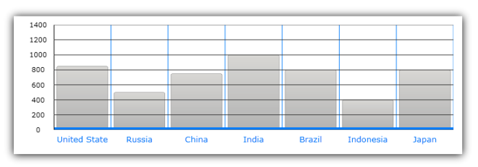
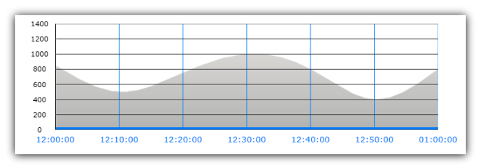
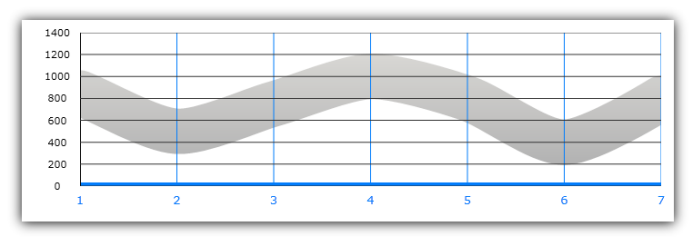
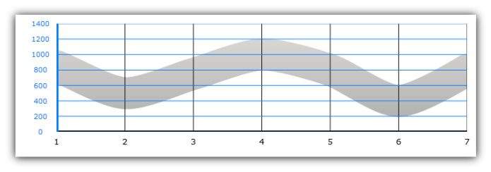
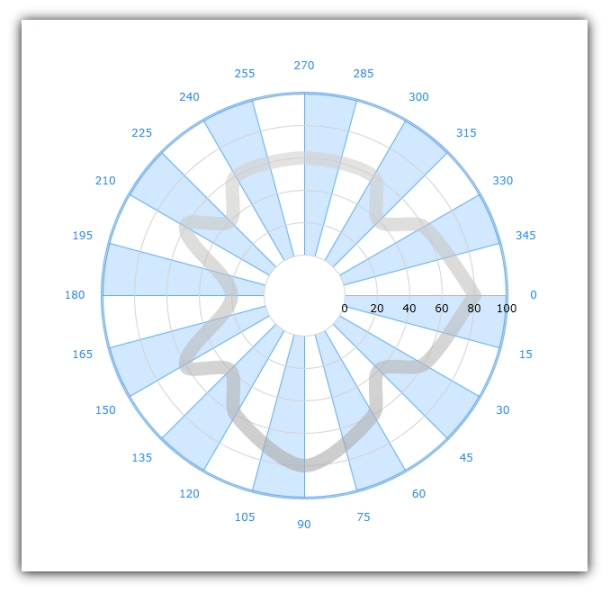
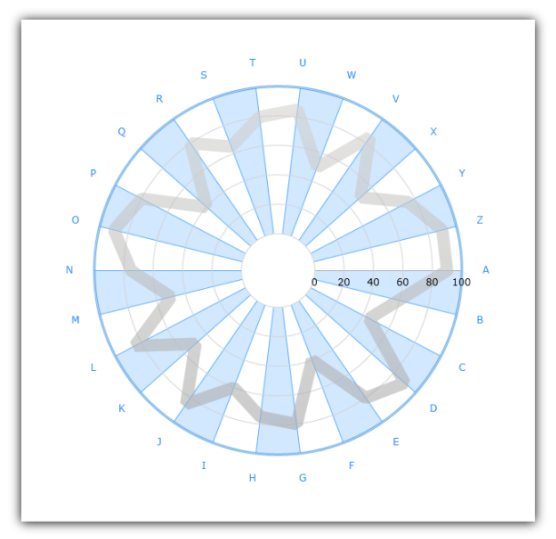

////

|metadata|
{
    "name": "igchartview-axes",
    "controlName": ["IGChartView"],
    "tags": ["Charting","Getting Started","Layouts"],
    "guid": "ce4f27e9-6aaf-4f02-b707-fd8c1e6d440b",  
    "buildFlags": [],
    "createdOn": "2012-05-11T19:47:42.8886409Z"
}
|metadata|
////

= Axes

== Topic Overview

=== Purpose

This topic explains the types of axes supported on the  _IGChartView_™ control.

=== In this topic

This topic contains the following sections:

* <<_Ref324841248, Introduction >>
* <<_Ref326566524, Common Axis Properties >>
* <<_Ref326569312, Axis Types >>
* <<_Ref326569342, Cartesian Axes >>

** <<_Ref326569349,Introduction to Cartesian axes>>
** <<_Ref326569354,IGCategoryXAxis>>
** <<_Ref326569361,IGCategoryDateTimeXAxis>>
** <<_Ref326569366,IGNumericXAxis>>
** <<_Ref326569371,IGNumericYAxis>>

* <<_Ref326573502, Polar Axes >>

** <<_Ref326573510,Introduction to polar axes>>
** <<_Ref326573514,IGNumericAngleAxis>>
** <<_Ref326573517,IGNumericRadiusAxis>>
** <<_Ref326573522,IGCategoryAngleAxis>>

* <<_Ref32654876, Related Content >>

[[_Ref324841248]]
== Introduction

[[_Ref326312648]]

=== Introduction to axes

In the  _IGChartView_  , an axis provides base properties for styling major gridlines, stripes, and axis label settings. The  _IGChartView_   control supports several types of axes used by different series groups. The axes available are contingent upon the type of series involved.

[[_Ref326566524]]
[[_Ref324841253]]
[[_Ref326312360]]
== Common Axis Properties

=== Common properties of the axis

Each axis type consists of both unique properties and common properties shared by all types of axis. The table below lists and describes these common properties.

[options="header", cols="a,a"]
|====
|Axis Property|Description

|`crossingAxis`
|Determines which axis will cross the current axis, see the link:igchartview-axis-crossing.html[Axis Crossing] topic for further information.

|`crossingValue`
|Determines the crossing location with another axis, see the link:igchartview-axis-crossing.html[Axis Crossing] topic for further information.

|`isInverted`
|Determines whether orientation of the axis is inverted.

|`majorStroke`
|Determines the brush of axis major lines.

|`majorStrokeDashArray`
|Determines the pattern and spaces between dashes of axis major lines.

|`majorStrokeThickness`
|Determines the thickness of axis major lines.

|`minorStroke`
|Determines the brush of axis minor lines.

|`minorStrokeDashArray`
|Determines the pattern and spaces between dashes of axis minor lines.

|`minorStrokeThickness`
|Determines the thickness of axis minor lines.

|`strip`
|Determines the brush of axis stripes between major axis lines.

|`stroke`
|Determines the brush of the axis line.

|`strokeDashArray`
|Determines the pattern and spaces between dashes of axis line.

|`strokeThickness`
|Determines the thickness of axis line.

|====

[[_Ref326569312]]
== Axis Types

=== Axis types table

The following table lists all of the axes, categorized in several types based on their orientation and shape in the chart plot area. It also lists applicable series groups for these axis types. Types of axes are grouped by chart plot area orientation/shape and their respective applicable series groups.

[options="header", cols="a,a,a"]
|====
|Axes Groups|Axes Types|Applicable Series Groups

|Cartesian Axes
| _IGCategoryXAxis_ 
| link:igchartview-category-series.html[Category Series], link:igchartview-scatter-series.html[Scatter Series], and link:igchartview-financial-price-series.html[Financial Price Series]

|
| _IGCategoryDateTimeXAxis_ 
| link:igchartview-category-series.html[Category Series] (including range and stack series), link:igchartview-scatter-series.html[Scatter Series], and link:igchartview-financial-price-series.html[Financial Price Series]

|
| _IGNumericYAxis_ 
| link:igchartview-category-series.html[Category Series], link:igchartview-scatter-series.html[Scatter Series], and link:igchartview-financial-price-series.html[Financial Price Series]

|
| _IGNumericXAxis_ 
| link:igchartview-scatter-series.html[Scatter Series]

|Polar Axes
| _IGNumericRadiusAxis_ 
| link:igchartview-polar-series.html[Polar Series] and link:igchartview-radial-series.html[Radial Series]

|
| _IGNumericAngleAxis_ 
| link:igchartview-polar-series.html[Polar Series]

|
| _IGCategoryAngleAxis_ 
| link:igchartview-radial-series.html[Radial Series]

|====

[[_Ref326569342]]
== Cartesian Axes

[[_Ref326569349]]

=== Introduction to Cartesian axes

Cartesian axes are used only in series that display data points using the Cartesian coordinate system (for example, link:igchartview-scatter-series.html[Scatter Series]). These axes are displayed as horizontal or vertical lines along either of the chart’s x or y coordinates.

By default, horizontal and vertical axes are drawn from left to right and bottom to top. The axes orientation can be changed in the  _IGChartView_   by using the `isInverted` property on an individual axis. Perpendicular lines to these axes are called “major gridlines” and they can be spaced evenly by configuring the `interval` axis property.

[[_Ref326569354]]

=== IGCategoryXAxis

The  _IGCategoryXAxis_   treats the data as a sequence of category labels with the marker placed at a point along the x-axis based on its position in the sequence. The following image highlights a sample  _IGCategoryXAxis_    __rendering__ .

[[_Ref326569361]]

=== IGCategoryDateTimeXAxis

The  _IGCategoryDateTimeXAxis_   treats the data as a sequence of date labels with the marker placed at a point along the x-axis based on its value in a data column; mapped using the axis `dateTimeMemberPath` property. The following image highlights a sample  _IGCategoryDateTimeXAxis_    __rendering__ .

[[_Ref326569366]]

=== IGNumericXAxis

The  _IGNumericXAxis_   treats the data as continuously varying numerical labels with the marker placed at a point along the x-axis. The label varies according to the value in a data column that is mapped using the `xPath` property of the  _IGScatterSeriesDataSourceHelper_   in the link:igchartview-scatter-series.html[Scatter Series]. The following image highlights a sample  _IGNumericXAxis_   rendering.

[[_Ref326569371]]

=== IGNumericYAxis

The  _IGNumericYAxis_   treats the data d as continuously varying numerical label with the marker placed at a point along the y-axis. The label varies according to the value in a data column that is mapped using the `yPath` property of the  _IGScatterSeriesDataSourceHelper_   in the link:igchartview-scatter-series.html[Scatter Series] or `valuePath` property for link:igchartview-category-series.html[Category Series]. The following image highlights a sample  _IGNumericYAxis_  .

[[_Ref326573502]]
== Polar Axes

[[_Ref326573510]]

=== Introduction to polar axes

Only used with Polar axes, the link:igchartview-polar-series.html[Polar Series] and link:igchartview-radial-series.html[Radial Series] display as lines running along either the chart’s radius or the angle coordinates. The following sections describe each of the polar axes together with illustrations of how they look when rendered with applicable series in the  _IGChartView_   control.

[[_Ref326573514]]

=== IGNumericAngleAxis

The  _IGNumericAngleAxis_   treats the data as continuously varying numerical labels with the marker placed at a point along the  _IGNumericAngleAxis_  . This point varies according to the value in a data column mapped using the `anglePath` property of the  _IGPolarSeriesDataSourceHelper_   in the link:igchartview-polar-series.html[Polar Series] chart type. For details on the  _IGNumericAngleAxis_  , refer to the link:igchartview-configuring-numeric-angle-axis.html[Configuring Numeric Angle Axis] topic.

The following image illustrates a sample  _IGNumericAngleAxis_  .

[[_Ref326573517]]

=== IGNumericRadiusAxis

The  _IGNumericRadiusAxis_   treats the data as continuously varying numerical labels with the marker placed at a point along the  _IGNumericRadiusAxis_  . This point varies according to the value in the data column mapped using the `radiusPath` property of the  _IGPolarSeriesDataSourceHelper_   in the link:igchartview-polar-series.html[Polar Series] chart type or the `valuePath` property of the  _IGCategorySeriesDataSourceHelper_   in the link:igchartview-radial-series.html[Radial Series] chart type. For details on  _IGNumericRadiusAxis_  , refer to the link:igchartview-configuring-numeric-radius-axis.html[Configuring Numeric Radius Axis] topic.

[[_Ref326573522]]

=== IGCategoryAngleAxis

The  _IGCategoryAngleAxis_   treats the data as a sequence of non-numerical text labels with the marker placed at a point along the angle axis according to its position in the sequence. For details on the  _IGCategoryAngleAxis_  , refer to the link:igchartview-configuring-category-angle-axis.html[Configuring Category Angle Axis] topic.

The following image illustrates a sample  _IGCategoryAngleAxis_  .

[[_Ref32654876]]
== Related Content

=== Topics

The following topics provide additional information related to this topic.

[options="header", cols="a,a"]
|====
|Topic|Purpose

| link:igchartview-axis-crossing.html[Axis Crossing]
|In the _IGChartView_, you can use the _IGCategoryXAxis_ object’s _crossingAxis_ and _crossingValue_ properties to change where the X-axis crosses the Y-axis.

| link:igchartview-axis-scales-and-intervals.html[Axis Scales and Intervals]
|This topic explains, with code examples, how to use axis scales and intervals on the _IGChartView_ control.

| link:igchartview.html[IGChartView]
|This topic serves as a gateway to the features and functionality of the _IGChartView_ control.

| link:igchartview-configuring-category-angle-axis.html[Configuring Category Angle Axis]
|This topic demonstrates, with code examples, how to use _IGCategoryAngleAxis_ in the _IGChartView_ .

| link:igchartview-configuring-numeric-angle-axis.html[Configuring Numeric Angle Axis]
|This topic demonstrates, with code examples, how to use _IGNumericAngleAxis_ in the _IGChartView_ .

| link:igchartview-configuring-numeric-radius-axis.html[Configuring Numeric Radius Axis]
|This topic demonstrates, with code examples, how to use _IGNumericRadusAxis_ in the _IGChartView_ .

|====