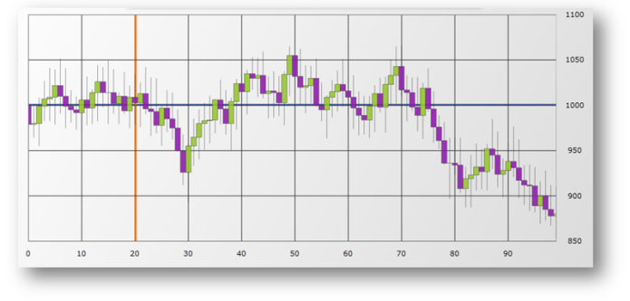

////

|metadata|
{
    "name": "igchartview-axis-crossing",
    "controlName": ["IGChartView"],
    "tags": ["Charting","How Do I","Selection"],
    "guid": "cf8104ea-11cb-4b0a-a9f2-ac5488a6f103",  
    "buildFlags": [],
    "createdOn": "2012-05-11T19:48:29.0502566Z"
}
|metadata|
////

= Axis Crossing

== Topic Overview

=== Purpose

This topic uses code examples to demonstrate how to create an axis crossing on the  _IGChartView_™ control.

=== In this topic

This topic contains the following sections:

* <<_Ref324841248, Introduction >>
* <<_Ref328722439, Adding an Axis Crossing to the IGChartView – Code Example >>

** <<_Ref326312342,Description>>
** <<_Ref327340455,Requirements>>
** <<_Ref326312348,Code>>

* <<_Ref326312360, Related Content >>

[[_Ref324841248]]
== Introduction

[[_Ref326312648]]

=== Introduction to the axis crossing

Use the  _IGCategoryXAxis_   object’s `crossingAxis` and `crossingValue` properties in  _IGChartView_   to change where the x-axis crosses the y-axis. Set the `crossingValue` to the value at which you want the x-axis to intersect the y-axis. The following can be applied to the  _IGNumericYAxis_   object’s `crossingAxis` and `crossingValue` properties to change where the y-axis crosses the x-axis.

The following image is an example of the axis crossing appearance with values set for  _IGCategoryXAxis_   and  _IGNumericYAxis_  .

[[_Ref324842387]]
[[_Ref328722439]]
[[_Ref324841253]]
== Adding an Axis Crossing to the  _IGChartView_   – Code Example

[[_Ref326312342]]

=== Description

The code below uses an area series chart type containing, randomly generated data and sets the axis crossing of the x-axis to 50 and the y-axis to 5. After the series has been added to the  _IGChartView_   instance, the current  _UIView_   then adds the  _IGChartView_   as a subview.

[[_Ref327340455]]

=== Requirements

This code example requires the inclusion of the  _IGChartView_   framework, information about how to add this framework can be found in the link:igchartview-adding-igchartview-uiview.html[Adding the IGChartView to a UIView] topic.

[[_Ref326312348]]

=== Code

*In Objective-C:*

[source,csharp]
----
 NSMutableArray *data = [[NSMutableArray alloc] init];
    for (int i = 0; i < 25; i++)
    {
        double value = arc4random() % 100;
        [data addObject:[[NSNumber alloc] initWithDouble:value]];
    }
    IGCategorySeriesDataSourceHelper *source = [[IGCategorySeriesDataSourceHelper alloc] init];
    source.values = data;
    IGChartView *infraChart = [[IGChartView alloc] initWithFrame:self.view.frame];
    [infraChart setAutoresizingMask:UIViewAutoresizingFlexibleWidth|UIViewAutoresizingFlexibleHeight];
    [infraChart setTheme:IGChartThemeIGTheme];
    IGCategoryXAxis *xAxis = [[IGCategoryXAxis alloc] initWithKey:@"xAxis"];
    IGNumericYAxis *yAxis = [[IGNumericYAxis alloc] initWithKey:@"yAxis"];
    xAxis.crossingAxis = yAxis;
    xAxis.strokeThickness = 5.0f;
    xAxis.crossingValue = 50;
    yAxis.crossingAxis = xAxis;
    yAxis.strokeThickness = 5.0f;
    yAxis.crossingValue = 5;
    [infraChart addAxis:xAxis];
    [infraChart addAxis:yAxis];
    IGAreaSeries *areaSeries = [[IGAreaSeries alloc] initWithKey:@"areaSeries"];
    areaSeries.xAxis = xAxis;
    areaSeries.yAxis = yAxis;
    areaSeries.dataSource = source;
    [infraChart addSeries:areaSeries];
    [self.view addSubview:infraChart];
----

*In C#:*

[source,csharp]
----
List<NSObject> data = new List<NSObject>();
   Random r = new Random();
   for(int i = 0;i <25; i++)
   {
       double val = r.Next() % 100; 
       data.Add(new NSNumber(val));
   }
IGCategoryDateSeriesDataSourceHelper source = new IGCategoryDateSeriesDataSourceHelper();
   source.Values = data.ToArray(); 
IGChartView chart = new IGChartView(this.View.Frame);
   chart.AutoresizingMask = UIViewAutoresizing.FlexibleHeight | UIViewAutoresizing.FlexibleWidth;
  this.View.AddSubview(chart);
 IGCategoryXAxis xAxis = new IGCategoryXAxis("xAxis");
   IGNumericYAxis yAxis = new IGNumericYAxis("yAxis");
   chart.AddAxis(xAxis);
   chart.AddAxis(yAxis);
xAxis.CrossingAxis = yAxis;
   xAxis.StrokeThickness = 5.0f;
   xAxis.CrossingValue = 50;
yAxis.CrossingAxis = xAxis;
   yAxis.StrokeThickness = 5.0f;
   yAxis.CrossingValue = 5;
IGAreaSeries series= new IGAreaSeries ("series");
   series.XAxis = xAxis;
   series.YAxis = yAxis;
   series.DataSource = source;
   chart.AddSeries(columnSeries);
----

[[_Ref326312360]]
== Related Content

=== Topics

The following topics provide additional information related to this topic.

[options="header", cols="a,a"]
|====
|Topic|Purpose

| link:igchartview.html[IGChartView]
|This topic serves as a gateway to the features and functionality of the _IGChartView_ control.

|====