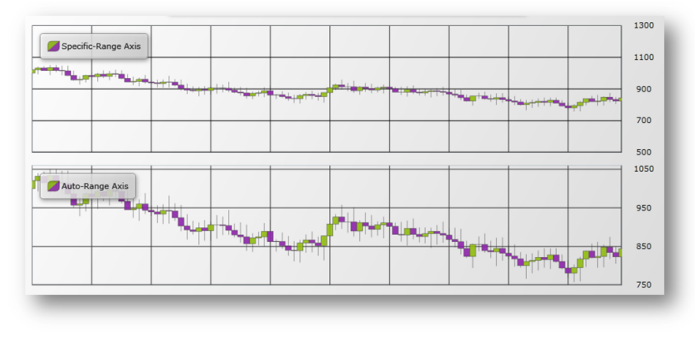

////
|metadata|
{
    "name": "igchartview-axis-scales-and-intervals",
    "controlName": ["IGChartView"],
    "tags": ["Charting","How Do I","Layouts","Styling"],
    "guid": "b520610e-0ac5-4029-9e83-9571ce08b3c3",
    "buildFlags": [],
    "createdOn": "2012-06-12T12:39:12.0591141Z"
}
|metadata|
////

= Axis Scales and Intervals

== Topic Overview

=== Purpose

This topic explains, with code examples, how to use axis scales and intervals on the  _IGChartView_™ control.

=== In this topic

This topic contains the following sections:

* <<_Ref324841248, Introduction >>
* <<_Ref324842387, Configuring the Axis Scale and Interval on the IGChartView – Code Example >>

** <<_Ref326312342,Description>>
** <<_Ref327340550,Requirements>>
** <<_Ref326312348,Code>>

* <<_Ref326312360, Related Content >>

[[_Ref324841248]]
== Introduction

[[_Ref326312648]]

=== Introduction to axis scales and intervals

In the  _IGChartView_   control, the axis range is the difference in numeric values from the beginning of the axis to the end or from the smallest to largest values in the data. The range minimum and maximum values represent the lowest and highest value of the axis, respectively.

In order to maximize the chart plot area the  _IGChartView_   control’s default settings, calculate the minimum and maximum values for the axis range based on the lowest and highest data points. However, the automatic calculation of an axis' minimum and maximum values may not be appropriate for your set of data points. For example, if your data has a minimum value of 850, you may want to set the minimum value of the axis using its `minimum` property to 800, thus rendering a graph where the lowest data point is spaced 50 units above the axis minimum. The same can be applied to the axis maximum value and the highest value of data points using axis’s `maximum` property.

In addition to specifying the scale, along a numeric axis, you can set the `interval` property at with gridlines and labels will appear on that axis within the set scale. The `interval` property can also be used when the chart is using the default automatic scale.

The following image compares an  _IGChartView,_   with its scale set for `minimum` and `maximum` on the  _IGNumericYAxis_   (top), an  _IGChartView_   (bottom) with its scale set automatically when the `minimum` or `maximum` properties are not set.

[[_Ref324842387]]
== Configuring the Axis Scale and Interval on the IGChartView – Code Example

[[_Ref326312342]]

=== Description

The code below uses an area series chart type containing, randomly generated data and sets the y-axis scale to the range of -10 to 110 with an interval of 10. After the series has been added to the  _IGChartView_   instance, the current  _UIView_   then adds the  _IGChartView_   as a subview.

[[_Ref327340550]]

=== Requirements

This code example requires the inclusion of the  _IGChartView_   framework. Additional information about how to add this framework can be found in the link:igchartview-adding-igchartview-uiview.html[Adding the IGChartView to a UIView] topic.

[[_Ref326312348]]

=== Code

*In Objective-C:*

[source,csharp]
----
 NSMutableArray *data = [[NSMutableArray alloc] init];
    for (int i = 0; i < 25; i++)
    {
        double value = arc4random() % 100;
        [data addObject:[[NSNumber alloc] initWithDouble:value]];
    }
    IGCategorySeriesDataSourceHelper *source = [[IGCategorySeriesDataSourceHelper alloc] init];
    source.values = data;
    IGChartView *infraChart = [[IGChartView alloc] initWithFrame:self.view.frame];
    [infraChart setAutoresizingMask:UIViewAutoresizingFlexibleWidth|UIViewAutoresizingFlexibleHeight];
    [infraChart setTheme:IGChartThemeIGTheme];
    IGCategoryXAxis *xAxis = [[IGCategoryXAxis alloc] initWithKey:@"xAxis"];
    IGNumericYAxis *yAxis = [[IGNumericYAxis alloc] initWithKey:@"yAxis"];
    yAxis.minimum = -10;
    yAxis.maximum = 110;
    yAxis.interval = 10;
    [infraChart addAxis:xAxis];
    [infraChart addAxis:yAxis];
    IGAreaSeries *areaSeries = [[IGAreaSeries alloc] initWithKey:@"areaSeries"];
    areaSeries.xAxis = xAxis;
    areaSeries.yAxis = yAxis;
    areaSeries.dataSource = source;
    [infraChart addSeries:areaSeries];
    [self.view addSubview:infraChart];
----

*In C#:*

[source,csharp]
----
public override void ViewDidLoad()
{
	base.ViewDidLoad();

	List<NSObject> data = new List<NSObject>();
	Random r = new Random();
	for (int i = 0; i < 25; i++)
	{
		double val = r.Next() % 100;
		data.Add(new NSNumber(val));
	}
	IGCategoryDateSeriesDataSourceHelper source = new IGCategoryDateSeriesDataSourceHelper();
	source.Values = data.ToArray();

	IGChartView chart = new IGChartView(this.View.Frame);
	chart.AutoresizingMask = UIViewAutoresizing.FlexibleHeight | UIViewAutoresizing.FlexibleWidth;

	this.View.AddSubview(chart);

	IGCategoryXAxis xAxis = new IGCategoryXAxis("xAxis");
	IGNumericYAxis yAxis = new IGNumericYAxis("yAxis");
	yAxis.Minimum = -10;
	yAxis.Maximum = 110;
	yAxis.Interval = 10;
	chart.AddAxis(xAxis);
	chart.AddAxis(yAxis);

	IGAreaSeries series = new IGAreaSeries("series");
	series.XAxis = xAxis;
	series.YAxis = yAxis;
	series.DataSource = source;
	chart.AddSeries(series);
}
----

[[_Ref326312360]]
== Related Content

=== Topics

The following topics provide additional information related to this topic. 

[options="header", cols="a,a"] 

|==== 

|Topic|Purpose 

| link:igchartview.html[IGChartView] 

|This topic serves as a gateway to the features and functionality of the _IGChartView_ control. 

|==== 