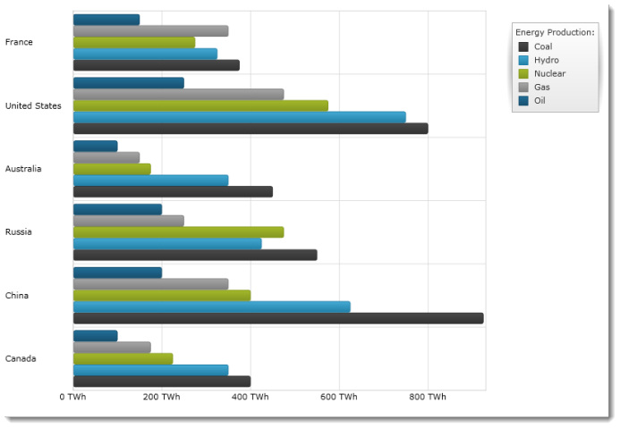

////

|metadata|
{
    "name": "igchartview-bar-series",
    "controlName": ["IGChartView"],
    "tags": ["Charting","How Do I"],
    "guid": "1239af13-6bbe-4d72-91dd-5ad02350b9aa",  
    "buildFlags": [],
    "createdOn": "2012-05-11T19:42:01.3444899Z"
}
|metadata|
////

= Bar Series

== Topic Overview

=== Purpose

This topic provides a conceptual overview of the Bar series in the  _IGChartView_™ control and provides a code example showing you how to add it to the chart views.

=== In this topic

This topic contains the following sections:

* <<_Ref324841248,Introduction>>

** <<_Ref328069606,Bar series summary>>
** <<_Ref326147595,Data requirements>>

* <<_Ref328069628,Adding a Bar Series to the  _IGChartView_   – Code Example>>

** <<_Ref326147609,Description>>
** <<_Ref328069636,Prerequisites>>
** <<_Ref326147614,Code>>

* <<_Ref324841253, Related Content >>

[[_Ref324841248]]
== Introduction

[[_Ref326147590]]

=== Bar series summary

The Bar series belongs to a group of category series and uses a collection of rectangles that extend from the  _y_ -axis on the left toward their corresponding data point values expressed on the x-axis. The Bar series uses the same concepts of data plotting as Column series, but data points are stretched along the vertical (y-axis) rather than horizontal (x-axis). In other words, the Bar series is rendered like the Column series, but with 90 degrees of clockwise rotation.

Figure 1: Bar Series

[[_Ref326147595]]

=== Data requirements

While the  _IGChartView_   control allows easy binding to your own data model, make sure to supply the appropriate amounts and types of data required by the series. If the data does not meet the minimum requirements, based on the type of series that you are using, the  _IGChartView_   will appear blank.

The following is a list of data requirements for the Bar series type:

*  *Required –*  the data model must contain at least one numeric data field.
*  *Optional –*  the data model may contain a string or  _NSDate_   field for labels.

[[_Ref328069628]]
[[_Ref324842387]]
== Adding a Bar Series to the  _IGChartView_   – Code Example

[[_Ref326147609]]

=== Description

The following code uses the link:igchartview-data-source-helpers.html[IGCategorySeriesDataSourceHelper] to supply randomly generated data to a bar series that first gets added to the  _IGChartView_   instance, and then the current  _UIView_   adds the  _IGChartView_   as a subview.

[[_Ref328069636]]

=== Prerequisites

This code example requires the inclusion of the  _IGChartView_   framework, detail about how to add this framework can be found in the link:igchartview-adding-the-chart-framework-file.html[Adding the Chart Framework File] topic.

[[_Ref326147614]]

=== Code

*In Objective-C:*

[source,csharp]
----
 NSMutableArray data = [[NSMutableArray alloc] init];
    for (int i = 0; i < 25; i++)
    {
        double value = arc4random() % 100;
        [data addObject:[[NSNumber alloc] initWithDouble:value]];
    }
    IGCategorySeriesDataSourceHelper *source = [[IGCategorySeriesDataSourceHelper alloc] init];
    source.values = data;
    IGChartView *infraChart = [[IGChartView alloc] initWithFrame:self.view.frame];
    [infraChart setAutoresizingMask:UIViewAutoresizingFlexibleWidth|UIViewAutoresizingFlexibleHeight];
    IGNumericXAxis *xAxis = [[IGNumericXAxis alloc] initWithKey:@"xAxis"];
    IGCategoryYAxis *yAxis = [[IGCategoryYAxis alloc] initWithKey:@"yAxis"];
    [infraChart addAxis:xAxis];
    [infraChart addAxis:yAxis];
    IGBarSeries *barSeries = [[IGBarSeries alloc] initWithKey:@"barSeries"];
    barSeries.xAxis = xAxis;
    barSeries.yAxis = yAxis;
    barSeries.dataSource = source;
    [infraChart addSeries:barSeries];
    [self.view addSubview:infraChart];
----

*In C#:*

[source,csharp]
----
public override void ViewDidLoad ()
{
   base.ViewDidLoad ();
 List<NSObject> data = new List<NSObject>();
   Random r = new Random();
   for(int i = 0;i <25; i++)
   {
      double val = r.Next() % 100; 
      data.Add(new NSNumber(val));
   }
 IGCategoryDateSeriesDataSourceHelper source = new IGCategoryDateSeriesDataSourceHelper();
   source.Values = data.ToArray();
 IGChartView chart = new IGChartView(this.View.Frame);
   chart.AutoresizingMask = UIViewAutoresizing.FlexibleHeight | UIViewAutoresizing.FlexibleWidth;
  this.View.AddSubview(chart);
 IGNumericXAxis xAxis = new IGNumericXAxis ("xAxis");
   IGCategoryYAxis yAxis = new IGCategoryYAxis ("yAxis");
   chart.AddAxis(xAxis);
   chart.AddAxis(yAxis);
 IGBarSeries series= new IGBarSeries ("series");
   series.XAxis = xAxis;
   series.YAxis = yAxis;
   series.DataSource = source;
   chart.AddSeries(columnSeries);
}
----

[[_Ref324841253]]
== Related Content

=== Topics

The following content provides additional information related to this topic.

[options="header", cols="a,a"]
|====
|Topic|Purpose

|[[_Hlk328071419]] 

link:igchartview-category-series.html[Category Series]
|This is a group of topics explaining the various types of Category series supported by the _IGChartView_ control.

|====