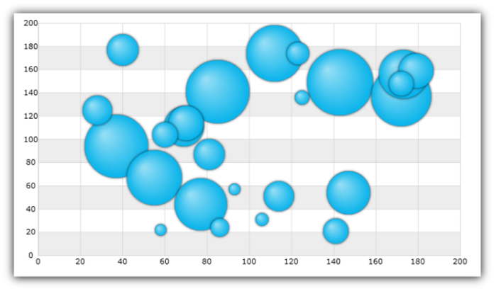

////

|metadata|
{
    "name": "igchartview-bubble-series",
    "controlName": ["IGChartView"],
    "tags": ["Charting","How Do I"],
    "guid": "9b1d934e-7e2c-44dd-9486-b339762f5ee2",  
    "buildFlags": [],
    "createdOn": "2012-05-21T13:59:28.5685512Z"
}
|metadata|
////

= Bubble Series

== Topic Overview

=== Purpose

This topic provides a conceptual overview of the Bubble series in the  _IGChartView_™ control and provides a code example showing you how to add it to the chart views.

=== In this topic

This topic contains the following sections:

* <<_Ref324841248, Introduction >>

** <<_Ref328069747,Bubble series summary>>
** <<_Ref326147654,Data requirements>>

* <<_Ref328069754, Adding a Bubble Series to the IGChartView – Code Example >>

** <<_Ref326147666,Description>>
** <<_Ref328069761,Prerequisites>>
** <<_Ref326147670,Code>>

* <<_Ref324841253, Related Content >>

[[_Ref324841248]]
== Introduction

[[_Ref326147649]]

=== Bubble series summary

The Bubble series belongs to a group of Scatter series that uses the Cartesian (x, y) coordinate system instead of the polar series’ polar (angle, radius) coordinates system. As the name implies, a Scatter series displays the data as a collection of data points dispersed across the Cartesian plane. Each data point is an ordered pair whose numeric values define its location on the Cartesian plane. The Bubble series is visually impactful drawing attention to uneven intervals or clusters of data. They can highlight the deviation of collected data from predicted results. The scatter series are often used to plot scientific and statistical data. In addition to these characteristics of the scatter series, the sizes of its markers (bubbles) are data-driven.

[[_Ref326147654]]

=== Data requirements

While the  _IGChartView_   control allows for easy binding to your own data model, it is important that you supply the appropriate amount and type of data required by that series. If the data does not meet the minimum requirements based on the type of series that you are using, the  _IGChartView_   will appear blank.

*Required –*  the bound data model must contain three numeric fields representing the x-y coordinates and the radius of each bubble on the chat.

[[_Ref324842387]]
[[_Ref328069754]]
== Adding a Bubble Series to the  _IGChartView_    _–_   Code Example

[[_Ref326147666]]

=== Description

The following code uses the link:igchartview-data-source-helpers.html[IGBubbleSeriesDataSourceHelper] to supply randomly generated data to a Bubble series that first gets added to the  _IGChartView_   instance, and then the current  _UIView_   adds the  _IGChartView_  as a subview.

[[_Ref328069761]]

=== Prerequisites

This code example requires the inclusion of the  _IGChartView_   framework, detail about how to add this framework can be found in the link:igchartview-adding-the-chart-framework-file.html[Adding the Chart Framework File] topic.

[[_Ref326147670]]

=== Code

*In Objective-C:*

[source,csharp]
----
 NSMutableArray *x = [[NSMutableArray alloc] init];
    for (int i = 0; i < 50; i++) {
        [x addObject:[[NSNumber alloc] initWithDouble:(arc4random() % 100)]];
    }
    NSMutableArray *y = [[NSMutableArray alloc] init];
    for (int i = 0; i < 50; i++) {
        [y addObject:[[NSNumber alloc] initWithDouble:(arc4random() % 100)]];
    }
    NSMutableArray *radius = [[NSMutableArray alloc] init];
    for (int i = 0; i < 50; i++) {
        [radius addObject:[[NSNumber alloc] initWithDouble:(arc4random() % 20 + 10)]];
    }
    IGBubbleSeriesDataSourceHelper *source = [[IGBubbleSeriesDataSourceHelper alloc] init];
    source.xValues = x;
    source.yValues = y;
    source.radiusValues = radius;
    IGChartView *infraChart = [[IGChartView alloc] initWithFrame:self.view.frame];
    IGNumericXAxis *xAxis = [[IGNumericXAxis alloc] initWithKey:@"xAxis"];
    IGNumericYAxis *yAxis = [[IGNumericYAxis alloc] initWithKey:@"yAxis"];
    [infraChart addAxis:xAxis];
    [infraChart addAxis:yAxis];
    IGBubbleSeries *bubbleSeries = [[IGBubbleSeries alloc] initWithKey:@"bubbleSeries"];
    bubbleSeries.xAxis = xAxis;
    bubbleSeries.yAxis = yAxis;
    bubbleSeries.dataSource = source;
    [infraChart addSeries:bubbleSeries];
    [self.view addSubview:infraChart];
----

*In C#:*

[source,csharp]
----
 List<NSObject> x = new List<NSObject>();
   Random r = new Random();
   for(int i = 0; i <50; i++)
      x.Add(new NSNumber(r.Next()% 100));
 List<NSObject> y= new List<NSObject>();
   for(int i = 0; i <50; i++)
      y.Add(new NSNumber(r.Next()% 100));
 List<NSObject> radius = new List<NSObject>();
   for(int i = 0; i <50; i++)
      radius.Add(new NSNumber(r.Next()% 20 + 10));
 IGBubbleSeriesDataSourceHelper source = new IGBubbleSeriesDataSourceHelper ();
   source.XValues =  x.ToArray(); 
  source.YValues =  y.ToArray();
 source.RadiusValues =  radius.ToArray();
 IGChartView chart = new IGChartView(this.View.Frame);
   chart.AutoresizingMask = UIViewAutoresizing.FlexibleHeight | UIViewAutoresizing.FlexibleWidth;
  this.View.AddSubview(chart);
 IGNumericXAxis xAxis = new IGNumericXAxis ("xAxis");
   IGNumericYAxis yAxis = new IGNumericYAxis("yAxis");
   chart.AddAxis(xAxis);
   chart.AddAxis(yAxis);
 IGWaterfallSeries series= new IGWaterfallSeries ("series");
   series.XAxis = xAxis;
   series.YAxis = yAxis;
   series.DataSource = source;
   chart.AddSeries(columnSeries);
----

[[_Ref324841253]]
== Related Content

=== Topics

The following content provides additional information related to this topic.

[options="header", cols="a,a"]
|====
|Topic|Purpose

| link:igchartview-scatter-series.html[Scatter Series]
|This topic provides a conceptual overview of the Scatter series in the _IGChartView_ control and provides a code example showing you how to add it to the chart views.

|====