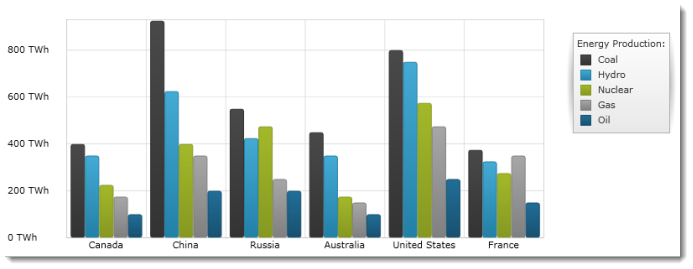

////

|metadata|
{
    "name": "igchartview-column-series",
    "controlName": ["IGChartView"],
    "tags": ["Charting","How Do I"],
    "guid": "bdcfc52c-7b5f-4d06-9248-aa7759bed9e6",  
    "buildFlags": [],
    "createdOn": "2012-05-16T19:06:52.7188216Z"
}
|metadata|
////

= Column Series

== Topic Overview

=== Purpose

This topic explains provides a conceptual overview of the Column series in the  _IGChartView_™ control.

=== In this topic

This topic contains the following sections:

* <<_Ref324841248,Introduction>>

** <<_Ref328070189,Column series summary>>
** <<_Ref326147713,Data requirements>>

* <<_Ref328070198,Adding a Column Series to the  _IGChartView –_   Code Example>>

** <<_Ref326147723,Description>>
** <<_Ref327981615,Prerequisites>>
** <<_Ref326147728,Code>>

* <<_Ref324841253,Related Content>>

[[_Ref324841248]]
== Introduction

[[_Ref326147708]]

=== Column series summary

The column series belongs to a group of category series and uses a collection of rectangles. Extending from the x-axis, on the bottom, toward the corresponding data point values on the y-axis, at the top of the chart, these rectangles reach away from the y-axis in either direction. Column series emphasizes the amount of change over a period or compares multiple items. Values are represented on the y-axis ( _IGNumericYAxis_  ) and categories on the x-axis ( _IGCategoryXAxis_   or  _IGCategoryDateTimeXAxis_  ). The column series uses the same concepts of data plotting as the bar series, but data points are stretched along the horizontal (x-axis) rather than the vertical (y-axis). In other words, the column series is rendered like the bar series but with 90 degrees of counter-clockwise rotation.

[[_Ref326147713]]

=== Data requirements

While the  _IGChartView_   control allows easy binding it to your own data model, it is important that you are supplying the appropriate amounts and types of data required by the series. If the data does not meet the minimum requirements, based on the type of series that you are using, the  _IGChartView_   will appear blank.

The following is a list of data requirements for the column series type:

*  *Required –*  the data model must contain at least one numeric field.
*  *Optional –*  the data model may contain a string or  _NSDate_   field for labels.

[[_Ref324842387]]
[[_Ref328070198]]
== Adding a Column Series to the  _IGChartView_    _–_   Code Example

[[_Ref326147723]]

=== Description

The following code uses the link:igchartview-data-source-helpers.html[IGCategorySeriesDataSourceHelper] to supply randomly generated data to a column series that first gets added to the  _IGChartView_   instance, and then the current UIView adds the  _IGChartView_   as a subview.

[[_Ref327981615]]

=== Prerequisites

This code example requires the inclusion of the  _IGChartView_   framework, detail about how to add this framework can be found in the link:igchartview-adding-the-chart-framework-file.html[Adding the Chart Framework File] topic.

[[_Ref326147728]]

=== Code

*In Objective-C:*

[source,csharp]
----
 NSMutableArray data = [[NSMutableArray alloc] init];
    for (int i = 0; i < 25; i++)
    {
        double value = arc4random() % 100;
        [data addObject:[[NSNumber alloc] initWithDouble:value]];
    }
    IGCategorySeriesDataSourceHelper *source = [[IGCategorySeriesDataSourceHelper alloc] init];
    source.values = data;
    IGChartView *infraChart = [[IGChartView alloc] initWithFrame:self.view.frame];
    [infraChart setAutoresizingMask:UIViewAutoresizingFlexibleWidth|UIViewAutoresizingFlexibleHeight];
    IGCategoryXAxis *xAxis = [[IGCategoryXAxis alloc] initWithKey:@"xAxis"];
    IGNumericYAxis *yAxis = [[IGNumericYAxis alloc] initWithKey:@"yAxis"];
    [infraChart addAxis:xAxis];
    [infraChart addAxis:yAxis];
    IGColumnSeries *columnSeries = [[IGColumnSeries alloc] initWithKey:@"columnSeries"];
    columnSeries.xAxis = xAxis;
    columnSeries.yAxis = yAxis;
    columnSeries.dataSource = source;
    [infraChart addSeries:columnSeries];
    [self.view addSubview:infraChart];
----

*In C#:*

[source,csharp]
----
 List<NSObject> data = new List<NSObject>();
   Random r = new Random();
   for(int i = 0;i <25; i++)
   {
      double val = r.Next() % 100; 
      data.Add(new NSNumber(val));
   }
 IGCategoryDateSeriesDataSourceHelper source = new IGCategoryDateSeriesDataSourceHelper();
   source.Values = data.ToArray();
 IGChartView chart = new IGChartView(this.View.Frame);
   chart.AutoresizingMask = UIViewAutoresizing.FlexibleHeight | UIViewAutoresizing.FlexibleWidth;
  this.View.AddSubview(chart);
 IGCategoryXAxis xAxis = new IGCategoryXAxis("xAxis");
   IGNumericYAxis yAxis = new IGNumericYAxis("yAxis");
   chart.AddAxis(xAxis);
   chart.AddAxis(yAxis);
 IGColumnSeries series= new IGColumnSeries ("series");
   series.XAxis = xAxis;
   series.YAxis = yAxis;
   series.DataSource = source;
   chart.AddSeries(columnSeries);
----

[[_Ref324841253]]
== Related Content

=== Topics

The following content provides additional information related to this topic.

[options="header", cols="a,a"]
|====
|Topic|Purpose

|[[_Hlk328070161]] 

link:igchartview-category-series.html[Category Series]
|This is a group of topics explaining the various types of Category series supported by the _IGChartView_ control.

|====