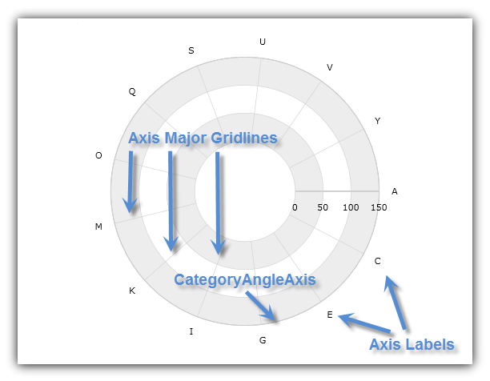
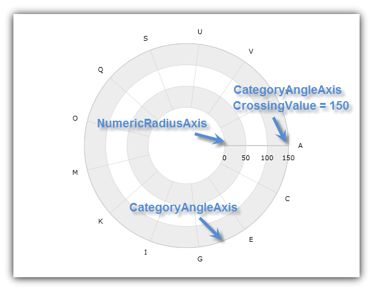
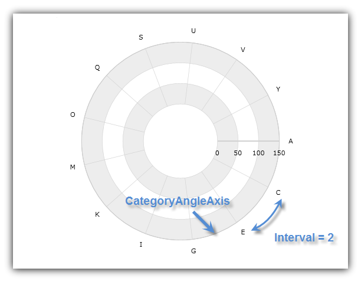
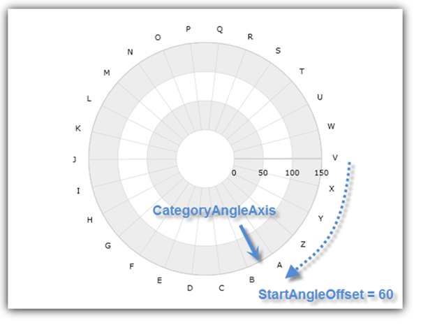

////

|metadata|
{
    "name": "igchartview-configuring-category-angle-axis",
    "controlName": ["IGChartView"],
    "tags": ["Charting","How Do I","Layouts","Styling"],
    "guid": "5aca47e3-3dad-471c-942c-a9f08c9420c7",  
    "buildFlags": [],
    "createdOn": "2012-06-12T13:21:24.6355176Z"
}
|metadata|
////

= Configuring Category Angle Axis

== Topic Overview

=== Purpose

This topic explains, with code examples, how to use the  _IGChartView_™ control’s category angle axis.

=== In this topic

This topic contains the following sections:

* <<_Ref324841248, Introduction >>
* <<_Ref327428459, Axis Crossing Properties >>

** <<_Ref326312342,Description>>
** <<_Ref326312348,Code>>

* <<_Ref327429943, Axis Range Properties >>

** <<_Ref327429950,Description>>
** <<_Ref327429955,Code>>

* <<_Ref327430815, Axis Offset >>

** <<_Ref327430822,Description>>
** <<_Ref327430826,Code>>

* <<_Ref329326709, Related Content >>

=== Requirements

The code snippets in this topic use the  _IGChartView_   and require the inclusion of the  _IGChartView_   framework, detail about how to add this framework can be found in the link:igchartview-adding-igchartview-uiview.html[Adding the IGChartView to a UIView] topic.

[[_Ref324841248]]
== Introduction

[[_Ref326312648]]

=== Introduction to the category angle axis

The  _IGCategoryAngleAxis_   takes the shape of a series of concentric circles of increasing radii emanating from the center of the chart with major gridlines that look like radial lines originating at the center of the chart and extending outwards.

The following image shows a sample implementation of the  _IGCategoryAngleAxis_   shape.

This type of axis is only used with radial series, in combination with  _IGNumericRadiusAxis,_   instead of the  _IGNumericAngleAxis_  , which is used only with Polar series.

[[_Ref327428459]]
[[_Ref324841253]]
== Axis Crossing Properties

[[_Ref326312342]]

=== Description

The  _IGCategoryAngleAxis_   has the following axis crossing properties.

[options="header", cols="a,a"]
|====
|Property Name|Description

|`crossingValue`
|The crossing value is the radius or distance from the beginning of the _IGNumericRadiusAxis_ through to the _IGCategoryAngleAxis_ . In other words, this value determines the location of intersection of the _IGCategoryAngleAxis_ on the _IGNumericRadiusAxis_ . Increasing the value of the `crossingValue` property, moves the _IGCategoryAngleAxis_ farther from the center of the chart while decreasing it moves the angle axis closer to the center along the radius axis. 

For example, if the _IGNumericRadiusAxis_ has a range value from 0 to 100 and a value of 50 is set on the _IGCategoryAngleAxis’_ `crossingValue` property then the angle axis will cross the radius axis at value of 50. By default, the crossing value of the angle is set to the maximum value of radius axis which means that the angle axis will be rendered at the outer ring of the chart.

|`crossingAxis`
|The crossing axis is the axis in the _IGChartView’s_ axes collection that crosses the _IGCategoryAngleAxis_ . This property must be bound to an _IGNumericRadiusAxis_ and vice-versa if there is more than one _IGCategoryAngleAxis_ and one _IGNumericRadiusAxis_ in the _IGChartView_ control’s axes collection. If you don’t specify the crossing axis, then the angle axis will just assume the first axis of the _IGNumericRadiusAxis_ type in the chart’s axes collection is the correct crossing axis.

|====

[[_Ref326312348]]

=== Code

The following code snippet uses the `crossingAxis` and `crossingValue` properties of the  _IGCategoryAngleAxis_   in the  _IGChartView_   control to set the intersection of  _IGCategoryAngleAxis_   with  _IGNumericRadiusAxis_   at a radius of 150° from the beginning of  _IGNumericRadiusAxis_  .

*In Objective-C:*

[source,csharp]
----
 IGChartView *infraChart = [[IGChartView alloc] initWithFrame:self.view.frame];
    IGCategoryAngleAxis *angleAxis = [[IGCategoryAngleAxis alloc] initWithKey:@"angleAxis"];
    IGNumericRadiusAxis *radiusAxis = [[IGNumericRadiusAxis alloc] initWithKey:@"radiusAxis"];
    angleAxis.crossingAxis = radiusAxis;
    angleAxis.crossingValue = 150;
    radiusAxis.crossingAxis = angleAxis;
    radiusAxis.crossingValue = 0;
    [infraChart addAxis:angleAxis];
    [infraChart addAxis:radiusAxis];
----

*In C#:*

[source,csharp]
----
IGChartView chart = new IGChartView(this.View.Frame);
IGCategoryAngleAxis  angleAxis = new IGCategoryAngleAxis("angleAxis");
   IGNumericRadiusAxis radiusAxis = new IGNumericRadiusAxis("radiusAxis");
   angleAxis.CrossingAxis = radiusAxis;
   angleAxis.CrossingValue = 150; 
   radiusAxis.CrossingAxis = angleAxis;
   radiusAxis.CrossingValue = 0;
   chart.AddAxis(angleAxis);
   chart.AddAxis(radiusAxis);
----

The following image is the result implementing the previous code snippet, which results in the labeling the numeric radius axis, category angle axis, and the crossing.

[[_Ref327429943]]
[[_Ref326312360]]
== Axis Range Properties

[[_Ref327429950]]

=== Description

The  _IGCategoryAngleAxis_   does not have minimum and maximum properties. Therefore, it always starts from the first item bound to it in the data set and then displays axis labels, and major gridlines, for the remaining items, spaced at even intervals equal to a value of the `interval` property.

[[_Ref327429955]]

=== Code

The following code snippet sets the axis interval on the  _IGCategoryAngleAxis_   and displays every other axis label in the  _IGChartView_   control.

*In Objective-C:*

[source,csharp]
----
 IGChartView *infraChart = [[IGChartView alloc] initWithFrame:self.view.frame];
    IGCategoryAngleAxis *angleAxis = [[IGNumericAngleAxis alloc] initWithKey:@"angleAxis"];
    IGNumericRadiusAxis *radiusAxis = [[IGNumericRadiusAxis alloc] initWithKey:@"radiusAxis"];
    angleAxis.interval = 2;
    [infraChart addAxis:angleAxis];
    [infraChart addAxis:radiusAxis];
----

*In C#:*

[source,csharp]
----
IGChartView chart = new IGChartView(this.View.Frame);
IGCategoryAngleAxis  angleAxis = new IGCategoryAngleAxis("angleAxis");
   IGNumericRadiusAxis radiusAxis = new IGNumericRadiusAxis("radiusAxis");
   angleAxis.Interval = 2;
chart.AddAxis(angleAxis);
   chart.AddAxis(radiusAxis);
----

The following image illustrates the implementation of the previous code snippet resulting in the labeling of the category angle axis and interval areas on the rendered chart.

[[_Ref327430815]]
== Axis Offset

[[_Ref327430822]]

=== Description

The  _IGCategoryAngleAxis_   references the default starting position of 0°, analogous to the 3 o’clock position (the right-hand side of the chart). However, this starting point is adjustable by setting the  _IGCategoryAngleAxis_   object’s `startAngleOffset` property to an angle that will offset the starting axis location in a clockwise direction. For example, setting the `startAngleOffset` property to 90° results in advancing the starting point 90° in a clockwise rotation, positioning the  _IGCategoryAngleAxis’_   starting point at 90°, analogous to the 6 o’clock position (the bottom of the chart). Conversely, setting the `startAngleOffset` property to 270° advances the  _IGCategoryAngleAxis’_   starting point to 270°, analogous the 12 o’clock position (the top of the chart). By default, the axis index advances the clockwise direction; however, you can set the  _IGCategoryAngleAxis’_   `isInverted` property to `YES`. This will retard the axis indices, or rotates the starting point in a counterclockwise direction.

[[_Ref327430826]]

=== Code

The following code snippet shows how to offset the  _IGCategoryAngleAxis’_   starting point on the  _IGChartView_   control by 60°.

*In Objective-C:*

[source,csharp]
----
 IGChartView *infraChart = [[IGChartView alloc] initWithFrame:self.view.frame];
    IGCategoryAngleAxis *angleAxis = [[IGCategoryAngleAxis alloc] initWithKey:@"angleAxis"];
    IGNumericRadiusAxis *radiusAxis = [[IGNumericRadiusAxis alloc] initWithKey:@"radiusAxis"];
    angleAxis.startAngleOffset = 60;
    [infraChart addAxis:angleAxis];
    [infraChart addAxis:radiusAxis];
----

*In C#:*

[source,csharp]
----
IGChartView chart = new IGChartView(this.View.Frame);
IGCategoryAngleAxis  angleAxis = new IGCategoryAngleAxis("angleAxis");
   IGNumericRadiusAxis radiusAxis = new IGNumericRadiusAxis("radiusAxis");
   angleAxis.StartAngleOffset= 2;
chart.AddAxis(angleAxis);
   chart.AddAxis(radiusAxis);
----

The following image illustrates the result of the implementing the previous code snippet labels the category angle axis and offsets the starting angle of the rendered chart.

[[_Ref329326709]]
== Related Content

=== Topics

The following topics provide additional information related to this topic.

[options="header", cols="a,a"]
|====
|Topic|Purpose

| link:igchartview-axis-crossing.html[Axis Crossing]
|This topic uses code examples to demonstrate how to create an axis crossing on the _IGChartView_ control.

| link:igchartview-axis-scales-and-intervals.html[Axis Scales and Intervals]
|This topic explains, with code examples, how to use axis scales and intervals on the _IGChartView_ control.

| link:igchartview.html[IGChartView]
|This topic serves as a gateway to the features and functionality of the _IGChartView_ control.

| link:igchartview-configuring-numeric-angle-axis.html[Configuring Numeric Angle Axis]
|This topic demonstrates, with code examples, how to use _IGNumericAngleAxis_ in the _IGChartView_ .

| link:igchartview-configuring-numeric-radius-axis.html[Configuring Numeric Radius Axis]
|This topic demonstrates, with code examples, how to use _IGNumericRadiusAxis_ in the _IGChartView_ .

|====