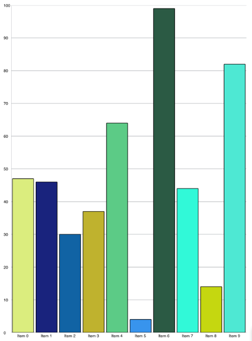

////

|metadata|
{
    "name": "igchartview-configuring-custom-highlighting",
    "tags": ["Getting Started","How Do I","Styling"],
    "controlName": ["IGChartView"],
    "guid": "c4a53044-b621-49e3-aed9-476bda79f40d",  
    "buildFlags": [],
    "createdOn": "2014-03-18T17:27:00.8410619Z"
}
|metadata|
////

= Configuring Custom Highlighting

== Topic Overview

=== Purpose

This topic provides a brief overview of custom highlighting on the  _IGChartView_™ control and demonstrates their use with a code example.

=== In this topic

This topic contains the following sections:

* <<_Ref324841248, Introduction >>
* <<_Ref255193732, Customizing Column Series Points – Code Example >>

** <<_Ref327344209,Description>>
** <<_Ref252521837,Preview>>
** <<_Ref327523606,Prerequisites>>
** <<_Ref327344217,Code>>

* <<_Ref215823716, Related Content >>

[[_Ref324841248]]
== Introduction

=== Custom highlighting summary

Custom highlighting allows for style customization of category series data points and markers displayed on the  _IGChartView_  . To use this functionality, adopt the  _IGChartViewDelegate_   protocol and override any of the following methods.

* `- (void)chartSeriesRenderHighlight:(IGChartView $$*$$)chartView forSeries:(IGSeries $$*$$)series withArgs:(IGAssigningCategoryStyleEventArgs $$* $$)args`
* `- (void)chartSeriesRenderMarkerHighlight:(IGChartView $$*$$)chartView forSeries:(IGSeries $$*$$)series withArgs:(IGAssigningCategoryMarkerStyleEventArgs $$* $$)args`

.Note:
[NOTE]
====
Stacked series chart types are not currently supported for this style customization.
====

When the series renders to the chart and calls these delegate methods it passes in an argument class object containing properties for fill, stroke, opacity and point index information for querying the associated data source item.

.Note:
[NOTE]
====
When your chart displays lots of data points, data points can become condensed and a single data point can represent several points. The argument class object passed to these delegate methods contains properties for `startIndex` and `endIndex`.
====

Setting the `isCustomCategoryMarkerStyleAllowed` or `isCustomCategoryStyleAllowed` property, located on the participating series, to `YES` enable this functionality; however, this could seriously affect chart performance.

[[_Ref255193732]]
[[_Ref324841253]]
== Customizing Column Series Points – Code Example

[[_Ref327344209]]

=== Description

The code example below creates an instance of the  _IGChartView_   containing an  _IGColumnSeries_   with 10 points of custom coloring.

[[_Ref252521837]]

=== Preview

[[_Ref327523606]]

=== Prerequisites

This code example requires the inclusion of the  __IG__  __Chart__  framework; details about how to add this framework are available in the link:igchartview-adding-the-chart-framework-file.html[Adding the Chart Framework File] topic.

[[_Ref327344217]]

=== Code

*In Objective-C:*

[source,csharp]
----
@interface igViewController () <IGChartViewDelegate>
{
    NSMutableArray *_values;
    IGChartView *_chart;
    IGCategorySeriesDataSourceHelper *_source;
    IGColumnSeries *_series;
}
@end
@implementation igViewController
- (void)viewDidLoad
{
    [super viewDidLoad];
    self.view.backgroundColor = [UIColor whiteColor];
    [self generateData:10];
    _source = [[IGCategorySeriesDataSourceHelper alloc] initWithValues:_values];
    _chart = [[IGChartView alloc] initWithFrame:CGRectInset(self.view.bounds, 10, 10)];
    _chart.autoresizingMask = UIViewAutoresizingFlexibleWidth|UIViewAutoresizingFlexibleHeight;
    _chart.delegate = self;
    [self.view addSubview:_chart];
    _series = (IGColumnSeries *)[_chart addSeriesForType:[IGColumnSeries class] usingKey:@"series" withDataSource:_source firstAxisKey:@"xAxis" secondAxisKey:@"yAxis"];
    _series.xAxis.majorStrokeThickness = 0;
    _series.isCustomCategoryStyleAllowed = YES;
}
- (void)generateData:(NSInteger)totalItems
{
    _values = [[NSMutableArray alloc] init];
    for (int i = 0; i < totalItems; i++)
    {
        [_values addObject:[[NSNumber alloc] initWithDouble:arc4random_uniform(100)]];
    }
}
- (void)chartSeriesRenderHighlight:(IGChartView *)chartView forSeries:(IGSeries *)series withArgs:(IGAssigningCategoryStyleEventArgs * )args
{
    CGFloat redColor = arc4random_uniform(255)/255.0;
    CGFloat greenColor = arc4random_uniform(255)/255.0;
    CGFloat blueColor = arc4random_uniform(255)/255.0;
    args.fill = [[IGBrush alloc] initWithR:redColor andG:greenColor andB:blueColor andA:1.0];
    args.stroke = [[IGBrush alloc] initWithColor:[UIColor blackColor]];
}
@end
----

*In C#:*

[source,csharp]
----
public class ChartDelegate : IGChartViewDelegate
{
      public override void RenderHighlight (IGChartView chartView, IGSeries series, IGAssigningCategoryStyleEventArgs args)
      {
            float redColor = new Random (DateTime.Now.Millisecond).Next(255)/255.0f;
            float greenColor = new Random (2 * DateTime.Now.Millisecond).Next(255)/255.0f;
            float blueColor = new Random (3 * DateTime.Now.Millisecond).Next(255)/255.0f;
            args.Fill = new IGBrush (redColor, greenColor, blueColor, 1.0f);
            args.Stroke = new IGBrush (UIColor.Black);
      }
}
public partial class ChartCustomHighlighting_CSViewController : UIViewController
{
      List<NSObject> _values;
      IGChartView _chart;
      IGCategorySeriesDataSourceHelper _source;
      IGColumnSeries _series;
      public ChartCustomHighlighting_CSViewController ()
      {
      }
      public override void ViewDidLoad ()
      {
            base.ViewDidLoad ();
            this.View.BackgroundColor = UIColor.White;
            GenerateData (10);
            _source = new IGCategorySeriesDataSourceHelper (_values.ToArray ());
            _chart = new IGChartView ();
            RectangleF chartRect = this.View.Bounds;
            chartRect.Inflate (-10, -10);
            _chart.Frame = chartRect;
            _chart.AutoresizingMask = UIViewAutoresizing.FlexibleWidth|UIViewAutoresizing.FlexibleHeight;
            _chart.Delegate = new ChartDelegate();
            this.View.Add (_chart);
            _series = (IGColumnSeries)_chart.AddSeries (new Class ("IGColumnSeries"), "series", _source, "xAxis", "yAxis");
            _series.XAxis.MajorStrokeThickness = 0;
            _series.IsCustomCategoryStyleAllowed = true;
      }
      public void GenerateData(int TotalItems)
      {
            _values = new List<NSObject>();
            for (int i = 0; i < TotalItems; i++)
            {
                  _values.Add (new NSNumber (new Random (i).Next (100)));
            }
      }
}
----

[[_Ref215823716]]
== Related Content

=== Topics

The following topic provides additional information related to this topic.

[options="header", cols="a,a"]
|====
|Topic|Purpose

| link:igchartview.html[IGChartView]
|The topics in this group cover enabling, configuring, and using the _IGChartView_ control’s supported features.

|====