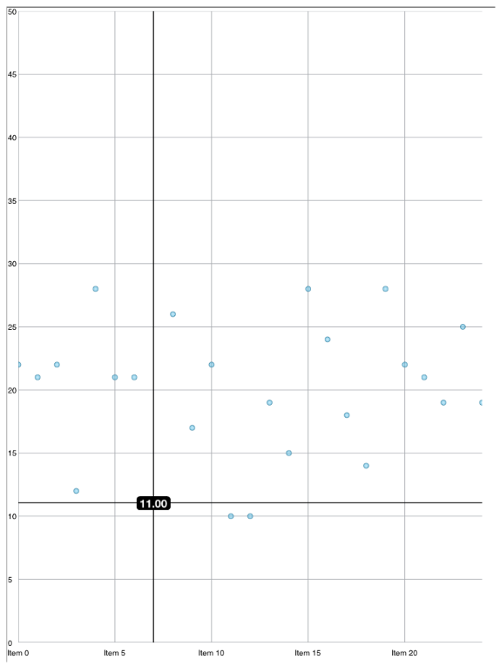

////

|metadata|
{
    "name": "igchartview-configuring-highlighting-layers",
    "tags": ["Getting Started","How Do I","Styling"],
    "controlName": ["IGChartView"],
    "guid": "a48d830b-7d22-498b-999a-616a5e476b14",  
    "buildFlags": [],
    "createdOn": "2014-03-18T17:31:28.0393448Z"
}
|metadata|
////

= Configuring Highlighting Layers

== Topic Overview

=== Purpose

This topic provides an overview of configuring highlighting layers on the  _IGChartView_™ control and demonstrates their use with a code example.

=== In this topic

This topic contains the following sections:

* <<_Ref324841248, Introduction >>
* <<_Ref255193732, Using the Crosshair Series Layer – Code Example >>

** <<_Ref327344209,Description>>
** <<_Ref252521837,Preview>>
** <<_Ref327523606,Prerequisites>>
** <<_Ref327344217,Code>>

* <<_Ref215823716, Related Content >>

[[_Ref324841248]]
== Introduction

=== Highlighting layers summary

The  _IGChartView_   provides series layers which allow for highlighting of data points via interaction with the screen. The following table details the supported highlighting layers.

[options="header", cols="a,a,a"]
|====
|Highlighting Layer|Description|Featured Properties

| _IGCrosshairLayer_ 
|Represents an annotation layer that displays crosshair lines that crosses through the closest value of the target series.
|
* `useInterpolation` – Determines if the drawn crosshair should interpolate values or just attach to actual point values `verticalLineVisiblity` / `horizontalLineVisibility` – Determines if the Vertical/Horizontal line should display when using this layer 

* `targetSeries` - By default the crosshair will show for each series loaded. If you want the crosshair to only appear for a single series you would associate it using this property. 

| _IGCategoryItemHighlightLayer_ 
|Represents an annotation layer that highlights items in a series that use a category axis either by drawing a banded shape at their position, or by rendering a marker at their position. Depending on the type of series, the default highlight will be affected. To override the type of highlight used, you can set the `highlightType` property.
|
* `useInterpolation` – Determines if the drawn crosshair should interpolate values or just attach itself to actual values 

* `bandHighlightWidth` - The width to use for the highlight region if drawing a band rather than filling a category 

* `highlightType` - The type of highlight shape to use when highlighting items 

* `skipUnknownValues` - Determines whether or not to skip unknown values when searching for series values 

| _IGCategoryHighlightLayer_ 
|Represents an annotation layer targeting a category axis, or all category axes in the chart. 

If the axis contains any series that are aligned between major gridlines of the axis (column, waterfall, etc) this will render a shape that fills the current category. Otherwise, it renders a band with an adjustable thickness at the closest gridline. 

Setting `useIterpolation` to `YES` causes the x position in the latter case to become affixed to the x position.
|
* `useInterpolation` – Determines if the drawn crosshair should interpolate values or just attach to actual values 

* `bandHighlightWidth` - The width to use for the highlight region if drawing a band rather than filling a category 

* `targetAxis` - The axis to target this annotation to. If null, this annotation targets all category axes simultaneously 

|====

In order to use highlighting layers functionality, create a new instance of the layer and add the series to the  _IGChartView_  .

*In Objective-C:*

[source,csharp]
----
IGCrosshairLayer *crosshairLayer = [[IGCrosshairLayer alloc] initWithKey:@"crosshair"];
crosshairLayer.brush = [[IGBrush alloc] initWithColor:[UIColor blackColor]];
 [chart addSeries:crosshairLayer];
----

*In C#:*

[source,csharp]
----
IGCrosshairLayer crosshairLayer = new IGCrosshairLayer ("crosshair");
crosshairLayer.Brush = new IGBrush (UIColor.Black);
chart.AddSeries (crosshairLayer);
----

.Note:
[NOTE]
====
It is highly recommended that you add these layers last to the series collection to ensure that they are rendered on top of other layers. Otherwise there is a good chance you will not be able to see them.
====

[[_Ref255193732]]
[[_Ref324841253]]
== Using the Crosshair Series Layer – Code Example

[[_Ref327344209]]

=== Description

The code example below creates an instance of the  _IGChartView_   that adds an  _IGCrosshairLayer_   to the chart. When a user long presses on the chart plotting, the crosshairs appear along with a tooltip overlaying the point to display the value.

[[_Ref252521837]]

=== Preview

[[_Ref327523606]]

=== Prerequisites

This code example requires the inclusion of the  _IGChart_   framework; details on how to add this framework are available in the link:igchartview-adding-the-chart-framework-file.html[Adding the Chart Framework File] topic.

[[_Ref327344217]]

=== Code

*In Objective-C:*

[source,csharp]
----
@interface igViewController () <IGChartViewDelegate>
{
    IGChartView *_chart;
    IGCategorySeriesDataSourceHelper *_source;
    IGPointSeries *_series;
    IGCrosshairLayer *_crosshairLayer;
    UILabel *_label;
    NSMutableArray *_data;
}
@end
@implementation igViewController
- (void)viewDidLoad
{
    [super viewDidLoad];
    self.view.backgroundColor = [UIColor whiteColor];
    [self generateData:25];
    _source = [[IGCategorySeriesDataSourceHelper alloc] initWithValues:_data];
    _chart = [[IGChartView alloc] initWithFrame:CGRectInset(self.view.bounds, 10, 10)];
    _chart.autoresizingMask = UIViewAutoresizingFlexibleHeight|UIViewAutoresizingFlexibleWidth;
    _chart.theme = [IGChartGradientThemes IGTheme];
    _chart.tooltipPinLocation = IGTooltipPinLocationPoint;
    _chart.delegate = self;
    [self.view addSubview:_chart];
    _series = (IGPointSeries *)[_chart addSeriesForType:[IGPointSeries class]
                                              usingKey:@"series"
                                        withDataSource:_source
                                          firstAxisKey:@"xAxis"
                                         secondAxisKey:@"yAxis"];
    _series.xAxis.extent = 30;
    _series.yAxis.minimum = 0;
    _series.yAxis.maximum = 50;
    _crosshairLayer = [[IGCrosshairLayer alloc] initWithKey:@"crosshair"];
    _crosshairLayer.brush = [[IGBrush alloc] initWithColor:[UIColor blackColor]];
    [_chart addSeries:_crosshairLayer];
}
- (UIView *)chartView:(IGChartView *)chartView viewForTooltipWithItemlist:(NSDictionary * )itemlist
{
    IGCategoryPoint *point = [itemlist objectForKey:@"series"];
    if (!_label)
    {
        _label = [[UILabel alloc] init];
        _label.backgroundColor = [UIColor blackColor];
        _label.textColor = [UIColor whiteColor];
        _label.font = [UIFont fontWithName:@"HelveticaNeue-Bold" size:17.0];
        _label.layer.cornerRadius = 5;
    }
    _label.text = [NSString stringWithFormat:@" %.2f ", point.value];
    [_label sizeToFit];
    return _label;
}
- (void)generateData:(NSInteger)totalItems
{
    _data = [[NSMutableArray alloc] init];
    for (int i = 0; i < totalItems; i++)
    {
        [_data addObject:[[NSNumber alloc] initWithDouble:arc4random_uniform(20) + 10]];
    }
}
@end
----

*In C#:*

[source,csharp]
----
public class ChartDelegate : IGChartViewDelegate
{
      UILabel _label;
      public override UIView ViewForTooltip (IGChartView chartView, NSDictionary itemlist, PointF point)
      {
            IGCategoryPoint cPoint = itemlist.ObjectForKey(new NSString("series")) as IGCategoryPoint;
            if (_label == null)
            {
                  _label = new UILabel ();
                  _label.BackgroundColor = UIColor.Black;
                  _label.TextColor = UIColor.White;
                  _label.Font = UIFont.FromName ("HelveticaNeue-Bold", 17.0f);
                  _label.Layer.CornerRadius = 5;
            }
            _label.Text = String.Format (" {0:#.00} ", cPoint.Value);
            _label.SizeToFit ();
            return _label;
      }
}
public partial class ChartHighlightingLayers_CSViewController : UIViewController
{
      IGChartView _chart;
      IGCategorySeriesDataSourceHelper _source;
      IGPointSeries _series;
      IGCrosshairLayer _crosshairLayer;
      List<NSObject> _data;
      public ChartHighlightingLayers_CSViewController ()
      {
      }
      public override void ViewDidLoad ()
      {
            base.ViewDidLoad ();
            this.View.BackgroundColor = UIColor.White;
            GenerateData (25);
            _source = new IGCategorySeriesDataSourceHelper (_data.ToArray ());
            _chart = new IGChartView ();
            RectangleF chartRect = this.View.Bounds;
            chartRect.Inflate (-10, -10);
            _chart.Frame = chartRect;
            _chart.AutoresizingMask = UIViewAutoresizing.FlexibleHeight|UIViewAutoresizing.FlexibleWidth;
            _chart.Theme = IGChartGradientThemes.IGTheme();
            _chart.TooltipPinLocation = IGTooltipPinLocation.IGTooltipPinLocationPoint;
            _chart.Delegate = new ChartDelegate();
            this.View.Add (_chart);
            _series = _chart.AddSeries (new Class ("IGPointSeries"), "series", _source, "xAxis", "yAxis") as IGPointSeries;
            _series.XAxis.Extent = 30;
            _series.YAxis.Minimum = 0;
            _series.YAxis.Maximum = 50;
            _crosshairLayer = new IGCrosshairLayer ("crosshair");
            _crosshairLayer.Brush = new IGBrush (UIColor.Black);
            _chart.AddSeries (_crosshairLayer);
      }
      public void GenerateData(int TotalItem)
      {
            _data = new List<NSObject> ();
            for (int i = 0; i < TotalItem; i++)
            {
                  _data.Add (new NSNumber (new Random (i * DateTime.Now.Millisecond).Next (10, 30)));
            }
      }
      public override bool PrefersStatusBarHidden ()
      {
            return true;
      }
}
----

[[_Ref215823716]]
== Related Content

=== Topics

The following topic provides additional information related to this topic.

[options="header", cols="a,a"]
|====
|Topic|Purpose

| link:igchartview.html[IGChartView]
|The topics in this group cover enabling, configuring, and using the _IGChartView_ control’s supported features.

|====