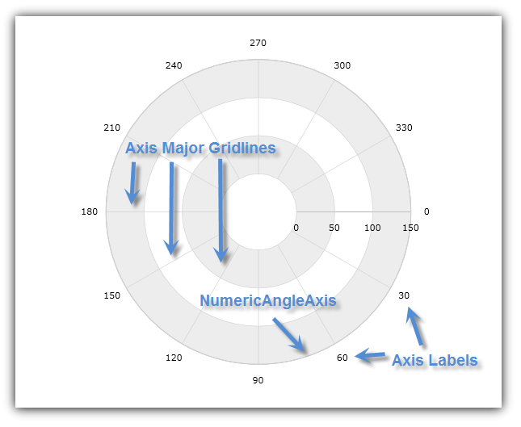
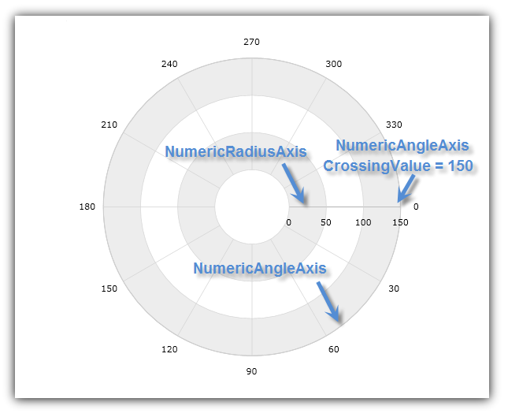
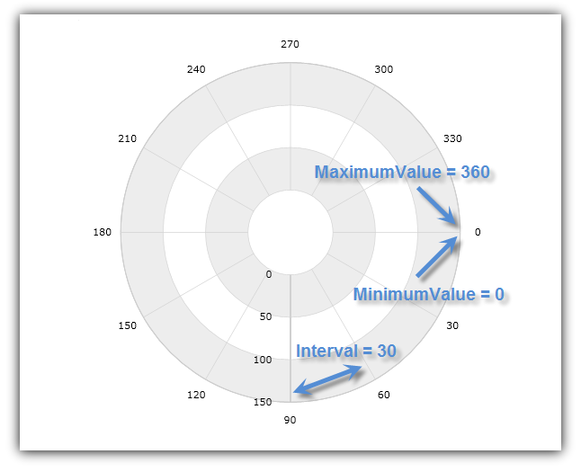
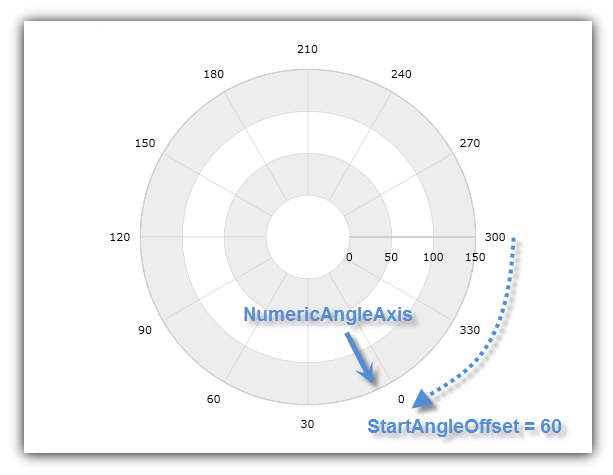

////

|metadata|
{
    "name": "igchartview-configuring-numeric-angle-axis",
    "controlName": ["IGChartView"],
    "tags": ["Charting","How Do I","Layouts","Styling"],
    "guid": "86911bf4-8869-4348-bb2c-0baaeedf26f0",  
    "buildFlags": [],
    "createdOn": "2012-06-12T13:20:16.7919717Z"
}
|metadata|
////

= Configuring Numeric Angle Axis

== Topic Overview

=== Purpose

This topic explains, with code examples, how to use the  _IGChartView_™ control’s numeric angle axis.

=== In this topic

This topic contains the following sections:

* <<_Ref324841248, Introduction >>
* <<_Ref327428459, Axis Crossing Properties >>

** <<_Ref326312342,Description>>
** <<_Ref326312348,Code>>

* <<_Ref327429943, Axis Range Properties >>

** <<_Ref327429950,Description>>
** <<_Ref327429955,Code>>

* <<_Ref327430815, Axis Offset >>

** <<_Ref327430822,Description>>
** <<_Ref327430826,Code>>

* <<_Ref326312360, Related Content >>

=== Requirements

The code snippets in this topic use the  _IGChartView_   and require the inclusion of the  _IGChartView_   framework, for more information about how to add this framework see the link:igchartview-adding-igchartview-uiview.html[Adding the IGChartView to a UIView] topic.

[[_Ref324841248]]
== Introduction

[[_Ref326312648]]

=== Introduction to the numeric angle axis

The  _IGNumericAngleAxis_   takes the shape of a series of concentric circles of increasing radii emanating from the center of the chart with major gridlines that look like radial lines originating at the center of the chart and extending outwards.

The following image illustrates the effect of implementing the  _IGNumericAngleAxis_   shape.

This type of axis can only be used with a Polar series, in combination with  _IGNumericRadiusAxis_  , instead of the  _IGCategoryAngleAxis_  , which is only used with a Radial series.

[[_Ref327428459]]
[[_Ref324841253]]
== Axis Crossing Properties

[[_Ref326312342]]

=== Description

The  _IGNumericAngleAxis_   has the following axis crossing properties.

[options="header", cols="a,a"]
|====
|Property Name|Description

|`crossingValue`
|The crossing value is the radius or distance from the beginning of the _IGNumericRadiusAxis_ . This value determines the location of intersection of the _IGNumericAngleAxis_ on the _IGNumericRadiusAxis_ . Increasing the value of the `crossingValue` property will move the _IGNumericAngleAxis_ farther from the center of the chart, and decreasing it will move the angle axis closer to the center along the radius axis. For example, if the _IGNumericRadiusAxis_ has a range value from 0 to 100 and a value of 50 is set on the `crossingValue` property of the _IGNumericAngleAxis_ then the angle axis will cross the radius axis at value of 50. By default, the crossing value of the angle is set to the maximum value of radius axis, which means that the angle axis will be rendered at the outer ring of the chart.

|`crossingAxis`
|The crossing axis is the axis in the _IGChartView’s_ axes collection that crosses the _IGNumericAngleAxis_ . This property must be bound to an _IGNumericRadiusAxis_ if there is more than one _IGNumericAngleAxis_ and one _IGNumericRadiusAxis_ in the axes collection. If you don’t specify the crossing axis, then the angle axis will assume the first axis of the _IGNumericRadiusAxis_ type in the chart’s axes collection is the correct crossing axis.

|====

[[_Ref326312348]]

=== Code

The following code snippet uses the `crossingAxis` and `crossingValue` properties of the  _IGNumericAngleAxis_   in the  _IGChartView_   control. It sets the intersection of  _IGNumericAngleAxis_   with  _IGNumericRadiusAxis_   at a radius of 150 from the beginning of the  _IGNumericRadiusAxis_  .

*In Objective-C:*

[source,csharp]
----
 IGChartView *infraChart = [[IGChartView alloc] initWithFrame:self.view.frame];
    IGNumericAngleAxis *angleAxis = [[IGNumericAngleAxis alloc] initWithKey:@"angleAxis"];
    IGNumericRadiusAxis *radiusAxis = [[IGNumericRadiusAxis alloc] initWithKey:@"radiusAxis"];
    angleAxis.crossingAxis = radiusAxis;
    angleAxis.crossingValue = 150;
    radiusAxis.crossingAxis = angleAxis;
    radiusAxis.crossingValue = 0;
    [infraChart addAxis:angleAxis];
    [infraChart addAxis:radiusAxis];
----

*In C#:*

[source,csharp]
----
IGChartView chart = new IGChartView(this.View.Frame);
IGNumericAngleAxis angleAxis = new IGNumericAngleAxis ("angleAxis");
   IGNumericRadiusAxis radiusAxis = new IGNumericRadiusAxis("radiusAxis");
   angleAxis.CrossingAxis = radiusAxis;
   angleAxis.CrossingValue = 150; 
   radiusAxis.CrossingAxis = angleAxis;
   radiusAxis.CrossingValue = 0;
   chart.AddAxis(angleAxis);
   chart.AddAxis(radiusAxis);
----

The following image illustrates the effect of implementing this code snippet and labels the numeric radius axis, numeric angle axis, and the crossing.

[[_Ref327429943]]
== Axis Range Properties

[[_Ref327429950]]

=== Description

The  _IGNumericAngleAxis_   has the following range properties.

[options="header", cols="a,a"]
|====
|Property Name|Description

|`interval`
|The interval between the consecutive major gridlines or angular separation between radial lines starting from the center of the chart.

|`maximum`
|The position at which the axis ends.

|`minimum`
|The position at which the axis begins.

|====

By default, the  _IGChartView_   uses an auto range which means that the `minimum` property will be set to a data point with the smallest angular data column and the `maximum` property will be set to a data point with the largest angular data column. However, manually setting a value range on the  _IGNumericAngleAxis_   will hide all data points with angular data columns falling outside this range. For example, if a collection of data points with angular data column varying from 0 to 360 is bound to a series and a value range from 50 (`minimum`) to 100 (`maximum`) is set on the  _IGNumericAngleAxis_  , then the chart will only show data points with angular data column between 50 and 100.

[[_Ref327429955]]

=== Code

The following code snippet uses range values with the  _IGNumericAngleAxis_   in the  _IGChartView_  . It sets the angle range between 0 and 360 and intervals of the major gridlines every 30 degrees.

*In Objective-C:*

[source,csharp]
----
 IGChartView *infraChart = [[IGChartView alloc] initWithFrame:self.view.frame];
    IGNumericAngleAxis *angleAxis = [[IGNumericAngleAxis alloc] initWithKey:@"angleAxis"];
    IGNumericRadiusAxis *radiusAxis = [[IGNumericRadiusAxis alloc] initWithKey:@"radiusAxis"];
    angleAxis.minimum = 0;
    angleAxis.maximum = 360;
    angleAxis.interval = 30;
    [infraChart addAxis:angleAxis];
    [infraChart addAxis:radiusAxis];
----

*In C#:*

[source,csharp]
----
 IGChartView chart = new IGChartView(this.View.Frame);
 IGNumericAngleAxis angleAxis = new IGNumericAngleAxis ("angleAxis");
   IGNumericRadiusAxis radiusAxis = new IGNumericRadiusAxis("radiusAxis");
   radiusAxis.Minimum= 0;
   radiusAxis.Maximum= 360; 
   radiusAxis.Interval= 30;
   chart.AddAxis(angleAxis);
   chart.AddAxis(radiusAxis);
----

The following image illustrates the effect of implementing this code snippet and labels the minimum, maximum, and interval areas of the rendered chart.

[[_Ref327430815]]
== Axis Offset

[[_Ref327430822]]

=== Description

The  _IGCategoryAngleAxis_   references the default starting position of 0°, analogous to the 3 o’clock position (the right-hand side of the chart). However, this starting point is adjustable by setting the  _IGCategoryAngleAxis_   object’s `startAngleOffset` property to an angle that will offset the starting axis location in a clockwise direction. For example, setting the `startAngleOffset` property to 90° results in advancing the starting point 90° in a clockwise rotation, positioning the  _IGCategoryAngleAxis’_   starting point at 90°, analogous to the 6 o’clock position (the bottom of the chart). Conversely, setting the `startAngleOffset` property to 270° advances the  _IGCategoryAngleAxis’_   starting point to 270°, analogous the 12 o’clock position (the top of the chart). By default, the axis index advances the clockwise direction; however, you can set the  _IGCategoryAngleAxis’_   `isInverted` property to `YES`. This will retard the axis indices, or rotates the starting point in a counterclockwise direction.

[[_Ref327430826]]

=== Code

The following code snippet shows how to offset the starting point of the  _IGNumericAngleAxis,_   in rendering the  _IGChartView_   control by 60° degrees.

*In Objective-C:*

[source,csharp]
----
 IGChartView *infraChart = [[IGChartView alloc] initWithFrame:self.view.frame];
    IGNumericAngleAxis *angleAxis = [[IGNumericAngleAxis alloc] initWithKey:@"angleAxis"];
    IGNumericRadiusAxis *radiusAxis = [[IGNumericRadiusAxis alloc] initWithKey:@"radiusAxis"];
    angleAxis.startAngleOffset = 60;
    [infraChart addAxis:angleAxis];
    [infraChart addAxis:radiusAxis];
----

*In C#:*

[source,csharp]
----
 IGChartView chart = new IGChartView(this.View.Frame);
 IGCategoryAngleAxis  angleAxis = new IGCategoryAngleAxis("angleAxis");
   IGNumericRadiusAxis radiusAxis = new IGNumericRadiusAxis("radiusAxis");
   angleAxis.StartAngleOffset= 60;
 chart.AddAxis(angleAxis);
   chart.AddAxis(radiusAxis);
----

The following image illustrates the effect of implementing this code snippet and labels the numeric angle axis and start angle offset areas of the rendered chart.

[[_Ref326312360]]
== Related Content

=== Topics

The following topics provide additional information related to this topic.

[options="header", cols="a,a"]
|====
|Topic|Purpose

| link:igchartview-axis-crossing.html[Axis Crossing]
|This topic uses code examples to demonstrate how to create an axis crossing on the _IGChartView_ control.

| link:igchartview-axis-scales-and-intervals.html[Axis Scales and Intervals]
|This topic explains, with code examples, how to use axis scales and intervals on the _IGChartView_ control.

| link:igchartview.html[IGChartView]
|This topic serves as a gateway to the features and functionality of the _IGChartView_ control.

| link:igchartview-configuring-category-angle-axis.html[Configuring Category Angle Axis]
|This topic demonstrates, with code examples, how to use _IGCategoryAngleAxis_ in the _IGChartView_ .

| link:igchartview-configuring-numeric-radius-axis.html[Configuring Numeric Radius Axis]
|This topic demonstrates, with code examples, how to use _IGNumericRadusAxis_ in the _IGChartView_ .

|====