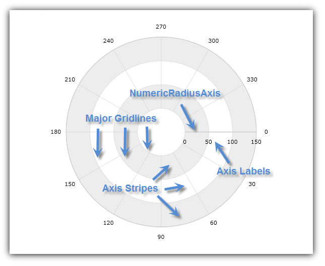
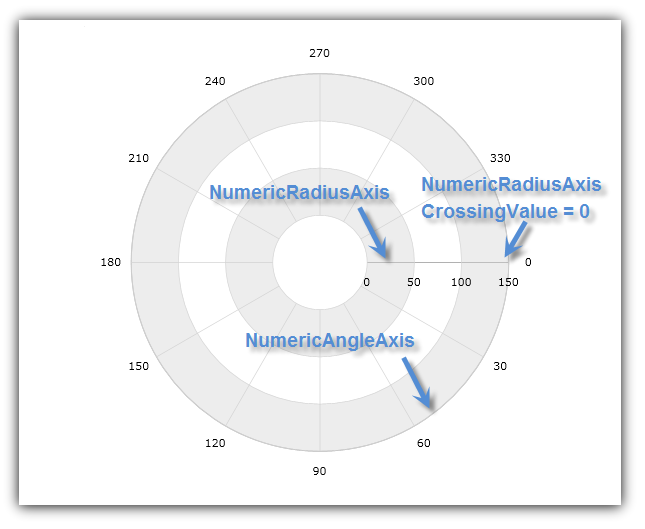
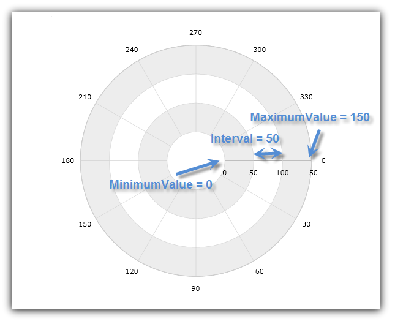
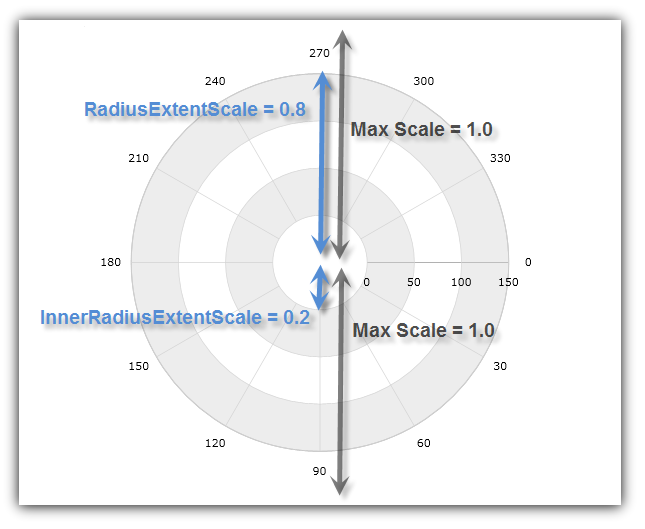

////

|metadata|
{
    "name": "igchartview-configuring-numeric-radius-axis",
    "controlName": ["IGChartView"],
    "tags": ["Charting","How Do I","Layouts","Styling"],
    "guid": "23e2cf1f-941d-49e6-9962-9ea9be5bd5f8",  
    "buildFlags": [],
    "createdOn": "2012-06-12T13:20:54.005862Z"
}
|metadata|
////

= Configuring Numeric Radius Axis

== Topic Overview

=== Purpose

This topic explains, with code examples, how to use the  _IGChartView_™ control’s numeric radius axis.

=== In this topic

This topic contains the following sections:

* <<_Ref324841248, Introduction >>
* <<_Ref327428459, Axis Crossing Properties >>

** <<_Ref326312342,Description>>
** <<_Ref326312348,Code>>

* <<_Ref327429943, Axis Range Properties >>

** <<_Ref327429950,Description>>
** <<_Ref327429955,Code>>

* <<_Ref327434110, Axis Extent Scales >>

** <<_Ref327430822,Description>>
** <<_Ref327430826,Code>>

* <<_Ref326312360, Related Content >>

=== Requirements

The code examples used in this topic use the  _IGChartView_   and require the inclusion of the  _IGChartView_   framework. For more information about how adding this framework, please refer to the link:igchartview-adding-igchartview-uiview.html[Adding the IGChartView to a UIView] topic.

[[_Ref324841248]]
== Introduction

[[_Ref326312648]]

=== Introduction to the numeric radius axis

The  _IGNumericRadiusAxis_    _IGChartView_   control takes the shape of a ray emanating from the center of a polar graph and pointing outwards to the boundary of the chart plot area. As illustrated below, the major gridlines of this axis consist of several, equally spaced nested concentric circles of increasing radii.

This type of axis can only be used with, a Polar series in combination with  _IGNumericAngleAxis_  ; or alternately with a Radial series in combination with  _IGCategoryAngleAxis_  .

[[_Ref327428459]]
[[_Ref324841253]]
== Axis Crossing Properties

[[_Ref326312342]]

=== Description

The  _IGNumericRadiusAxis_   has the following axis crossing properties.

[options="header", cols="a,a"]
|====
|Property Name|Description

|`crossingValue`
|The crossing value is the relative angle between the _IGNumericRadiusAxis_ and the polar axis with a valid range of 0° to 360°. By default, this value is set to zero degrees, analogous to the 3 o’clock position, on the _IGCategoryAngleAxis_ or _IGNumericAngleAxis_ . The value of the `crossingValue` property indicates the number of degrees with which to rotate the _IGNumericRadiusAxis_ clockwise from the horizontal polar axis (the axis running through the 3 and 9 o’clock position). For example, a value of 90 set on `crossingValue` property orients the _IGNumericRadiusAxis_ to the vertical polar axis (the axis running through the 6 and 12 o’clock positions 90° and 270° respectively).

|`crossingAxis`
|The crossing axis is the axis in the _IGChartView_ control’s axes collection that crosses the _IGNumericRadiusAxis_ . This property must be bound to an _IGNumericAngleAxis_ (Polar series) or _IGCategoryAngleAxis_ (Radial series), and vice-versa, if there is more than one _IGNumericRadiusAxis_ and one _IGNumericAngleAxis_ or _IGCategoryAngleAxis_ in the axes collection of the _IGChartView_ .

|====

[[_Ref326312348]]

=== Code

The following code snippet uses the `crossingAxis` and `crossingValue` properties of the  _IGNumericRadiusAxis_   in the  _IGChartView_   control. It sets the intersection of  _IGNumericRadiusAxis_   with  _IGNumericAngleAxis_   at an angle of 0° from the beginning of the  _IGNumericAngleAxis_  .

*In Objective-C:*

[source,csharp]
----
 IGChartView *infraChart = [[IGChartView alloc] initWithFrame:self.view.frame];
    IGNumericAngleAxis *angleAxis = [[IGNumericAngleAxis alloc] initWithKey:@"angleAxis"];
    IGNumericRadiusAxis *radiusAxis = [[IGNumericRadiusAxis alloc] initWithKey:@"radiusAxis"];
    angleAxis.crossingAxis = radiusAxis;
    angleAxis.crossingValue = 150;
    radiusAxis.crossingAxis = angleAxis;
    radiusAxis.crossingValue = 0;
    [infraChart addAxis:angleAxis];
    [infraChart addAxis:radiusAxis];
----

*In C#:*

[source,csharp]
----
IGChartView chart = new IGChartView(this.View.Frame);
IGNumericAngleAxis angleAxis = new IGNumericAngleAxis ("angleAxis");
   IGNumericRadiusAxis radiusAxis = new IGNumericRadiusAxis("radiusAxis");
   angleAxis.CrossingAxis = radiusAxis;
   angleAxis.CrossingValue = 150; 
   radiusAxis.CrossingAxis = angleAxis;
   radiusAxis.CrossingValue = 0;
   chart.AddAxis(angleAxis);
   chart.AddAxis(radiusAxis);
----

The following image illustrates the effect of implementing this code snippet, and labels the numeric radius axis, numeric angle axis, and the crossing.

[[_Ref327429943]]
== Axis Range Properties

[[_Ref327429950]]

=== Description

The  _IGNumericAngleAxis_   has the following range properties.

[options="header", cols="a,a"]
|====
|Property Name|Description

|`minimum`
|The point or origin where the axis begins.

|`maximum`
|The point where the axis ends.

|`interval`
|The interval between the consecutive major gridlines or angular separation between radial lines starting from the center of the chart.

|====

By default, the  _IGChartView_   uses an auto range feature, which means that the `minimum` property will be set to the data point with the smallest angular data column and the `maximum` property will be set to the data point with the largest angular data column. However, manually setting a value range on the  _IGNumericRadiusAxis_   will hide all data points with radius data columns falling outside this range. For example, if a collection of data points, with a radius data column varying from 0 to 200 bound to a series and a value range of 50 (`minimum`) and 100 (`maximum`), is set on  _IGNumericRadiusAxis_  , then the chart will only show data points with radius data column between 50 and 100.

[[_Ref327429955]]

=== Code

The following code snippet uses range values with the  _IGNumericRadiusAxis_   in the  _IGChartView_  . It sets the radius axis range between 0° and 150°, and the intervals of the major gridlines to 50.

*In Objective-C:*

[source,csharp]
----
 IGChartView *infraChart = [[IGChartView alloc] initWithFrame:self.view.frame];
    IGNumericAngleAxis *angleAxis = [[IGNumericAngleAxis alloc] initWithKey:@"angleAxis"];
    IGNumericRadiusAxis *radiusAxis = [[IGNumericRadiusAxis alloc] initWithKey:@"radiusAxis"];
    radiusAxis.minimum = 0;
    radiusAxis.maximum = 150;
    radiusAxis.interval = 50;
    [infraChart addAxis:angleAxis];
    [infraChart addAxis:radiusAxis];
----

*In C#:*

[source,csharp]
----
IGChartView chart = new IGChartView(this.View.Frame);
IGNumericAngleAxis angleAxis = new IGNumericAngleAxis ("angleAxis");
   IGNumericRadiusAxis radiusAxis = new IGNumericRadiusAxis("radiusAxis");
   radiusAxis.Minimum= 0;
   radiusAxis.Maximum= 150; 
   radiusAxis.Interval= 50;
   chart.AddAxis(angleAxis);
   chart.AddAxis(radiusAxis);
----

The following image illustrates the effect of implementing the previous code snippet, and labels the  _minimum_  ,  _maximum_  , and  _interval_   areas of the rendered chart.

[[_Ref327430815]]
[[_Ref327434110]]
== Axis Extent Scales

[[_Ref327430822]]

=== Description

The  _IGNumericRadiusAxis_   has two unique properties listed in the table below for configuring the axis scale.

[options="header", cols="a,a"]
|====
|Property Name|Description

|`radiusExtentScale`
|The percentage of the outer radius width, used as the maximum radius or how far the maximum radius extents from the center of the chart. The valid range is from 0.0 to 1.0.

|`innerRadiusExtentScale`
|The percentage of the inner radius extent to use as the minimum radius or how big the blank space should be at the center of the chart. For example, a value of 0 set on the `innerRadiusExtentScale` property will result in no blank space in the center of chart. The valid range is from 0.0 to 1.0.

|====

.Note:
[NOTE]
====
In order for the chart to render correctly and display radius lines and axis labels the value for the `radiusExtentScale` property should always be higher than the value for `innerRadiusExtentScale` property.
====

[[_Ref327430826]]

=== Code

The following code snippet shows how to use radius extent scales with the  _IGNumericRadiusAxis_   in the  _IGChartView_   control. It increases the inner radius by 20% of the chart radius and decreases the outer radius by 80% of the chart radius implements. This renders a blank space in the center of the chart, thus making space for the labels outside the numerical angle axis.

*In Objective-C:*

[source,csharp]
----
 IGChartView *infraChart = [[IGChartView alloc] initWithFrame:self.view.frame];
    IGNumericAngleAxis *angleAxis = [[IGNumericAngleAxis alloc] initWithKey:@"angleAxis"];
    IGNumericRadiusAxis *radiusAxis = [[IGNumericRadiusAxis alloc] initWithKey:@"radiusAxis"];
    radiusAxis.radiusExtentScale = 0.8f;
    radiusAxis.innerRadiusExtentScale = 0.2f;
    [infraChart addAxis:angleAxis];
    [infraChart addAxis:radiusAxis];
----

*In C#:*

[source,csharp]
----
IGChartView chart = new IGChartView(this.View.Frame);
IGNumericAngleAxis angleAxis = new IGNumericAngleAxis ("angleAxis");
   IGNumericRadiusAxis radiusAxis = new IGNumericRadiusAxis("radiusAxis");
   radiusAxis.RadiusExtentScale = .8f;
   radiusAxis.InnerRadiusExtentScale= .2f;
   chart.AddAxis(angleAxis);
   chart.AddAxis(radiusAxis);
----

The following image illustrates the effect of implementing the previous code snippet and labels the radius extent scale, inner radius extent scale, and max scale areas of the rendered chart.

[[_Ref326312360]]
== Related Content

=== Topics

The following topics provide additional information related to this topic.

[options="header", cols="a,a"]
|====
|Topic|Purpose

| link:igchartview-axis-crossing.html[Axis Crossing]
|This topic uses code examples to demonstrate how to create an axis crossing on the _IGChartView_ control.

| link:igchartview-axis-scales-and-intervals.html[Axis Scales and Intervals]
|This topic explains, with code examples, how to use axis scales and intervals on the _IGChartView_ control.

| link:igchartview.html[IGChartView]
|This topic serves as a gateway to the features and functionality of the _IGChartView_ control.

| link:igchartview-configuring-category-angle-axis.html[Configuring Category Angle Axis]
|This topic demonstrates, with code examples, how to use _IGCategoryAngleAxis_ in the _IGChartView_ .

| link:igchartview-configuring-numeric-angle-axis.html[Configuring Numeric Angle Axis]
|This topic demonstrates, with code examples, how to use _IGNumericAngleAxis_ in the _IGChartView_ .

|====