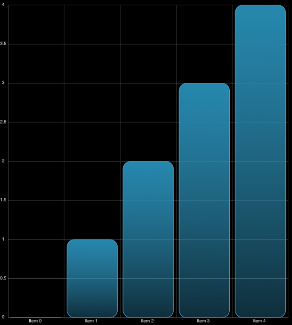

////

|metadata|
{
    "name": "igchartview-configuring-rounded-corners",
    "tags": ["Charting","Getting Started","How Do I","Styling"],
    "controlName": ["IGChartView"],
    "guid": "64a5739e-a652-4655-afa3-d7d32a9f2b45",  
    "buildFlags": [],
    "createdOn": "2013-08-26T17:12:36.8389767Z"
}
|metadata|
////

= Configuring Rounded Corners

== Topic Overview

=== Purpose

This topic provides a conceptual overview of configuring rounded corners on the  _IGChartView_™ control.

=== In this topic

This topic contains the following sections:

* <<_Ref324841248, Introduction >>
* <<_Ref215823716, Related Content >>

[[_Ref324841248]]
== Introduction

[[_Ref215796828]]

=== Rounded corners summary

To create rounded corners simply assign a value to the `radiusX` and `radiusY` properties, located on the series class, of those series that support rounded corners:

*  _IGBarSeries_  
*  _IGColumnSeries_  
*  _IGRadialColumnSeries_  
*  _IGRadialPieSeries_  
*  _IGRangeColumnSeries_  
*  _IGStacked100BarSeries_  
*  _IGStackedBarSeries_  
*  _IGStacked100ColumnSeries_  
*  _IGStackedColumnSeries_  
*  _IGWaterfallSeries_  

The  _IGColumnSeries_   and  _IGBarSeries_   have an additional property called `roundedCorners` that accepts one of the following enumerations.

* `IGRoundedCornersAll` - All corners are rounded (default).
* `IGRoundedCornersBase` - Bottom corner rounding for positive value columns and top corner rounding for negative values.
* `IGRoundedCornersPeak` - For  _IGColumnSeries_   top corners will be rounded for positive value columns and bottom corners will be rounded for negative value columns. For  _IGBarSeries_   right corners will be rounded for positive values and left corners for negative values.

The illustration below demonstrates rounded corners on the  _IGColumnSeries_   with the `radiusX` and `radiusY` properties set to 20.

[[_Ref324841253]]
[[_Ref215823716]]
== Related Content

=== Topics

The following topic provides additional information related to this topic.

[options="header", cols="a,a"]
|====
|Topic|Purpose

| link:igchartview.html[IGChartView]
|The topics in this group cover enabling, configuring, and using the _IGChartView_ control’s supported features.

|====