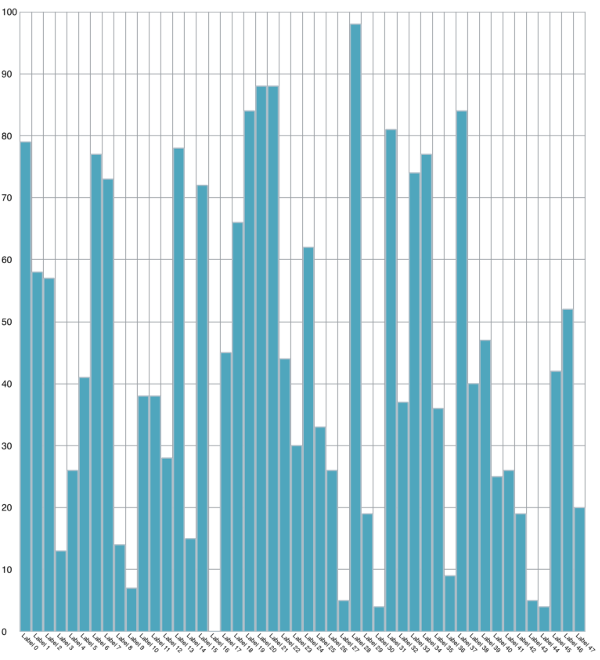

////

|metadata|
{
    "name": "igchartview-configuring-smart-axis-label-panel",
    "tags": ["Getting Started","How Do I","Styling"],
    "controlName": ["IGChartView"],
    "guid": "70a20cc5-3c69-46fa-aad3-5f86fcfd58d1",  
    "buildFlags": [],
    "createdOn": "2014-09-12T12:39:47.7247921Z"
}
|metadata|
////

= Configuring the Smart Axis Label Panel

== Topic Overview

=== Purpose

This topic provides a conceptual overview of the smart axis label panel on the  _IGChartView_™ control and demonstrates the configuration using a code example.

=== In this topic

This topic contains the following sections:

* <<_Ref324841248, Introduction >>
* <<_Ref248895787, Configuring the Smart Axis Label Panel – Code Example >>

** <<_Ref327344209,Description>>
** <<_Ref252521837,Preview>>
** <<_Ref327523606,Prerequisites>>
** <<_Ref327344217,Code>>

* <<_Ref215823716, Related Content >>

[[_Ref324841248]]
== Introduction

=== Smart axis panel summary

__The smart axis label panel__   __feature__  will calculate the amount of space needed for the labels and will automatically lay them out in a way that displays them without collisions. The label panel tries to fit all labels horizontally, staying within provided or default constraints. If that fails, the labels will be rotated at either 45, 135 or 90 degrees, depending on available space. The label panel controls the extent, rotation, font size and staggering. These characteristics can be set explicitly or by specifying an appropriate range of values.

.Note:
[NOTE]
====
This feature is only available on  _IGCategoryXAxis_   for horizontal category series such as area, column, line, point, range area, range column, spline, spline area, step area, step line and waterfall series.
====

To enable the smart axis label panel set  _useSmartAxisPanel_   to `YES`. Properties prefixed with `smartAxis` introduce various layout constraints and are optional. For example, the axis extent can be explicitly set via `smartAxisExtent` property. This will ensure that the label panel always has that height, no matter what the other properties are set to. The extent can also be set via the `smartAxisMinimumExtent` and `smartAxisMaximumExtent` properties. This will ensure that the panel height stays within those two values.

Number of stagger levels, font size and rotation angle can all be specified in a similar fashion.

.Note:
[NOTE]
====
When a label is rotated anything related to staggering is disregarded.
====

The allowed space between labels is also controllable by setting the `smartAxisProximityMargin` property. When this property is set if two labels have less separation than this margin, they are considered to be colliding.

[[_Ref248895787]]
[[_Ref324841253]]
== Configuring the Smart Axis Label Panel – Code Example

[[_Ref327344209]]

=== Description

The code example below demonstrates the usage of the smart axis label panel on the  _IGChartView_  . The chart’s data is updated every 3 seconds to demonstrate the labels being automatically laid out to the best fit.

[[_Ref252521837]]

=== Preview

[[_Ref327523606]]

=== Prerequisites

This code example requires the inclusion of the  __IG__  framework; details about how to add this framework are available in the link:igchartview-adding-the-chart-framework-file.html[Adding the Chart Framework File] topic.

[[_Ref327344217]]

=== Code

*In Objective-C:*

[source,csharp]
----
@interface igSmartAxisLabelsDataModel : NSObject
 @property(nonatomic, retain) NSString *label;
 @property(nonatomic, assign) CGFloat value;
 @end
 @implementation igSmartAxisLabelsDataModel
 @end
 @interface igViewController ()
 {
     IGChartView *_chartView;
     NSMutableArray *_data;
     IGCategorySeriesDataSourceHelper *_dsh;
     IGColumnSeries *_series;
     IGCategoryXAxis *_xAxis;
     IGNumericYAxis *_yAxis;
 }
 @end
 @implementation igViewController
 - (void)viewDidLoad
 {
     [super viewDidLoad];
     _data = [self createData:20];
     _chartView = [[IGChartView alloc] initWithFrame:CGRectInset(self.view.bounds, 5, 5)];
     _chartView.autoresizingMask = UIViewAutoresizingFlexibleWidth | UIViewAutoresizingFlexibleHeight;
     _dsh = [[IGCategorySeriesDataSourceHelper alloc] initWithData:_data andValuePath:@"value"];
     _dsh.labelPath = @"label";
     _series = (IGColumnSeries *) [_chartView addSeriesForType:[IGColumnSeries class] usingKey:@"series" withDataSource:_dsh firstAxisKey:@"x" secondAxisKey:@"y"];
     _xAxis = (IGCategoryXAxis *) [_chartView findAxisByKey:@"x"];
     _yAxis = (IGNumericYAxis *) [_chartView findAxisByKey:@"y"];
     _xAxis.interval = 1;
     _xAxis.useSmartAxisPanel = YES;
     _yAxis.minimum = 0;
     _yAxis.maximum = 100;
     [self.view addSubview:_chartView];
     [NSTimer scheduledTimerWithTimeInterval:3.0 target:self selector:@selector(timerTick) userInfo:nil repeats:YES];
 }
 - (BOOL)prefersStatusBarHidden
 {
     return YES;
 }
 - (NSMutableArray *)createData:(int)count
 {
     NSMutableArray *data = [[NSMutableArray alloc] initWithCapacity:count];
     for (int counter = 0; counter < count; counter++)
     {
         igSmartAxisLabelsDataModel *obj = [[igSmartAxisLabelsDataModel alloc] init];
         obj.value = arc4random() % 100;
         obj.label = [NSString stringWithFormat:@"Label %d", counter];
         [data addObject:obj];
     }
     return data;
 }
 - (void)timerTick
 {
     _data = [self createData:arc4random() % 50 + 10];
     _dsh = [[IGCategorySeriesDataSourceHelper alloc] initWithData:_data andValuePath:@"value"];
     _dsh.labelPath = @"label";
     _series.dataSource = _dsh;
 }
 @end
----

*In C#:*

[source,csharp]
----
public class SmartAxisLabelsDataModel : NSObject
{
      [Export("Label")]
      public String Label { get; set; }
      [Export("Value")]
      public float Value { get; set; }
}
public partial class ChartSmartAxisLabelPanel_CSViewController : UIViewController
{
      IGChartView _chartView;
      List<NSObject> _data;
      IGCategorySeriesDataSourceHelper _dsh;
      IGColumnSeries _series;
      IGCategoryXAxis _xAxis;
      IGNumericYAxis _yAxis;
      public List<NSObject> CreateData(int count)
      {
            List<NSObject> data = new List<NSObject> (count);
            for (int counter = 0; counter < count; counter++)
            {
                  SmartAxisLabelsDataModel obj = new SmartAxisLabelsDataModel();
                  obj.Value = new Random().Next() % 100;
                  obj.Label = String.Format ("Label {0:D}", counter);
                  data.Add (obj);
            }
            return data;
      }
      [Export("TimerTick")]
      public void TimerTick()
      {
            _data = CreateData (new Random ().Next () % 50 + 10);
            _dsh = new IGCategorySeriesDataSourceHelper (_data.ToArray (), "Value");
            _dsh.LabelPath = @"Label";
            _series.DataSource = _dsh;
      }
      public ChartSmartAxisLabelPanel_CSViewController (IntPtr handle) : base (handle)
      {
      }
      public override void ViewDidLoad ()
      {
            base.ViewDidLoad ();
            _data = CreateData(20);
            RectangleF chartRect = this.View.Bounds;
            chartRect.Inflate (-5, -5);
            _chartView = new IGChartView ();
            _chartView.Frame = chartRect;
            _chartView.AutoresizingMask = UIViewAutoresizing.FlexibleWidth | UIViewAutoresizing.FlexibleHeight;
            _dsh = new IGCategorySeriesDataSourceHelper (_data.ToArray (), "Value");
            _dsh.LabelPath = @"Label";
            _series = _chartView.AddSeries (new MonoTouch.ObjCRuntime.Class ("IGColumnSeries"), "series", _dsh, "x", "y") as IGColumnSeries;
            _xAxis = _chartView.FindAxisByKey ("x") as IGCategoryXAxis;
            _yAxis = _chartView.FindAxisByKey ("y") as IGNumericYAxis;
            _xAxis.Interval = 1;
            _xAxis.UseSmartAxisPanel = true;
            _yAxis.Minimum = 0;
            _yAxis.Maximum = 100;
            this.View.Add (_chartView);
            NSTimer.CreateScheduledTimer (3, this, new MonoTouch.ObjCRuntime.Selector ("TimerTick"), null, true); 
      }
      public override bool PrefersStatusBarHidden ()
      {
            return true;
      }
}
----

[[_Ref215823716]]
== Related Content

=== Topics

The following topic provides additional information related to this topic.

[options="header", cols="a,a"]
|====
|Topic|Purpose

| link:igchartview.html[IGChartView]
|The topics in this group cover enabling, configuring, and using the _IGChartView_ control’s supported features.

|====