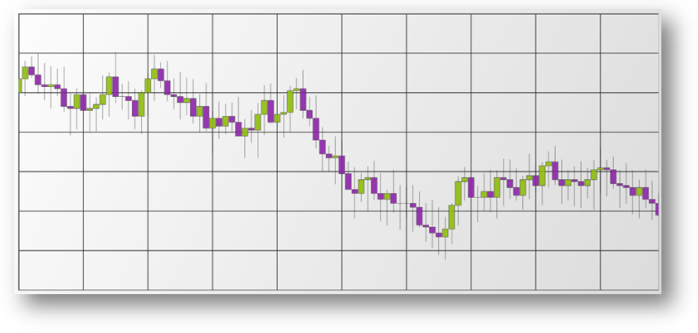

////

|metadata|
{
    "name": "igchartview-financial-price-series-candlestick",
    "controlName": ["IGChartView"],
    "tags": ["Charting","How Do I"],
    "guid": "c675b28b-e400-40fa-8767-e32a9a4fea6b",  
    "buildFlags": [],
    "createdOn": "2012-05-24T18:13:27.0800648Z"
}
|metadata|
////

= Financial Price Series in Candlestick Mode

== Topic Overview

=== Purpose

This topic provides a conceptual overview of the Financial Price series in Candlestick mode in the  _IGChartView_™ control and uses a code sample to demonstrate how to add it the chart view.

=== In this topic

This topic contains the following sections:

* <<_Ref324841248, Introduction >>

** <<_Ref326216643,Financial Price series in Candlestick mode summary>>
** <<_Ref326216649,Data requirements>>

* <<_Ref327934157, Adding a Financial Price Series in Candlestick Mode to the IGChartView – Code Example >>

** <<_Ref326216660,Description>>
** <<_Ref327934145,Prerequisites>>
** <<_Ref326216665,Code>>

* <<_Ref324841253, Related Content >>

[[_Ref324841248]]
== Introduction

[[_Ref326216643]]

=== Financial Price Series in Candlestick mode summary

The  _IGChartView’s_   financial price series in candlestick mode is used to plot stock prices, and show the stock's daily high, low, opening and closing prices. The benefit of using charts in this series is that they are early indicators, signaling market movement earlier than other charts.

The series plots each data point as a vertical column with vertical lines on both the top and bottom.

The vertical line indicates the span between a financial instrument’s high and low value where the top of the vertical line indicating the session’s highest price and the bottom of the vertical line indicating the session’s lowest price. The vertical line indicates the span between a financial investment’s high and low value with the top of the vertical line indicating the session’s highest price and the bottom of the vertical line indicating the session’s lowest price.

The vertical columns indicate the span between the financial investment’s opening and closing values. The columns are filled using Series’ Brush when there is positive value and using series’ negativeBrush property when there is negative value between the opening and closing values.

[[_Ref326216649]]

=== Data requirements

While the  _IGChartView_   control allows easy binding to your own data model, make sure to supply the appropriate amounts and types of data required by the series. If the data does not meet the minimum requirements, based on the type of series that you are using, the  _IGChartView_   will appear blank.

*  *Required –*  the data model must contain at least four numeric fields representing open, high, low, and close for rendering the data on the chart.

[[_Ref324842387]]
[[_Ref327934157]]
== Adding a Financial Price Series in Candlestick Mode to the  _IGChartView_   – Code Example

[[_Ref326216660]]

=== Description

The code below uses the link:igchartview-data-source-helpers.html[IGCategorySeriesDataSourceHelper] to supply randomly generated data to a financial price series that first gets added to the  _IGChartView_   instance, and then the current  _UIView_   adds the  _IGChartView_   as a subview.

[[_Ref327934145]]

=== Prerequisites

This code example requires the inclusion of the  _IGChartView_   framework, detail about how to add this framework can be found in the link:igchartview-adding-the-chart-framework-file.html[Adding the Chart Framework File] topic.

[[_Ref326216665]]

=== Code

*In Objective-C:*

[source,csharp]
----
 NSMutableArray *open = [[NSMutableArray alloc] init];
    for (int i = 0; i < 25; i++) {
        [open addObject:[[NSNumber alloc] initWithDouble:(arc4random() % 100)]];
    }
    NSMutableArray *high = [[NSMutableArray alloc] init];
    for (int i = 0; i < 25; i++) {
        [high addObject:[[NSNumber alloc] initWithDouble:(arc4random() % 100 + 30)]];
    }
    NSMutableArray *low = [[NSMutableArray alloc] init];
    for (int i = 0; i < 25; i++) {
        [low addObject:[[NSNumber alloc] initWithDouble:(arc4random() % 100)]];
    }
    NSMutableArray *close = [[NSMutableArray alloc] init];
    for (int i = 0; i < 25; i++) {
        [close addObject:[[NSNumber alloc] initWithDouble:(arc4random() % 100 + 10)]];
    }
    IGOHLCSeriesDataSourceHelper *source = [[IGOHLCSeriesDataSourceHelper alloc] init];
    source.openValues = open;
    source.highValues = high;
    source.lowValues = low;
    source.closeValues = close;
    IGChartView *infraChart = [[IGChartView alloc] initWithFrame:self.view.frame];
    IGCategoryXAxis *xAxis = [[IGCategoryXAxis alloc] initWithKey:@"xAxis"];
    IGNumericYAxis *yAxis = [[IGNumericYAxis alloc] initWithKey:@"yAxis"];
    [infraChart addAxis:xAxis];
    [infraChart addAxis:yAxis];
    IGFinancialPriceSeries *financialPriceSeries = [[IGFinancialPriceSeries alloc] initWithKey:@"financialPriceSeries"];
    financialPriceSeries.xAxis = xAxis;
    financialPriceSeries.yAxis = yAxis;
    financialPriceSeries.dataSource = source;
    financialPriceSeries.displayType = IGPriceDisplayTypeCandlestick;
    [infraChart addSeries:financialPriceSeries];
    [self.view addSubview:infraChart];
----

*In C#:*

[source,csharp]
----
Random r = new Random();
   List<NSObject> open = new List<NSObject>();
   List<NSObject> high = new List<NSObject>();
   List<NSObject> low = new List<NSObject>();
   List<NSObject> close = new List<NSObject>();
   for(int i = 0;i <25; i++)
   {
    open.Add(new NSNumber(r.Next() % 100));
    high.Add(new NSNumber(r.Next() % 100 + 30));
    low.Add(new NSNumber(r.Next() % 100));
    close.Add(new NSNumber(r.Next() % 100 + 10));
   }
IGOHLCSeriesDataSourceHelper source = new IGOHLCSeriesDataSourceHelper();
   source.OpenValues = open.ToArray();
   source.HighValues = high.ToArray();
   source.LowValues = low.ToArray();
   source.CloseValues = close.ToArray();
IGChartView chart = new IGChartView(this.View.Frame);
   chart.AutoresizingMask = UIViewAutoresizing.FlexibleHeight | UIViewAutoresizing.FlexibleWidth;
   this.View.AddSubview(chart);
IGCategoryXAxis xAxis = new IGCategoryXAxis("xAxis");
   IGNumericYAxis yAxis = new IGNumericYAxis("yAxis");
   chart.AddAxis(xAxis);
   chart.AddAxis(yAxis);
IGFinancialPriceSeries series = new IGFinancialPriceSeries("series");
   series.XAxis = xAxis;
   series.YAxis = yAxis;
   series.DataSource = source;
   series.DisplayType = IGPriceDisplayType.IGPriceDisplayTypeCandlestick;
chart.AddSeries(series);
----

[[_Ref324841253]]
== Related Content

=== Topics

The following topics provide additional information related to this topic.

[options="header", cols="a,a"]
|====
|Topic|Purpose

| link:igchartview-chart-series.html[Chart Series]
|The _IGChartView_ control chart series is divided into several groups, this parent topic contains links and details about each one.

|====