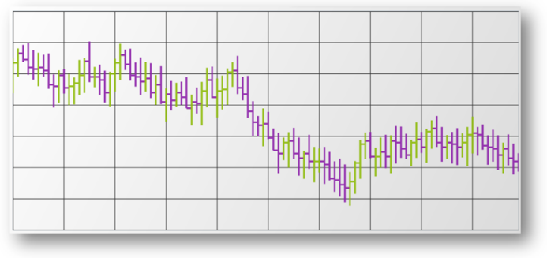

////

|metadata|
{
    "name": "igchartview-financial-price-series-ohlc",
    "controlName": ["IGChartView"],
    "tags": ["Charting","How Do I"],
    "guid": "db342e3d-52e4-4fe7-a006-70fb3ca154d9",  
    "buildFlags": [],
    "createdOn": "2012-05-24T18:12:38.9760648Z"
}
|metadata|
////

= Financial Price Series in OHLC Mode

== Topic Overview

=== Purpose

This topic provides a conceptual overview of the Financial Price series in OHLC mode in the  _IGChartView_™ control and uses a code example to demonstrate how to add the chart type to the chart view.

=== In this topic

This topic contains the following sections:

* <<_Ref324841248, Introduction >>

** <<_Ref328077649,Financial Price series in OHLC mode summary>>
** <<_Ref326147852,Data requirements>>

* <<_Ref327933612, Adding a Financial Price Series in OHLC Mode to the IGChartView – Code Example >>

** <<_Ref326147864,Description>>
** <<_Ref327933297,Prerequisites>>
** <<_Ref326147870,Code>>

* <<_Ref324841253, Related Content >>

[[_Ref324841248]]
== Introduction

[[_Ref326147846]]

=== Financial Price series in OHLC mode summary

The  _IGChartView’s_   Financial Price series in OHLC mode is used to plot stock prices and show the stock's high, low, and daily opening and closing prices. The benefit of using charts in this series is that they are early indicators, signaling market movement earlier than other charts.

This series plots each data point as a vertical line with horizontal lines perpendicular on both the left and right side to it. This series plots each data point as a vertical line with horizontal lines perpendicular to it on both its left and right side.

The vertical line indicates the span between an investment’s high and low values With the top of the vertical line indicating a session highest price and the bottom of the vertical line indicating the session lowest price.

The horizontal lines indicate the span between the opening and closing values of an investment with the left-hand horizontal line representing the session’s opening value and the right-hand horizontal line representing the session’s closing value

[[_Ref326147852]]

=== Data requirements

While the  _IGChartView_   control allows easy binding to your own data model, make sure to supply the appropriate amounts and types of data required by the series. If the data does not meet the minimum requirements, based on the type of series that you are using, the  _IGChartView_   will appear blank.

*Required –*  the data model must contain at least four numeric fields representing open, high, low, and close for rendering the data on the chart.

[[_Ref324842387]]
[[_Ref327933612]]
== Adding a Financial Price Series in OHLC Mode to the  _IGChartView_   – Code Example

[[_Ref326147864]]

=== Description

The code below uses the link:igchartview-data-source-helpers.html[IGCategorySeriesDataSourceHelper] to supply randomly generated data to a financial price series that first gets added to the  _IGChartView_   instance, and then the  _IGChartView_   is added as a subview of the current  _UIView_  .

[[_Ref327933297]]

=== Prerequisites

This code example requires the inclusion of the  _IGChartView_   framework, detail about how to add this framework can be found in the link:igchartview-adding-the-chart-framework-file.html[Adding the Chart Framework File] topic.

[[_Ref326147870]]

=== Code

*In Objective-C:*

[source,csharp]
----
 NSMutableArray *open = [[NSMutableArray alloc] init];
    for (int i = 0; i < 25; i++) {
        [open addObject:[[NSNumber alloc] initWithDouble:(arc4random() % 100)]];
    }
    NSMutableArray *high = [[NSMutableArray alloc] init];
    for (int i = 0; i < 25; i++) {
        [high addObject:[[NSNumber alloc] initWithDouble:(arc4random() % 100 + 30)]];
    }
    NSMutableArray *low = [[NSMutableArray alloc] init];
    for (int i = 0; i < 25; i++) {
        [low addObject:[[NSNumber alloc] initWithDouble:(arc4random() % 100)]];
    }
    NSMutableArray *close = [[NSMutableArray alloc] init];
    for (int i = 0; i < 25; i++) {
        [close addObject:[[NSNumber alloc] initWithDouble:(arc4random() % 100 + 10)]];
    }
    IGOHLCSeriesDataSourceHelper *source = [[IGOHLCSeriesDataSourceHelper alloc] init];
    source.openValues = open;
    source.highValues = high;
    source.lowValues = low;
    source.closeValues = close;
    IGChartView *infraChart = [[IGChartView alloc] initWithFrame:self.view.frame];
    IGCategoryXAxis *xAxis = [[IGCategoryXAxis alloc] initWithKey:@"xAxis"];
    IGNumericYAxis *yAxis = [[IGNumericYAxis alloc] initWithKey:@"yAxis"];
    [infraChart addAxis:xAxis];
    [infraChart addAxis:yAxis];
    IGFinancialPriceSeries *financialPriceSeries = [[IGFinancialPriceSeries alloc] initWithKey:@"financialPriceSeries"];
    financialPriceSeries.xAxis = xAxis;
    financialPriceSeries.yAxis = yAxis;
    financialPriceSeries.dataSource = source;
    financialPriceSeries.displayType = IGPriceDisplayTypeOHLC;
    [infraChart addSeries:financialPriceSeries];
    [self.view addSubview:infraChart];
----

*In C#:*

[source,csharp]
----
Random r = new Random();
   List<NSObject> open = new List<NSObject>();
   List<NSObject> high = new List<NSObject>();
   List<NSObject> low = new List<NSObject>();
   List<NSObject> close = new List<NSObject>();
   for(int i = 0;i <25; i++)
   {
    open.Add(new NSNumber(r.Next() % 100));
    high.Add(new NSNumber(r.Next() % 100 + 30));
    low.Add(new NSNumber(r.Next() % 100));
    close.Add(new NSNumber(r.Next() % 100 + 10));
   }
IGOHLCSeriesDataSourceHelper source = new IGOHLCSeriesDataSourceHelper();
   source.OpenValues = open.ToArray();
   source.HighValues = high.ToArray();
   source.LowValues = low.ToArray();
   source.CloseValues = close.ToArray();
IGChartView chart = new IGChartView(this.View.Frame);
   chart.AutoresizingMask = UIViewAutoresizing.FlexibleHeight | UIViewAutoresizing.FlexibleWidth;
   this.View.AddSubview(chart);
IGCategoryXAxis xAxis = new IGCategoryXAxis("xAxis");
   IGNumericYAxis yAxis = new IGNumericYAxis("yAxis");
   chart.AddAxis(xAxis);
   chart.AddAxis(yAxis);
IGFinancialPriceSeries series = new IGFinancialPriceSeries("series");
   series.XAxis = xAxis;
   series.YAxis = yAxis;
   series.DataSource = source;
   series.DisplayType = IGPriceDisplayType.IGPriceDisplayTypeOHLC;
chart.AddSeries(series);
----

[[_Ref324841253]]
== Related Content

=== Topics

The following topics provide additional information related to this topic.

[options="header", cols="a,a"]
|====
|Topic|Purpose

| link:igchartview-financial-price-series.html[Financial Price Series]
|Used to plot stock prices, the _IGChartView_ ’s financial price series show a stock's high, low, open, and close prices over time. It can also display trend lines for stock prices. The financial price series is often used in combination with a number of other financial indicators to show price trends.

|====