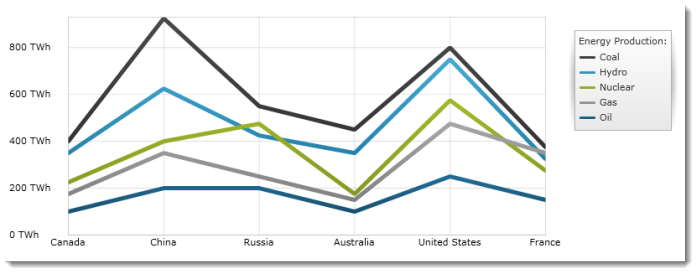

////

|metadata|
{
    "name": "igchartview-line-series",
    "controlName": ["IGChartView"],
    "tags": ["Charting","How Do I"],
    "guid": "c13b45e9-e51d-4f69-953c-9d9b44d7e92f",  
    "buildFlags": [],
    "createdOn": "2012-05-16T19:07:18.3616177Z"
}
|metadata|
////

= Line Series

== Topic Overview

=== Purpose

This topic provides a conceptual overview of the Line series in the  _IGChartView_™ control and uses a code example to demonstrate how to add it to the chart view.

=== In this topic

This topic contains the following sections:

* <<_Ref324841248,Introduction>>

** <<_Ref328075278,Line series summary>>
** <<_Ref326147976,Data requirements>>

* <<_Ref324842387,Adding a Line Series to the  _IGChartView_   – Code Example>>

** <<_Ref326147987,Description>>
** <<_Ref327931012,Prerequisites>>
** <<_Ref326147992,Code>>

* <<_Ref324841253, Related Content >>

[[_Ref324841248]]
== Introduction

[[_Ref326147970]]

=== Line series summary

Line series belongs to a group of category series that uses a collection of points connected by straight line segments when rendered. Values are represented on the y-axis ( _IGNumericYAxis_  ) and categories display along the x-axis ( _IGCategoryXAxis_   or  _IGCategoryDateTimeXAxis_  ).

The line series emphasizes the amount of change over time, or compares multiple items as well as the relationship of parts to a whole by displaying the total of the plotted values. Line series is identical to the spline series in all aspects except that line connecting data points do not have spline interpolation and smoothing for improved presentation of data.

[[_Ref326147976]]

=== Data requirements

While the  _IGChartView_   control allows easy binding to your own data model, make sure to supply the appropriate amounts and types of data required by the series. If the data does not meet the minimum requirements, based on the type of series that you are using, the  _IGChartView_   will appear blank.

The following is a list of data requirements for the area series type:

*  *Required –*  the data model must contain at least one numeric field. The data model should contain two or more data items so that a line can have two or more points.
*  *Optional –*  the data model may contain an optional string or  _NSDate_   field for labels.

[[_Ref324842387]]
== Adding a Line Series to the  _IGChartView_   – Code Example

[[_Ref326147987]]

=== Description

The code below uses the link:igchartview-data-source-helpers.html[IGCategorySeriesDataSourceHelper] to supply randomly generated data to a line series that first gets added to the  _IGChartView_   instance, and then the  _IGChartView_   is added as a subview of the current  _UIView_  .

[[_Ref327341906]]

=== Prerequisites

This code example requires the inclusion of the  _IGChartView_   framework, detail about how to add this framework can be found in the link:igchartview-adding-the-chart-framework-file.html[Adding the Chart Framework File] topic.

[[_Ref326147992]]

=== Code

*In Objective-C:*

[source,csharp]
----
 NSMutableArray *data = [[NSMutableArray alloc] init];
    for (int i = 0; i < 25; i++)
    {
        double value = arc4random() % 100;
        [data addObject:[[NSNumber alloc] initWithDouble:value]];
    }
    IGCategorySeriesDataSourceHelper *source = [[IGCategorySeriesDataSourceHelper alloc] init];
    source.values = data;
    IGChartView *infraChart = [[IGChartView alloc] initWithFrame:self.view.frame];
    [infraChart setAutoresizingMask:UIViewAutoresizingFlexibleWidth|UIViewAutoresizingFlexibleHeight];
    IGCategoryXAxis *xAxis = [[IGCategoryXAxis alloc] initWithKey:@"xAxis"];
    IGNumericYAxis *yAxis = [[IGNumericYAxis alloc] initWithKey:@"yAxis"];
    [infraChart addAxis:xAxis];
    [infraChart addAxis:yAxis];
    IGLineSeries *lineSeries = [[IGLineSeries alloc] initWithKey:@"lineSeries"];
    lineSeries.xAxis = xAxis;
    lineSeries.yAxis = yAxis;
    lineSeries.dataSource = source;
    [infraChart addSeries:lineSeries];
    [self.view addSubview:infraChart];
----

*In C#:*

[source,csharp]
----
 List<NSObject> data = new List<NSObject>();
   Random r = new Random();
   for(int i = 0;i <25; i++)
   {
      double val = r.Next() % 100; 
      data.Add(new NSNumber(val));
   }
 IGCategoryDateSeriesDataSourceHelper source = new IGCategoryDateSeriesDataSourceHelper();
   source.Values = data.ToArray();
 IGChartView chart = new IGChartView(this.View.Frame);
   chart.AutoresizingMask = UIViewAutoresizing.FlexibleHeight | UIViewAutoresizing.FlexibleWidth;
  this.View.AddSubview(chart);
 IGCategoryXAxis xAxis = new IGCategoryXAxis("xAxis");
   IGNumericYAxis yAxis = new IGNumericYAxis("yAxis");
   chart.AddAxis(xAxis);
   chart.AddAxis(yAxis);
 IGLineSeries series= new IGLineSeries ("series");
   series.XAxis = xAxis;
   series.YAxis = yAxis;
   series.DataSource = source;
   chart.AddSeries(columnSeries);
----

[[_Ref324841253]]
== Related Content

=== Topics

The following topics provide additional information related to this topic.

[options="header", cols="a,a"]
|====
|Topic|Purpose

| link:igchartview-category-series.html[Category Series]
|This is a group of topics explaining the various types of Category series supported by the _IGChartView_ control.

|====