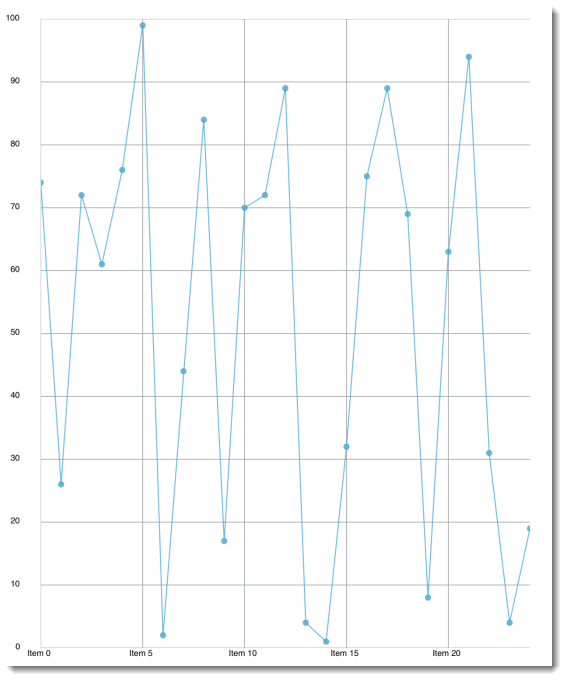

////

|metadata|
{
    "name": "igchartview-markers",
    "controlName": ["IGChartView"],
    "tags": ["Charting","How Do I","Styling"],
    "guid": "12904b2f-7e3d-46d6-9797-3b580deab0e0",  
    "buildFlags": [],
    "createdOn": "2012-05-11T19:35:00.9455135Z"
}
|metadata|
////

= Markers

== Topic Overview

=== Purpose

This topic provides a conceptual overview of the chart marker shapes used in the  _IGChartView_™ control.

=== In this topic

This topic contains the following sections:

* <<_Ref329132120, Marker Shapes >>

** <<_Ref329132134,Introduction>>
** <<_Ref327864136,Marker shape types>>

* <<_Ref324841253, Related Content >>

[[_Ref329132120]]
[[_Ref324841248]]
== Marker Shapes

[[_Ref329132134]]

=== Introduction

Markers are visual elements that display data point values in the  _IGChartView_   control's plot area. Markers help your users immediately identify a given data point's value, even if the value falls between major or minor grid lines. There are a number of predefined marker shapes available to be used with the chart’s series. An identifying characteristic of those series that support markers is the presence of `markerType` property, which when set to `IGMarkerTypeAutomatic`, results in the series index in the chart’s series array determining marker selection.

Figure 1: Line Series chart type using `IGMarkerTypeAutomatic`.

[[_Ref327864136]]

=== Marker shape types

The following table contains the supported marker shapes and their associated type name.

[options="header", cols="a,a"]
|====
|Marker Shape Name|Preview

|`IGMarkerTypeAutomatic`
|(no preview)

|`IGMarkerTypeCircle`
|image::images/IGChartView_-_Markers_2.png[]

|`IGMarkerTypeDiamond`
|image::images/IGChartView_-_Markers_3.png[]

|`IGMarkerTypeHexagon`
|image::images/IGChartView_-_Markers_4.png[]

|`IGMarkerTypeHexagram`
|image::images/IGChartView_-_Markers_5.png[]

|`IGMarkerTypeNone`
|(no preview)

|`IGMarkerTypePentagon`
|image::images/IGChartView_-_Markers_6.png[]

|`IGMarkerTypePentagram`
|image::images/IGChartView_-_Markers_7.png[]

|`IGMarkerTypePyramid`
|image::images/IGChartView_-_Markers_8.png[]

|`IGMarkerTypeSquare`
|image::images/IGChartView_-_Markers_9.png[]

|`IGMarkerTypeTetragram`
|image::images/IGChartView_-_Markers_10.png[]

|`IGMarkerTypeTriangle`
|image::images/IGChartView_-_Markers_11.png[]

|====

[[_Ref324841253]]
== Related Content

=== Topics

The following topic provides additional information related to this topic.

[options="header", cols="a,a"]
|====
|Topic|Purpose

| link:igchartview.html[IGChartView]
|This topic serves as a gateway to the features and functionality of the _IGChartView_ control.

|====