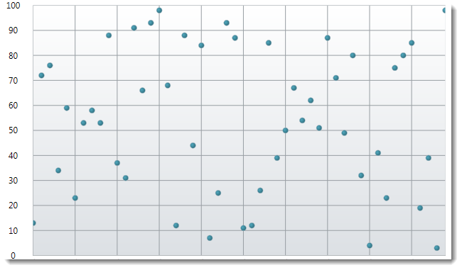

////

|metadata|
{
    "name": "igchartview-point-series",
    "controlName": ["IGChartView"],
    "tags": ["Charting","How Do I"],
    "guid": "a3b58bc5-187c-4658-b7eb-28d08de9b01e",  
    "buildFlags": [],
    "createdOn": "2012-05-16T19:07:40.9261297Z"
}
|metadata|
////

= Point Series

== Topic Overview

=== Purpose

This topic provides a conceptual overview of the Point series in the  _IGChartView_™ control and uses a code example to demonstrate how to add it to the chart view.

=== In this topic

This topic contains the following sections:

* <<_Ref324841248,Introduction>>

** <<_Ref328074732,Point series summary>>
** <<_Ref326148208,Data requirements>>

* <<_Ref324842387,Adding a Point Series to the  _IGChartView_   – Code Example>>

** <<_Ref326148218,Description>>
** <<_Ref328074886,Prerequisites>>
** <<_Ref326148224,Code>>

* <<_Ref324841253,Related Content>>

[[_Ref324841248]]
== Introduction

[[_Ref326148202]]

=== Point series summary

The Point series is one of the chart types belonging to the category series and uses points or markers on a chart when rendered. The numeric values correspond to y-axis ( _IGNumericYAxis_  ), and the x-axis ( _IGCategoryXAxis_   or  _IGCategoryDateTimeXAxis_  ) is used for displaying the labels.

[[_Ref326148208]]

=== Data requirements

While the  _IGChartView_   control allows easy binding to your own data model, make sure to supply the appropriate amounts and types of data required by the series. If the data does not meet the minimum requirements, based on the type of series that you are using, the  _IGChartView_   will appear blank.

The following is a list of data requirements for the area series type:

*  *Required –*  the data model must contain at least one numeric field for rendering the data.
*  *Optional –*  the data model may contain an optional string or  _NSDate_   field for labels.

[[_Ref324842387]]
== Adding a Point Series to the  _IGChartView_   – Code Example

[[_Ref326148218]]

=== Description

The code below uses the link:igchartview-data-source-helpers.html[IGCategorySeriesDataSourceHelper] to supply randomly generated data to a point series that first gets added to the  _IGChartView_   instance, and then the  _IGChartView_   is added as a subview of the current  _UIView_  .

[[_Ref328074886]]

=== Prerequisites

This code example requires the inclusion of the  _IGChartView_   framework, detail about how to add this framework can be found in the link:igchartview-adding-the-chart-framework-file.html[Adding the Chart Framework File] topic.

[[_Ref326148224]]

=== Code

*In Objective-C:*

[source,csharp]
----
 NSMutableArray data = [[NSMutableArray alloc] init];
    for (int i = 0; i < 25; i++)
    {
        double value = arc4random() % 100;
        [data addObject:[[NSNumber alloc] initWithDouble:value]];
    }
    IGCategorySeriesDataSourceHelper *source = [[IGCategorySeriesDataSourceHelper alloc] init];
    source.values = data;
    IGChartView *infraChart = [[IGChartView alloc] initWithFrame:self.view.frame];
    [infraChart setAutoresizingMask:UIViewAutoresizingFlexibleWidth|UIViewAutoresizingFlexibleHeight];
    IGCategoryXAxis *xAxis = [[IGCategoryXAxis alloc] initWithKey:@"xAxis"];
    IGNumericYAxis *yAxis = [[IGNumericYAxis alloc] initWithKey:@"yAxis"];
    [infraChart addAxis:xAxis];
    [infraChart addAxis:yAxis];
    IGPointSeries *lineSeries = [[IGPointSeries alloc] initWithKey:@"pointSeries"];
    pointSeries.xAxis = xAxis;
    pointSeries.yAxis = yAxis;
    pointSeries.dataSource = source;
    [infraChart addSeries:pointSeries];
    [self.view addSubview:infraChart];
----

*In C#:*

[source,csharp]
----
 List<NSObject> data = new List<NSObject>();
   Random r = new Random();
   for(int i = 0;i <25; i++)
   {
      double val = r.Next() % 100; 
      data.Add(new NSNumber(val));
   }
 IGCategoryDateSeriesDataSourceHelper source = new IGCategoryDateSeriesDataSourceHelper();
   source.Values = data.ToArray();
 IGChartView chart = new IGChartView(this.View.Frame);
   chart.AutoresizingMask = UIViewAutoresizing.FlexibleHeight | UIViewAutoresizing.FlexibleWidth;
  this.View.AddSubview(chart);
 IGCategoryXAxis xAxis = new IGCategoryXAxis("xAxis");
   IGNumericYAxis yAxis = new IGNumericYAxis("yAxis");
   chart.AddAxis(xAxis);
   chart.AddAxis(yAxis);
 IGPointSeries series= new IGPointSeries ("series");
   series.XAxis = xAxis;
   series.YAxis = yAxis;
   series.DataSource = source;
   chart.AddSeries(columnSeries);
----

[[_Ref324841253]]
== Related Content

=== Topics

The following topics provide additional information related to this topic.

[options="header", cols="a,a"]
|====
|Topic|Purpose

| link:igchartview-category-series.html[Category Series]
|This is a group of topics explaining the various types of Category series supported by the _IGChartView_ control.

|====