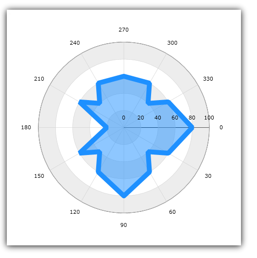

////

|metadata|
{
    "name": "igchartview-polar-area-series",
    "controlName": ["IGChartView"],
    "tags": ["Charting","How Do I"],
    "guid": "f188f7b7-31e4-4b38-9802-b0f490f728ca",  
    "buildFlags": [],
    "createdOn": "2012-05-21T17:56:23.6526075Z"
}
|metadata|
////

= Polar Area Series

== Topic Overview

=== Purpose

This topic provides a conceptual overview of the Polar Area series in the  _IGChartView_™ control and uses a code example demonstrating how to add it to the chart views.

=== In this topic

This topic contains the following sections:

* <<_Ref324841248, Introduction >>

** <<_Ref326148275,Polar Area series summary>>
** <<_Ref326148280,Data requirements>>

* <<_Ref328131312,Adding a Polar Area Series to the  _IGChartView_   – Code Example>>

** <<_Ref326148290,Description>>
** <<_Ref327342513,Prerequisites>>
** <<_Ref326148296,Code>>

* <<_Ref324841253, Related Content >>

[[_Ref324841248]]
== Introduction

[[_Ref326148275]]

=== Polar Area series summary

The Polar Area series takes the shape of a filled polygon whose corners (vertices) are represented by the data point’s polar coordinates. Using the same concepts of the link:igchartview-area-series.html[Area Series], the Polar Area series uses polar coordinates to wraps data points around a circular plot. Polar coordinates consist of an ordered pair with the values representing the data points distance from and the angle formed in relation to the center. As opposed to stretching them along a Cartesian plane, as the link:igchartview-area-series.html[Area Series] does. As with other series types, multiple Polar Area series can be plotted on the same data chart and may overlay one another to show differences and similarities between data sets.

Figure 1: Polar Area series

[[_Ref326148280]]

=== Data requirements

While the  _IGChartView_   control allows for easy binding to your own data model, it is important that you supply the appropriate amount and type of data required by that series. If the data does not meet the minimum requirements based on the type of series that you are using, the  _IGChartView_   will appear blank.

*Required:*  The bound data model must contain two numeric fields representing the angle and radius of each data point.

[[_Ref324842387]]
[[_Ref328131312]]
== Adding a Polar Area Series to the  _IGChartView_   – Code Example

[[_Ref326148290]]

=== Description

The following code uses the link:igchartview-data-source-helpers.html[IGBubbleSeriesDataSourceHelper] to supply randomly generated data to a bubble series that first gets added to the  _IGChartView_   instance, and then the  _IGChartView_   is added as a subview of the current  _UIView_  .

[[_Ref327342513]]

=== Prerequisites

This code example requires the inclusion of the  _IGChartView_   framework, detail about how to add this framework can be found in the link:igchartview-adding-the-chart-framework-file.html[Adding the Chart Framework File] topic.

[[_Ref326148296]]

=== Code

*In Objective-C:*

[source,csharp]
----
 NSMutableArray *angle = [[NSMutableArray alloc] init];
    for (int i = 0; i < 25; i++) {
        [angle addObject:[[NSNumber alloc] initWithDouble:(i * 14)]];
    }
    NSMutableArray *radius = [[NSMutableArray alloc] init];
    for (int i = 0; i < 25; i++) {
        [radius addObject:[[NSNumber alloc] initWithDouble:(arc4random() % 100)]];
    }
    IGPolarSeriesDataSourceHelper *source = [[IGPolarSeriesDataSourceHelper alloc] init];
    source.angleValues = angle;
    source.radiusValues = radius;
    IGChartView *infraChart = [[IGChartView alloc] initWithFrame:self.view.frame];
    IGNumericAngleAxis *angleAxis = [[IGNumericAngleAxis alloc] initWithKey:@"angleAxis"];
    IGNumericRadiusAxis *radiusAxis = [[IGNumericRadiusAxis alloc] initWithKey:@"radiusAxis"];
    angleAxis.minimum = 0;
    angleAxis.maximum = 360;
    angleAxis.interval = 30;
    [infraChart addAxis:angleAxis];
    [infraChart addAxis:radiusAxis];
    IGPolarAreaSeries *polarAreaSeries = [[IGPolarAreaSeries alloc] initWithKey:@"polarAreaSeries"];
    polarAreaSeries.angleAxis = angleAxis;
    polarAreaSeries.radiusAxis = radiusAxis;
    polarAreaSeries.dataSource = source;
    polarAreaSeries.markerType = IGMarkerTypeNone;
    [infraChart addSeries:polarAreaSeries];
    [self.view addSubview:infraChart];
----

*In C#:*

[source,csharp]
----
List<NSObject> angle = new List<NSObject>();
   Random r = new Random();
   for(int i = 0; i < 25; i++)
      angle.Add(new NSNumber(i*14));
 List<NSObject> radius= new List<NSObject>();
   for(int i = 0; i < 25; i++)
      radius.Add(new NSNumber(r.Next()% 100));
 IGPolarSeriesDataSourceHelper source = new IGPolarSeriesDataSourceHelper ();
   source.AngleValues =  angle.ToArray(); 
  source.RadiusValues =  radius.ToArray();
 IGChartView chart = new IGChartView(this.View.Frame);
   chart.AutoresizingMask = UIViewAutoresizing.FlexibleHeight | UIViewAutoresizing.FlexibleWidth;
  this.View.AddSubview(chart);
 IGNumericAngleAxis angleAxis= new IGNumericAngleAxis ("xAxis");
   IGNumericRadiusAxis radiusAxis= new IGNumericRadiusAxis ("yAxis");
   chart.AddAxis(angleAxis);
   chart.AddAxis(radiusAxis);
angleAxis.minimum = 0;
   angleAxis.maximum = 360;
   angleAxis.interval = 30;
IGPolarAreaSeries series= new IGPolarAreaSeries ("series");
   series.AngleAxis= angleAxis;
   series.RadiusAxis = radiusAxis;
   series.DataSource = source;
   chart.AddSeries(columnSeries);
----

[[_Ref324841253]]
== Related Content

=== Topics

The following topics provide additional information related to this topic.

[options="header", cols="a,a"]
|====
|Topic|Purpose

| link:igchartview-polar-series.html[Polar Series]
|This is a group of topics explaining the various types of Polar series supported by the _IGChartView_ control.

|====