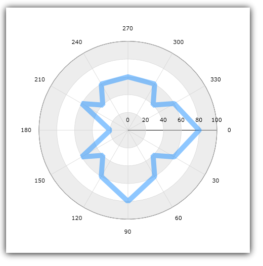

////

|metadata|
{
    "name": "igchartview-polar-line-series",
    "controlName": ["IGChartView"],
    "tags": ["Charting","How Do I"],
    "guid": "aba129c9-130a-4c29-95f8-cb6d5916176a",  
    "buildFlags": [],
    "createdOn": "2012-05-21T17:56:50.5801477Z"
}
|metadata|
////

= Polar Line Series

== Topic Overview

=== Purpose

This topic provides a conceptual overview of the Polar Line series in the  _IGChartView_™ control and provides a code example showing you how to add it to the chart views.

=== In this topic

This topic contains the following sections:

* <<_Ref324841248, Introduction >>

** <<_Ref328076501,Polar Line series summary>>
** <<_Ref326327824,Data requirements>>

* <<_Ref328076508,Adding a Polar Line Series to the  _IGChartView_   – Code Example>>

** <<_Ref326327832,Description>>
** <<_Ref328076518,Prerequisites>>
** <<_Ref326327837,Code>>

* <<_Ref324841253, Related Content >>

[[_Ref324841248]]
== Introduction

[[_Ref326327819]]

=== Polar Line series summary

The Polar Line series renders data as a collection of straight lines connected to polar coordinates against a circular polar plot. Using the same concepts of the link:igchartview-line-series.html[Line Series], the polar Line series uses polar coordinates to wraps data points around a circular plot.

Polar coordinates consist of an ordered pair with the values representing the data points distance from and the angle formed in relation to the center. As opposed to stretching them along a Cartesian plane, as the link:igchartview-line-series.html[Line Series] does. As with other series types, multiple Polar Scatter series can be plotted on the same data chart and they can overlay one another to show differences and similarities between data sets.

[[_Ref326327824]]

=== Data requirements

While the  _IGChartView_   control allows for easy binding to your own data model, it is important that you supply the appropriate data amount and type required by that series. If the data model does not meet the series’ minimum requirements, the  _IGChartView_   will appear blank.

*Required –*  to render polar line data, the bound data model must contain 2 numeric fields, one for each of the two polar coordinates (angle and radius).

[[_Ref324842387]]
[[_Ref328076508]]
== Adding a Polar Line Series to the  _IGChartView_   – Code Example

[[_Ref326327832]]

=== Description

The code below uses the link:igchartview-data-source-helpers.html[IGPolarSeriesDataSourceHelper] to supply randomly generated data to a polar line series that first gets added to the  _IGChartView_   instance, and then the  _IGChartView_   is added as a subview of the current UIView.

[[_Ref328076518]]

=== Prerequisites

This code example requires the inclusion of the  _IGChartView_   framework, detail about how to add this framework can be found in the link:igchartview-adding-the-chart-framework-file.html[Adding the Chart Framework File] topic.

[[_Ref326327837]]

=== Code

*In Objective-C:*

[source,csharp]
----
 NSMutableArray *angle = [[NSMutableArray alloc] init];
    for (int i = 0; i < 25; i++) {
        [angle addObject:[[NSNumber alloc] initWithDouble:(i * 14)]];
    }
    NSMutableArray *radius = [[NSMutableArray alloc] init];
    for (int i = 0; i < 25; i++) {
        [radius addObject:[[NSNumber alloc] initWithDouble:(arc4random() % 100)]];
    }
    IGPolarSeriesDataSourceHelper *source = [[IGPolarSeriesDataSourceHelper alloc] init];
    source.angleValues = angle;
    source.radiusValues = radius;
    IGChartView *infraChart = [[IGChartView alloc] initWithFrame:self.view.frame];
    IGNumericAngleAxis *angleAxis = [[IGNumericAngleAxis alloc] initWithKey:@"angleAxis"];
    IGNumericRadiusAxis *radiusAxis = [[IGNumericRadiusAxis alloc] initWithKey:@"radiusAxis"];
    angleAxis.minimum = 0;
    angleAxis.maximum = 360;
    angleAxis.interval = 30;
    [infraChart addAxis:angleAxis];
    [infraChart addAxis:radiusAxis];
    IGPolarLineSeries *polarLineSeries = [[IGPolarLineSeries alloc] initWithKey:@"polarLineSeries"];
    polarLineSeries.angleAxis = angleAxis;
    polarLineSeries.radiusAxis = radiusAxis;
    polarLineSeries.dataSource = source;
    polarLineSeries.markerType = IGMarkerTypeNone;
    [infraChart addSeries:polarLineSeries];
    [self.view addSubview:infraChart];
----

*In C#:*

[source,csharp]
----
List<NSObject> angle = new List<NSObject>();
   Random r = new Random();
   for(int i = 0; i < 25; i++)
      angle.Add(new NSNumber(i*14));
List<NSObject> radius= new List<NSObject>();
   for(int i = 0; i < 25; i++)
      radius.Add(new NSNumber(r.Next()% 100));
 IGPolarSeriesDataSourceHelper source = new IGPolarSeriesDataSourceHelper ();
   source.AngleValues =  angle.ToArray(); 
  source.RadiusValues =  radius.ToArray();
IGChartView chart = new IGChartView(this.View.Frame);
   chart.AutoresizingMask = UIViewAutoresizing.FlexibleHeight | UIViewAutoresizing.FlexibleWidth;
  this.View.AddSubview(chart);
IGNumericAngleAxis angleAxis= new IGNumericAngleAxis ("xAxis");
   IGNumericRadiusAxis radiusAxis= new IGNumericRadiusAxis ("yAxis");
   chart.AddAxis(angleAxis);
   chart.AddAxis(radiusAxis);
angleAxis.minimum = 0;
   angleAxis.maximum = 360;
   angleAxis.interval = 30;
IGPolarLineSeries series= new IGPolarLineSeries ("series");
   series.AngleAxis= angleAxis;
   series.RadiusAxis = radiusAxis;
   series.DataSource = source;
   chart.AddSeries(columnSeries);
----

[[_Ref324841253]]
== Related Content

=== Topics

The following topics provide additional information related to this topic.

[options="header", cols="a,a"]
|====
|Topic|Purpose

|[[_Hlk328076609]] 

link:igchartview-polar-series.html[Polar Series]
|This is a group of topics explaining the various types of Polar series supported by the _IGChartView_ control.

|====