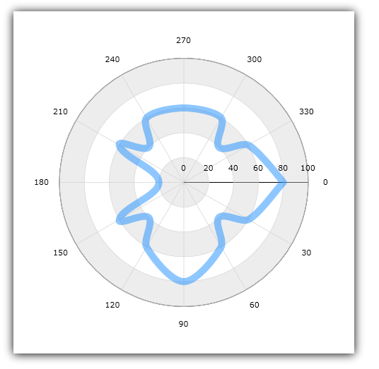

////

|metadata|
{
    "name": "igchartview-polar-spline-series",
    "controlName": ["IGChartView"],
    "tags": ["Charting","How Do I"],
    "guid": "e7512aed-16ca-47a2-b45d-a54d03c59e2a",  
    "buildFlags": [],
    "createdOn": "2013-02-06T13:09:44.4616421Z"
}
|metadata|
////

= Polar Spline Series

== Topic Overview

=== Purpose

This topic provides a conceptual overview of the Polar Spline Series in the  _IGChartView_™ control and provides a code example showing you how to add it to the chart views.

=== In this topic

This topic contains the following sections:

* <<_Ref324841248, Introduction >>

** <<_Ref328076501,Polar Spline series summary>>
** <<_Ref326327824,Data requirements>>

* <<_Ref328076508,Adding a Polar Spline Series to the  _IGChartView_   – Code Example>>

** <<_Ref326327832,Description>>
** <<_Ref328076518,Prerequisites>>
** <<_Ref326327837,Code>>

* <<_Ref324841253, Related Content >>

[[_Ref324841248]]
== Introduction

[[_Ref328076501]]

=== Polar Spline series summary

Rendered using a collection of spline lines connecting data points in polar (angle/radius) coordinate system, the Polar Spline series uses the same concepts of data plotting as the link:igchartview-scatter-spline-series.html[Scatter Spline Series] but wraps data points around a circle rather than stretching them along a horizontal line., You can plot multiple Polar Spline series, like with other series types, in the same data chart and they may be overlaid one apon another to show the differences and similarities between data sets.

[[_Ref326327824]]

=== Data requirements

While the  _IGChartView_   control allows for easy binding to your own data model, make sure to supply the appropriate data amounts and types required by the series. Failing to do so causes the  _IGChartView_   to appear blank.

*Required –* The bound data model must contain 2 numeric fields, one for each of the two polar coordinates (angle and radius), for rendering polar line data.

[[_Ref324842387]]
[[_Ref328076508]]
== Adding a Polar Spline Series to the  _IGChartView_   – Code Example

[[_Ref326327832]]

=== Description

The code below uses the link:igchartview-data-source-helpers.html[IGPolarSeriesDataSourceHelper] to supply randomly generated data to a Polar Spline Series by first adding to the  _IGChartView_   instance, and then adding the  _IGChartView_   as a subview of the current UIView.

[[_Ref328076518]]

=== Prerequisites

This code example requires the inclusion of the  _IGChartView_   framework, detail about how to add this framework is available in the link:igchartview-adding-the-chart-framework-file.html[Adding the Chart Framework File] topic.

[[_Ref326327837]]

=== Code

*In C#:*

[source,csharp]
----
NSMutableArray angle = new NSMutableArray();
for (int i = 0; i < 25; i++) {
      angle.Add(new NSNumber((i * 14)));
}
NSMutableArray radius = new NSMutableArray();
for (int i = 0; i < 25; i++) {
      radius.Add(new NSNumber((new Random(i).Next() % 100)));
}
IGPolarSeriesDataSourceHelper source = new IGPolarSeriesDataSourceHelper();
source.AngleValues = angle;
source.RadiusValues = radius;
IGChartView infraChart = new IGChartView(this.View.Frame);
IGNumericAngleAxis angleAxis = new IGNumericAngleAxis("angleAxis");
IGNumericRadiusAxis radiusAxis = new IGNumericRadiusAxis("radiusAxis");
angleAxis.Minimum = 0;
angleAxis.Maximum = 360;
angleAxis.Interval = 30;
infraChart.AddAxis(angleAxis);
infraChart.AddAxis(radiusAxis);
IGPolarSplineSeries polarSplineSeries = new IGPolarSplineSeries("polarSplineSeries");
polarSplineSeries.AngleAxis = angleAxis;
polarSplineSeries.RadiusAxis = radiusAxis;
polarSplineSeries.DataSource = source;
polarSplineSeries.MarkerType = IGMarkerType.IGMarkerTypeNone;
infraChart.AddSeries(polarSplineSeries);
(this.View).AddSubview(infraChart);
----

*In Objective-C:*

[source,csharp]
----
 NSMutableArray *angle = [[NSMutableArray alloc] init];
    for (int i = 0; i < 25; i++) {
        [angle addObject:[[NSNumber alloc] initWithDouble:(i * 14)]];
    }
    NSMutableArray *radius = [[NSMutableArray alloc] init];
    for (int i = 0; i < 25; i++) {
        [radius addObject:[[NSNumber alloc] initWithDouble:(arc4random() % 100)]];
    }
    IGPolarSeriesDataSourceHelper *source = [[IGPolarSeriesDataSourceHelper alloc] init];
    source.angleValues = angle;
    source.radiusValues = radius;
    IGChartView *infraChart = [[IGChartView alloc] initWithFrame:self.view.frame];
    IGNumericAngleAxis *angleAxis = [[IGNumericAngleAxis alloc] initWithKey:@"angleAxis"];
    IGNumericRadiusAxis *radiusAxis = [[IGNumericRadiusAxis alloc] initWithKey:@"radiusAxis"];
    angleAxis.minimum = 0;
    angleAxis.maximum = 360;
    angleAxis.interval = 30;
    [infraChart addAxis:angleAxis];
    [infraChart addAxis:radiusAxis];
    IGPolarSplineSeries *polarSplineSeries = [[IGPolarSplineSeries alloc] initWithKey:@"polarSplineSeries"];
    polarSplineSeries.angleAxis = angleAxis;
    polarSplineSeries.radiusAxis = radiusAxis;
    polarSplineSeries.dataSource = source;
    polarSplineSeries.markerType = IGMarkerTypeNone;
    [infraChart addSeries:polarSplineSeries];
    [self.view addSubview:infraChart];
----

[[_Ref324841253]]
== Related Content

=== Topics

The following topics provide additional information related to this topic.

[options="header", cols="a,a"]
|====
|Topic|Purpose

|[[_Hlk328076609]] 

link:igchartview-chart-series.html[Chart Series]
|This collection of topics explains each of the individual charts supported by the _IGChartView_ control.

|====