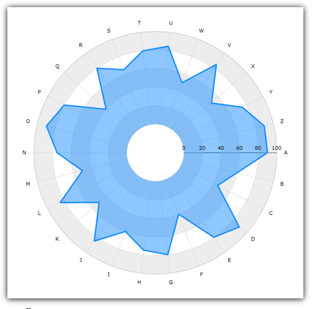

////

|metadata|
{
    "name": "igchartview-radial-area-series",
    "controlName": ["IGChartView"],
    "tags": ["Charting","How Do I"],
    "guid": "00d257cd-53b5-4c69-bee0-049aed71bbc4",  
    "buildFlags": [],
    "createdOn": "2013-02-06T15:04:24.3275599Z"
}
|metadata|
////

= Radial Area Series

== Topic Overview

=== Purpose

This topic is a conceptual overview of the  _IGChartView_™ control’s Radial Area Series and provides a code example demonstrating how to add it to the chart view.

=== In this topic

This topic contains the following sections:

* <<_Ref324841248, Introduction >>

** <<_Ref215796828,Radial Area series summary>>
** <<_Ref327344200,Data requirements>>

* <<_Ref327936206,Adding a Radial Area Series to the IGChartView – Code Example>>

** <<_Ref327344209,Description>>
** <<_Ref327523606,Prerequisites>>
** <<_Ref327344217,Code>>

* <<_Ref324841253, Related Content >>

[[_Ref324841248]]
== Introduction

[[_Ref215796828]]

=== Radial Area series summary

Radial Area series has a shape of a filled polygon bound by a collection of straight lines connecting data points. The Radial Area series uses the same concepts of data plotting as the link:igchartview-area-series.html[Area Series] but wraps data points around a circle rather than stretching them along a horizontal line.

[[_Ref327344200]]

=== Data requirements

While the  _IGChartView_  control allows easy binding to your own data model, make sure to supply the appropriate amounts and types of data required by the series. Failing to do so causes the  _IGChartView_  to appear blank.

*Required –* the data model must contain one numeric field to render Radial Line Series data.

[[_Ref324842387]]
[[_Ref327936206]]
== Adding a Radial Area Series to the IGChartView – Code Example

[[_Ref327344209]]

=== Description

The code below uses the link:igchartview-data-source-helpers.html[IGCategorySeriesDataSourceHelper] to supply randomly generated data to a Radial Area series by first adding to the  _IGChartView_   instance, then next adding the  _IGChartView_   as a subview of the current  _UIView_  .

[[_Ref327523606]]

=== Prerequisites

This code example requires the inclusion of the  _IGChartView_   framework, detail about how to add this framework is available in the link:igchartview-adding-the-chart-framework-file.html[Adding the Chart Framework File] topic.

[[_Ref327344217]]

=== Code

*In C#:*

[source,csharp]
----
List<NSObject> values = new List<NSObject>();
for (int i = 0; i < 25; i++) {
      values.Add(new NSNumber((new Random(i).Next() % 100)));
}
IGCategorySeriesDataSourceHelper source = new IGCategorySeriesDataSourceHelper();
source.Values = values.ToArray();
IGChartView infraChart = new IGChartView(this.View.Frame);
IGCategoryAngleAxis angleAxis = new IGCategoryAngleAxis("angleAxis");
IGNumericRadiusAxis radiusAxis = new IGNumericRadiusAxis("radiusAxis");
radiusAxis.InnerRadiusExtentScale = 0.10f;
infraChart.AddAxis(angleAxis);
infraChart.AddAxis(radiusAxis);
IGRadialAreaSeries radialAreaSeries = new IGRadialAreaSeries("radialAreaSeries");
radialAreaSeries.AngleAxis = angleAxis;
radialAreaSeries.ValueAxis = radiusAxis;
radialAreaSeries.DataSource = source;
radialAreaSeries.MarkerType = IGMarkerType.IGMarkerTypeNone;
infraChart.AddSeries(radialAreaSeries);
(this.View).AddSubview(infraChart);
----

*In Objective-C:*

[source,csharp]
----
 NSMutableArray *values = [[NSMutableArray alloc] init];
    for (int i = 0; i < 25; i++)     {        [values addObject:[[NSNumber alloc] initWithDouble:(arc4random() % 100)]];    }
    IGCategorySeriesDataSourceHelper *source = [[IGCategorySeriesDataSourceHelper alloc] init];    source.values = values;
    IGChartView *infraChart = [[IGChartView alloc] initWithFrame:self.view.frame];
    IGCategoryAngleAxis *angleAxis = [[IGCategoryAngleAxis alloc] initWithKey:@"angleAxis"];    IGNumericRadiusAxis * radiusAxis = [[IGNumericRadiusAxis alloc] initWithKey:@"radiusAxis"];    radiusAxis.innerRadiusExtentScale = 0.10;    [infraChart addAxis:angleAxis];    [infraChart addAxis:radiusAxis];
    IGRadialAreaSeries *radialAreaSeries = [[IGRadialAreaSeries alloc] initWithKey:@"radialAreaSeries"];
    radialAreaSeries.angleAxis = angleAxis;
    radialAreaSeries.valueAxis = radiusAxis;
    radialAreaSeries.dataSource = source;
    radialAreaSeries.markerType = IGMarkerTypeNone;
    [infraChart addSeries:radialAreaSeries];
    [self.view addSubview:infraChart];
----

[[_Ref324841253]]
== Related Content

=== Topics

The following topics provide additional information related to this topic.

[options="header", cols="a,a"]
|====
|Topic|Purpose

| link:igchartview-chart-series.html[Chart Series]
|This collection of topics explains each of the individual charts supported by the _IGChartView_ control.

|====