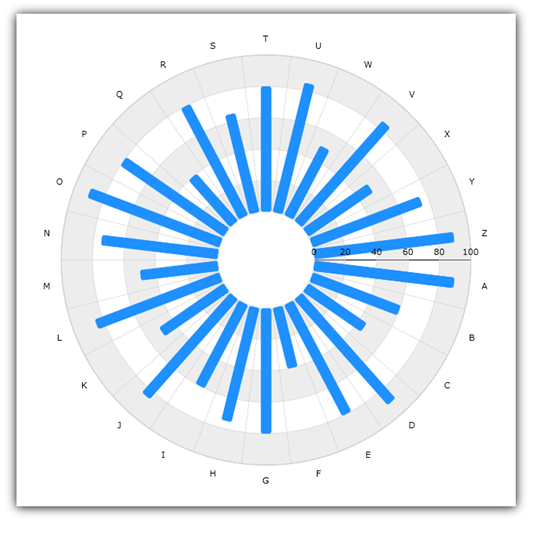

////

|metadata|
{
    "name": "igchartview-radial-column-series",
    "controlName": ["IGChartView"],
    "tags": ["Charting","How Do I"],
    "guid": "4c00eae7-e9d0-4ef1-b92d-d39b832ca577",  
    "buildFlags": [],
    "createdOn": "2012-05-21T17:59:45.5981581Z"
}
|metadata|
////

= Radial Column Series

== Topic Overview

=== Purpose

This topic provides a conceptual overview of the  _IGChartView_™ control and provides a code sample demonstrating how to add it to the chart view.

=== In this topic

This topic contains the following sections:

* <<_Ref324841248, Introduction >>

** <<_Ref327932716,Radial Column series summary>>
** <<_Ref327932727,Data requirements>>

* <<_Ref324842387, Adding a Radial Column Series to the IGChartView - Code Example >>

** <<_Ref324842387,>><<_Ref324842387,>><<_Ref327932736,Description>>
** <<_Ref327932741,Prerequisites>>
** <<_Ref327932745,Code>>

* <<_Ref327932752, Related Content >>

[[_Ref324841248]]
== Introduction

[[_Ref327932716]]

=== Radial Column series summary

The Radial column series uses a collection of rectangles emanating from the center of the chart toward the data point’s coordinates. The radial column series uses the same concepts of data plotting as the column series but wraps data points around a circle rather than stretching them along a horizontal line.

[[_Ref327932727]]

=== Data requirements

While the  _IGChartView_   control allows for easy binding to your own data model, it is important that you supply the appropriate amount and type of data required by that series. If the data does not meet the minimum requirements of the type of series that is being used, the  _IGChartView_   will appear blank.

*Required –*  the bound data model must contain 1 numeric field to render radial pie data.

[[_Ref324842387]]
[[_Ref324841253]]
== Adding a Radial Column Series to the  _IGChartView_   – Code Example

[[_Ref327932736]]

=== Description

The code below uses the link:igchartview-data-source-helpers.html[IGCategorySeriesDataSourceHelper] to supply randomly generated data to a radial column series that first gets added to the  _IGChartView_   instance, and then the current  _UIView_   adds the  _IGChartView_   as a subview.

[[_Ref327932741]]

=== Prerequisites

This code example requires the inclusion of the  _IGChartView_   framework, detail about how to add this framework can be found in the link:igchartview-adding-the-chart-framework-file.html[Adding the Chart Framework File] topic.

[[_Ref327932745]]

=== Code

*In Objective-C:*

[source,csharp]
----
 NSMutableArray *values = [[NSMutableArray alloc] init];
    for (int i = 0; i < 25; i++) {
        [values addObject:[[NSNumber alloc] initWithDouble:(arc4random() % 100)]];
    }
    IGCategorySeriesDataSourceHelper *source = [[IGCategorySeriesDataSourceHelper alloc] init];
    source.values = values;
    IGChartView *infraChart = [[IGChartView alloc] initWithFrame:self.view.frame];
    IGCategoryAngleAxis *angleAxis = [[IGCategoryAngleAxis alloc] initWithKey:@"angleAxis"];
    IGNumericRadiusAxis *radiusAxis = [[IGNumericRadiusAxis alloc] initWithKey:@"radiusAxis"];
    radiusAxis.innerRadiusExtentScale = 0.10;
    [infraChart addAxis:angleAxis];
    [infraChart addAxis:radiusAxis];
    IGRadialColumnSeries *radialColumnSeries = [[IGRadialColumnSeries alloc] initWithKey:@"radialColumnSeries"];
    radialColumnSeries.angleAxis = angleAxis;
    radialColumnSeries.valueAxis = radiusAxis;
    radialColumnSeries.dataSource = source;
    radialColumnSeries.markerType = IGMarkerTypeNone;
    [infraChart addSeries:radialColumnSeries];
    [self.view addSubview:infraChart];
----

*In C#:*

[source,csharp]
----
 List<NSObject> data = new List<NSObject>();
   Random r = new Random();
   for(int i = 0;i <25; i++)
   {
      double val = r.Next() % 100; 
      data.Add(new NSNumber(val));
   }
 IGCategoryDateSeriesDataSourceHelper source = new IGCategoryDateSeriesDataSourceHelper();
   source.Values = data.ToArray();
 IGChartView chart = new IGChartView(this.View.Frame);
   chart.AutoresizingMask = UIViewAutoresizing.FlexibleHeight | UIViewAutoresizing.FlexibleWidth;
  this.View.AddSubview(chart);
 IGCategoryAngleAxis angleAxis = new IGCategoryAngleAxis("angleAxis");
   IGNumericRadiusAxis radiusAxis = new IGNumericRadiusAxis("radiusAxis");
   chart.AddAxis(angleAxis );
   chart.AddAxis(radiusAxis );
 radiusAxis.InnerRadiusExtentScale = 0.10f;
 IGRadialColumnSeries series= new IGRadialColumnSeries("series");
   series.AngleAxis= angleAxis ;
   series.RadiusAxis = radiusAxis ;
   series.DataSource = source;
   chart.AddSeries(columnSeries);
----

[[_Ref327932752]]
== Related Content

=== Topics

The following topics provide additional information related to this topic.

[options="header", cols="a,a"]
|====
|Topic|Purpose

| link:igchartview-chart-series.html[Chart Series]
|The _IGChartView_ control chart series is divided into several groups, this parent topic contains links and details about each one.

|====