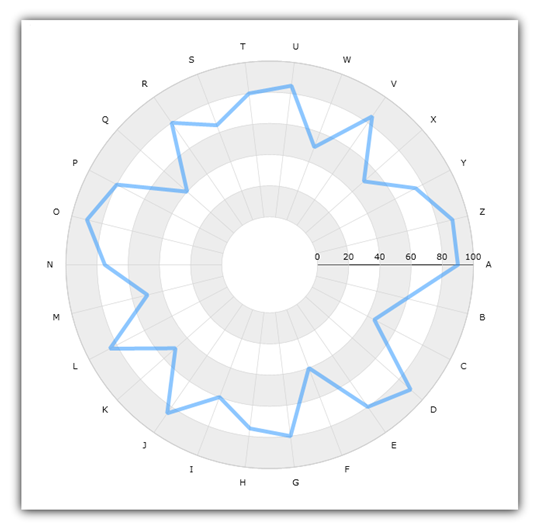

////

|metadata|
{
    "name": "igchartview-radial-line-series",
    "controlName": ["IGChartView"],
    "tags": ["Charting","How Do I"],
    "guid": "ee07a6ac-e1f2-4be3-a358-6d9f285c3d8f",  
    "buildFlags": [],
    "createdOn": "2012-05-21T18:00:13.0057257Z"
}
|metadata|
////

= Radial Line Series

== Topic Overview

=== Purpose

This topic provides a conceptual overview of the Radial Line series in the  _IGChartView_™ control and uses a code sample to demonstrate how to add it to the chart view.

=== In this topic

This topic contains the following sections:

* <<_Ref324841248, Introduction >>

** <<_Ref327932958,Radial Line series summary>>
** <<_Ref327932970,Data requirements>>

* <<_Ref327932978, Adding a Radial Line Series to the IGChartView – Code Example >>

** <<_Ref327932989,Description>>
** <<_Ref327932997,Prerequisites>>
** <<_Ref327933006,Code>>

* <<_Ref324841253, Related Content >>

[[_Ref324841248]]
== Introduction

[[_Ref327932958]]

=== Radial Line series summary

The Radial line series uses a collection of straight lines connecting data points when rendered. The radial line series uses the same concepts of data plotting as the line series, but wraps data points around a circle rather than stretching them along a horizontal line.

[[_Ref327932970]]

=== Data requirements

While the  _IGChartView_   control allows for easy binding to your own data model, it is important that you supply the appropriate amount and type of data required by that series. If the data model does not meet the series’ minimum requirements, the  _IGChartView_   will appear blank.

*Required*  – the bound data model must contain one numeric field to render Radial Line series data.

[[_Ref324842387]]
[[_Ref327932978]]
== Adding a Radial Line Series to the  _IGChartView_   – Code Example

[[_Ref327932989]]

=== Description

The code below uses the link:igchartview-data-source-helpers.html[IGCategorySeriesDataSourceHelper] to supply randomly generated data to a radial line series that first gets added to the  _IGChartView_   instance, and then the  _IGChartView_   is added as a subview of the current  _UIView_  .

[[_Ref327932997]]

=== Prerequisites

This code example requires the inclusion of the  _IGChartView_   framework, detail about how to add this framework can be found in the link:igchartview-adding-the-chart-framework-file.html[Adding the Chart Framework File] topic.

[[_Ref327933006]]

=== Code

*In Objective-C:*

[source,csharp]
----
 NSMutableArray *values = [[NSMutableArray alloc] init];
    for (int i = 0; i < 25; i++) {
        [values addObject:[[NSNumber alloc] initWithDouble:(arc4random() % 100)]];
    }
    IGCategorySeriesDataSourceHelper *source = [[IGCategorySeriesDataSourceHelper alloc] init];
    source.values = values;
    IGChartView *infraChart = [[IGChartView alloc] initWithFrame:self.view.frame];
    IGCategoryAngleAxis *angleAxis = [[IGCategoryAngleAxis alloc] initWithKey:@"angleAxis"];
    IGNumericRadiusAxis *radiusAxis = [[IGNumericRadiusAxis alloc] initWithKey:@"radiusAxis"];
    radiusAxis.innerRadiusExtentScale = 0.10;
    [infraChart addAxis:angleAxis];
    [infraChart addAxis:radiusAxis];
    IGRadialLineSeries *radialLineSeries = [[IGRadialLineSeries alloc] initWithKey:@"radialLineSeries"];
    radialLineSeries.angleAxis = angleAxis;
    radialLineSeries.valueAxis = radiusAxis;
    radialLineSeries.dataSource = source;
    radialLineSeries.markerType = IGMarkerTypeNone;
    [infraChart addSeries:radialLineSeries];
    [self.view addSubview:infraChart];
----

*In C#:*

[source,csharp]
----
 List<NSObject> data = new List<NSObject>();
   Random r = new Random();
   for(int i = 0;i <25; i++)
   {
      double val = r.Next() % 100; 
      data.Add(new NSNumber(val));
   }
 IGCategoryDateSeriesDataSourceHelper source = new IGCategoryDateSeriesDataSourceHelper();
   source.Values = data.ToArray();
 IGChartView chart = new IGChartView(this.View.Frame);
   chart.AutoresizingMask = UIViewAutoresizing.FlexibleHeight | UIViewAutoresizing.FlexibleWidth;
  this.View.AddSubview(chart);
 IGCategoryAngleAxis angleAxis = new IGCategoryAngleAxis("angleAxis");
   IGNumericRadiusAxis radiusAxis = new IGNumericRadiusAxis("radiusAxis");
   chart.AddAxis(angleAxis );
   chart.AddAxis(radiusAxis );
 radiusAxis.InnerRadiusExtentScale = 0.10f;
 IGRadialLineSeries series= new IGRadialLineSeries("series");
   series.AngleAxis= angleAxis ;
   series.RadiusAxis = radiusAxis ;
   series.DataSource = source;
   chart.AddSeries(columnSeries);
----

[[_Ref324841253]]
== Related Content

=== Topics

The following topics provide additional information related to this topic.

[options="header", cols="a,a"]
|====
|Topic|Purpose

| link:igchartview-radial-series.html[Radial Series]
|This is a group of topics explaining the various types of Radial series supported by the _IGChartView_ control.

|====