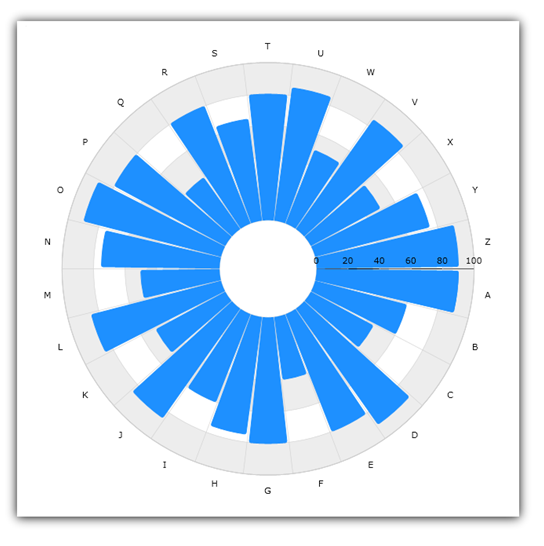

////

|metadata|
{
    "name": "igchartview-radial-pie-series",
    "controlName": ["IGChartView"],
    "tags": ["Charting","How Do I"],
    "guid": "5f15d8e0-4414-4593-b7c1-4e0b8a776e62",  
    "buildFlags": [],
    "createdOn": "2012-05-21T18:00:37.0931035Z"
}
|metadata|
////

= Radial Pie Series

== Topic Overview

=== Purpose

This topic provides a conceptual overview of the Radial Pie series in the  _IGChartView_™ control and uses a code sample to demonstrate how to add it to the chart view.

=== In this topic

This topic contains the following sections:

* <<_Ref324841248, Introduction >>

** <<_Ref327931659,Radial Pie series summary>>
** <<_Ref327931676,Data requirements>>

* <<_Ref324842387, Adding a Radial Pie Series to the IGChartView – Code Example >>

** <<_Ref327931803,Description>>
** <<_Ref327931812,Prerequisites>>
** <<_Ref327931821,Code>>

* <<_Ref324841253, Related Content >>

[[_Ref324841248]]
== Introduction

[[_Ref327931659]]

=== Radial Pie series summary

The Radial Pie series uses pie slices, emanating from the center of the chart toward the data point’s coordinates. The radial pie series uses the same idea of categorizing multiple series of data points and plotting them around on a circle rather than stretching data points along a horizontal line.

[[_Ref327931676]]

=== Data requirements

While the  _IGChartView_   control allows for easy binding to your own data model, it is important that you supply the appropriate amount and type of data required by that series. If the data does not meet the minimum requirements of the type of series that being used, the  _IGChartView_   will appear blank.

*Required –*  to render radial pie data, the bound data model must contain 1 numeric field.

[[_Ref324842387]]
== Adding a Radial Pie Series to the  _IGChartView_   – Code Example

[[_Ref327931803]]

=== Description

The code below uses the link:igchartview-data-source-helpers.html[IGCategorySeriesDataSourceHelper] to supply randomly generated data to a radial pie series that first gets added to the  _IGChartView_   instance, and then the  _IGChartView_   is added as a subview of the current  _UIView_  .

[[_Ref327931812]]

=== Prerequisites

This code example requires the inclusion of the  _IGChartView_   framework, detail about how to add this framework can be found in the link:igchartview-adding-the-chart-framework-file.html[Adding the Chart Framework File] topic.

[[_Ref327931821]]

=== Code

*In Objective-C:*

[source,csharp]
----
 NSMutableArray *values = [[NSMutableArray alloc] init];
    for (int i = 0; i < 25; i++) {
        [values addObject:[[NSNumber alloc] initWithDouble:(arc4random() % 100)]];
    }
    IGCategorySeriesDataSourceHelper *source = [[IGCategorySeriesDataSourceHelper alloc] init];
    source.values = values;
    IGChartView *infraChart = [[IGChartView alloc] initWithFrame:self.view.frame];
    IGCategoryAngleAxis *angleAxis = [[IGCategoryAngleAxis alloc] initWithKey:@"angleAxis"];
    IGNumericRadiusAxis *radiusAxis = [[IGNumericRadiusAxis alloc] initWithKey:@"radiusAxis"];
    radiusAxis.innerRadiusExtentScale = 0.10;
    [infraChart addAxis:angleAxis];
    [infraChart addAxis:radiusAxis];
    IGRadialPieSeries *radialPieSeries = [[IGRadialPieSeries alloc] initWithKey:@"radialPieSeries"];
    radialPieSeries.angleAxis = angleAxis;
    radialPieSeries.valueAxis = radiusAxis;
    radialPieSeries.dataSource = source;
    radialPieSeries.markerType = IGMarkerTypeNone;
    [infraChart addSeries:radialPieSeries];
    [self.view addSubview:infraChart];
----

*In C#:*

[source,csharp]
----
 List<NSObject> data = new List<NSObject>();
   Random r = new Random();
   for(int i = 0;i <25; i++)
   {
      double val = r.Next() % 100; 
      data.Add(new NSNumber(val));
   }
 IGCategoryDateSeriesDataSourceHelper source = new IGCategoryDateSeriesDataSourceHelper();
   source.Values = data.ToArray();
 IGChartView chart = new IGChartView(this.View.Frame);
   chart.AutoresizingMask = UIViewAutoresizing.FlexibleHeight | UIViewAutoresizing.FlexibleWidth;
  this.View.AddSubview(chart);
 IGCategoryAngleAxis angleAxis = new IGCategoryAngleAxis("angleAxis");
   IGNumericRadiusAxis radiusAxis = new IGNumericRadiusAxis("radiusAxis");
   chart.AddAxis(angleAxis );
   chart.AddAxis(radiusAxis );
 radiusAxis.InnerRadiusExtentScale = 0.10f;
 IGRadialLineSeries series= new IGRadialPieSeries("series");
   series.AngleAxis= angleAxis ;
   series.RadiusAxis = radiusAxis ;
   series.DataSource = source;
   chart.AddSeries(columnSeries);
----

[[_Ref324841253]]
== Related Content

=== Topics

The following topics provide additional information related to this topic.

[options="header", cols="a,a"]
|====
|Topic|Purpose

|[[_Hlk328077052]] 

link:igchartview-radial-series.html[Radial Series]
|This is a group of topics explaining the various types of Radial series supported by the _IGChartView_ control.

|====