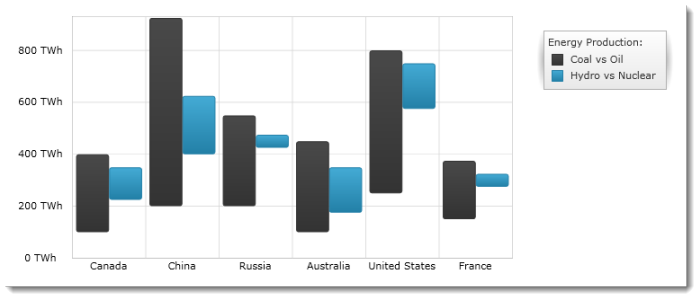

////

|metadata|
{
    "name": "igchartview-range-column-series",
    "controlName": ["IGChartView"],
    "tags": ["Charting","How Do I"],
    "guid": "e7126edf-c2bc-4d72-9a16-ba008d5217ff",  
    "buildFlags": [],
    "createdOn": "2012-05-17T14:00:16.7290187Z"
}
|metadata|
////

= Range Column Series

== Topic Overview

=== Purpose

This topic provides a conceptual overview of the Range Column series in the  _IGChartView_™ control and uses a code example to demonstrate how to add it to the chart view.

=== In this topic

This topic contains the following sections:

* <<_Ref324841248, Introduction >>

** <<_Ref328075064,Range Column series summary>>
** <<_Ref327343943,Data requirements>>

* <<_Ref324842387, Adding a Range Column Series to the  _IGChartView_   – Code Example >>

** <<_Ref327343951,Description>>
** <<_Ref328075085,Prerequisites>>
** <<_Ref327343959,Code>>

* <<_Ref324841253, Related Content >>

[[_Ref324841248]]
== Introduction

[[_Ref327343938]]

=== Range Column series summary

Range column series belongs to a group of category series and uses a collection of vertical columns, which show the difference between two values of a data point, when rendered. This type of series emphasizes the amount of change between low and high values in the same data point over a time or compares multiple items.

Range values are represented on the y-axis ( _IGNumericYAxis_  ) and categories are displayed on the x-axis ( _IGCategoryXAxis_   or  _IGCategoryDateTimeXAxis_  ). The range column series is identical to the range area series in all aspects except that the ranges are represented as a set of vertical columns rather than filled area.

[[_Ref327343943]]

=== Data requirements

While the  _IGChartView_   control allows easy binding to your own data model, make sure to supply the appropriate amounts and types of data required by the series. If the data does not meet the minimum requirements, based on the type of series that you are using, the  _IGChartView_   will appear blank.

The following is a list of data requirements for the area series type:

*  *Required –*  the data model must contain at least two numeric data columns for rendering the range between the values.
*  *Optional –*  the data model may contain an optional string or  _NSDate_   field for labels.

[[_Ref324842387]]
== Adding a Range Column Series to the  _IGChartView_   – Code Example

[[_Ref327343951]]

=== Description

The code below uses the link:igchartview-data-source-helpers.html[IGHighLowSeriesDataSourceHelper] to supply randomly generated data to a range column series that first gets added to the  _IGChartView_   instance, and then the  _IGChartView_   is added as a subview of the current  _UIView_  .

[[_Ref328075085]]

=== Prerequisites

This code example requires the inclusion of the  _IGChartView_   framework, detail about how to add this framework can be found in the link:igchartview-adding-the-chart-framework-file.html[Adding the Chart Framework File] topic.

[[_Ref327343959]]

=== Code

*In Objective-C:*

[source,csharp]
----
 NSMutableArray *dataHigh = [[NSMutableArray alloc] init];
    NSMutableArray *dataLow = [[NSMutableArray alloc] init];
    for (int i = 0; i < 10; i++)
    {
        double value = arc4random() % 100 + 100;
        [dataHigh addObject:[[NSNumber alloc] initWithDouble:value]];
        value -= 100;
        [dataLow addObject:[[NSNumber alloc] initWithDouble:value]];
    }
    IGHighLowSeriesDataSourceHelper *source = [[IGHighLowSeriesDataSourceHelper alloc] init];
    source.highValues = dataHigh;
    source.lowValues = dataLow;
    IGChartView *infraChart = [[IGChartView alloc] initWithFrame:self.view.frame];
    [infraChart setAutoresizingMask:UIViewAutoresizingFlexibleWidth|UIViewAutoresizingFlexibleHeight];
    IGCategoryXAxis *xAxis = [[IGCategoryXAxis alloc] initWithKey:@"xAxis"];
    IGNumericYAxis *yAxis = [[IGNumericYAxis alloc] initWithKey:@"yAxis"];
    [infraChart addAxis:xAxis];
    [infraChart addAxis:yAxis];
    IGRangeColumnSeries *rangeColumnSeries = [[IGRangeColumnSeries alloc] initWithKey:@"rangeColumnSeries"];
    rangeColumnSeries.xAxis = xAxis;
    rangeColumnSeries.yAxis = yAxis;
    rangeColumnSeries.dataSource = source;
    [infraChart addSeries:rangeColumnSeries];
    [self.view addSubview:infraChart];
----

*In C#:*

[source,csharp]
----
List<NSObject> dataHigh = new List<NSObject>();
   List<NSObject> dataLow = new List<NSObject>();
   Random r = new Random();
   for(int i = 0;i <25; i++)
   {
      double val = r.Next() % 100 + 100; 
      dataHigh.Add(new NSNumber(val));
      val -= 100
      dataLow.Add(new NSNumber(val));
}
 IGCategoryDateSeriesDataSourceHelper source = new IGCategoryDateSeriesDataSourceHelper();
   source.HighValues = dataHigh.ToArray();
   source.LowValues = dataLow.ToArray();
IGChartView chart = new IGChartView(this.View.Frame);
   chart.AutoresizingMask = UIViewAutoresizing.FlexibleHeight | UIViewAutoresizing.FlexibleWidth;
  this.View.AddSubview(chart);
 IGCategoryXAxis xAxis = new IGCategoryXAxis("xAxis");
   IGNumericYAxis yAxis = new IGNumericYAxis("yAxis");
   chart.AddAxis(xAxis);
   chart.AddAxis(yAxis);
IGRangeColumnSeries series= new IGRangeColumnSeries ("series");
   series.XAxis = xAxis;
   series.YAxis = yAxis;
   series.DataSource = source;
   chart.AddSeries(columnSeries);
----

[[_Ref324841253]]
== Related Content

=== Topics

The following topics provide additional information related to this topic.

[options="header", cols="a,a"]
|====
|Topic|Purpose

| link:igchartview-category-series.html[Category Series]
|This is a group of topics explaining the various types of Category series supported by the _IGChartView_ control.

|====