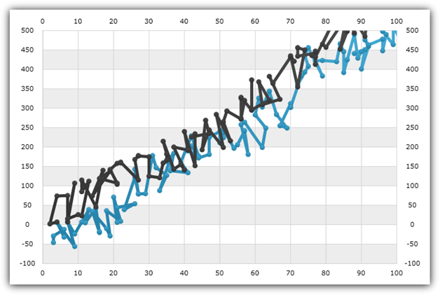

////

|metadata|
{
    "name": "igchartview-scatter-line-series",
    "controlName": ["IGChartView"],
    "tags": ["Charting","How Do I"],
    "guid": "4c79ca9d-a72c-4f9b-9f44-e2855e11db27",  
    "buildFlags": [],
    "createdOn": "2013-02-06T14:46:31.7443123Z"
}
|metadata|
////

= Scatter Line Series

== Topic Overview

=== Purpose

This topic provides a conceptual overview of the Scatter Line Series in the  _IGChartView_™ control and uses a code example to demonstrate how to add it to the chart view.

=== In this topic

This topic contains the following sections:

* <<_Ref324841248, Introduction >>

** <<_Ref327344196,Scatter Line Series summary>>
** <<_Ref327344200,Data requirements>>

* <<_Ref327936206,Adding a Scatter Line Series to the IGChartView – Code Example>>

** <<_Ref327344209,Description>>
** <<_Ref327523606,Prerequisites>>
** <<_Ref327344217,Code>>

* <<_Ref324841253, Related Content >>

[[_Ref324841248]]
== Introduction

[[_Ref327344196]]

=== Scatter Line series summary

The Scatter Line series is a link:igchartview-scatter-series-1.html[Scatter Series] where the points are sequentially connected by line segments to show either the relationship among the items in several distinct data series or to plot a line-using x and y coordinates. The data marker’s x and y coordinates are determined by two data values. A Scatter Line series draws attention to uneven intervals in data and is often used to plot scientific data; highlight the deviation of collected data from predicted results; and used to organize data chronologically.

A chart with Scatter Line series, displays data as a collection of points connected by a straight line with each connected point having the value of one variable determining the position on the horizontal axis and the value of the other variable determining the position on the vertical axis.

[[_Ref327344200]]

=== Data requirements

While the  _IGChartView_   control allows easy binding to your own data model, make sure to supply the appropriate amounts and types of data required by the series. Failing to do so causes the  _IGChartView_  to appear blank.

*Required –*  the data model must contain two numeric fields representing the x and y values for each point on the chart to render the data.

[[_Ref324842387]]
[[_Ref327936206]]
== Adding a Scatter Line Series to the IGChartView – Code Example

[[_Ref327344209]]

=== Description

The code below uses the link:igchartview-data-source-helpers.html[IGScatterSeriesDataSourceHelper] to supply randomly generated data to a Scatter Line Series by first adding to the  _IGChartView_   instance, and then adding the  _IGChartView_   as a subview of the current  _UIView_  .

[[_Ref327523606]]

=== Prerequisites

This code example requires the inclusion of the  _IGChartView_   framework, detail about how to add this framework can be found in the link:igchartview-adding-the-chart-framework-file.html[Adding the Chart Framework File] topic.

[[_Ref327344217]]

=== Code

*In C#:*

[source,csharp]
----
NSMutableArray x = new NSMutableArray();
for (int i = 0; i < 50; i++) {
      x.Add(new NSNumber((new Random(DateTime.Now.Millisecond).Next() % 100)));
}
NSMutableArray y = new NSMutableArray();
for (int i = 0; i < 50; i++) {
      y.Add(new NSNumber((new Random(DateTime.Now.Millisecond).Next() % 100)));
}
IGScatterSeriesDataSourceHelper source = new IGScatterSeriesDataSourceHelper();
source.XValues = x;
source.YValues = y;
IGChartView infraChart = new IGChartView(this.View.Frame);
IGNumericXAxis xAxis = new IGNumericXAxis("xAxis");
IGNumericYAxis yAxis = new IGNumericYAxis("yAxis");
infraChart.AddAxis(xAxis);
infraChart.AddAxis(yAxis);
IGScatterLineSeries scatterSeries = new IGScatterLineSeries("scatterSeries");
scatterSeries.XAxis = xAxis;
scatterSeries.YAxis = yAxis;
scatterSeries.DataSource = source;
infraChart.AddSeries(scatterSeries);
(this.View).AddSubview(infraChart);
----

*In Objective-C:*

[source,csharp]
----
 NSMutableArray *x = [[NSMutableArray alloc] init];
    for (int i = 0; i < 50; i++) {
        [x addObject:[[NSNumber alloc] initWithDouble:(arc4random() % 100)]];
    }
    NSMutableArray *y = [[NSMutableArray alloc] init];
    for (int i = 0; i < 50; i++) {
        [y addObject:[[NSNumber alloc] initWithDouble:(arc4random() % 100)]];
    }
    IGScatterSeriesDataSourceHelper *source = [[IGScatterSeriesDataSourceHelper alloc] init];
    source.xValues = x;
    source.yValues = y;
    IGChartView *infraChart = [[IGChartView alloc] initWithFrame:self.view.frame];
    IGNumericXAxis *xAxis = [[IGNumericXAxis alloc] initWithKey:@"xAxis"];
    IGNumericYAxis *yAxis = [[IGNumericYAxis alloc] initWithKey:@"yAxis"];
    [infraChart addAxis:xAxis];
    [infraChart addAxis:yAxis];
    IGScatterLineSeries *scatterSeries = [[IGScatterLineSeries alloc] initWithKey:@"scatterSeries"];
    scatterSeries.xAxis = xAxis;
    scatterSeries.yAxis = yAxis;
    scatterSeries.dataSource = source;
    [infraChart addSeries:scatterSeries];
    [self.view addSubview:infraChart];
----

[[_Ref324841253]]
== Related Content

=== Topics

The following topics provide additional information related to this topic.

[options="header", cols="a,a"]
|====
|Topic|Purpose

| link:igchartview-chart-series.html[Chart Series]
|This collection of topics explains each of the individual charts supported by the _IGChartView_ control.

|====