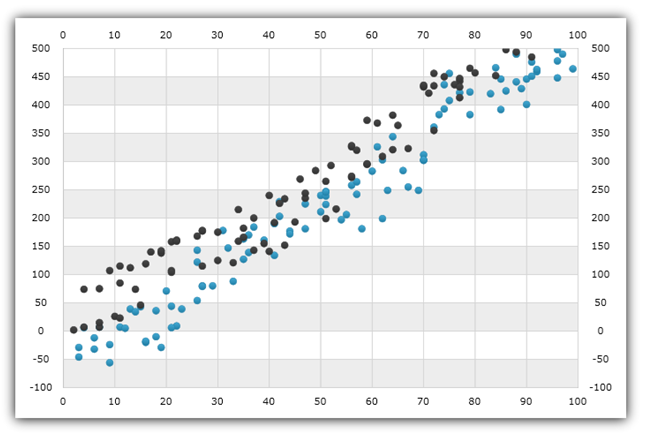

////

|metadata|
{
    "name": "igchartview-scatter-series-1",
    "controlName": ["IGChartView"],
    "tags": ["Charting","How Do I"],
    "guid": "dc081776-ff3e-4188-ba45-b7b0272856c8",  
    "buildFlags": [],
    "createdOn": "2012-05-21T14:00:12.6090702Z"
}
|metadata|
////

= Scatter Series

== Topic Overview

=== Purpose

This topic provides a conceptual overview of the Scatter Series in the  _IGChartView_™ control and uses a code example to demonstrate how to add it to the chart view.

=== In this topic

This topic contains the following sections:

* <<_Ref324841248, Introduction >>

** <<_Ref327344196,Scatter series summary>>
** <<_Ref327344200,Data requirements>>

* <<_Ref327936206,Adding a Scatter Series to the IGChartView – Code Example>>

** <<_Ref327344209,Description>>
** <<_Ref327523606,Prerequisites>>
** <<_Ref327344217,Code>>

* <<_Ref324841253, Related Content >>

[[_Ref324841248]]
== Introduction

[[_Ref327344196]]

=== Scatter series summary

The scatter series is commonly used for one of two purposes. First, it shows the relationship among the items in several distinct series of data, and second, it plots data values using x and y coordinates. A scatter series draws attention to uneven data intervals or clusters. This type of series is often used to plot scientific data, and can highlight the deviation of collected data from predicted results. The scatter series can also be used to organize data chronologically (even if the data is not in chronological order).

A chart with scatter series, displays data as a collection of points, represented by an ordered pair with one term determining the position on the horizontal axis and the other term determining the position on the vertical axis.

[[_Ref327344200]]

=== Data requirements

While the  _IGChartView_   control allows easy binding to your own data model, make sure to supply the appropriate amounts and types of data required by the series. If the data does not meet the minimum requirements, based on the type of series that you are using, the  _IGChartView_   will appear blank.

*Required –*  the data model must contain two numeric fields representing the x and y values for each point on the chart for rendering the data.

[[_Ref324842387]]
[[_Ref327936206]]
== Adding a Scatter Series to the IGChartView – Code Example

[[_Ref327344209]]

=== Description

The code below uses the link:igchartview-data-source-helpers.html[IGScatterSeriesDataSourceHelper] to supply randomly generated data to a scatter series that first gets added to the  _IGChartView_   instance, and then the  _IGChartView_   is added as a subview of the current UIView.

[[_Ref327523606]]

=== Prerequisites

This code example requires the inclusion of the  _IGChartView_   framework, detail about how to add this framework can be found in the link:igchartview-adding-the-chart-framework-file.html[Adding the Chart Framework File] topic.

[[_Ref327344217]]

=== Code

*In Objective-C:*

[source,csharp]
----
 NSMutableArray *x = [[NSMutableArray alloc] init];
    for (int i = 0; i < 50; i++) {
        [x addObject:[[NSNumber alloc] initWithDouble:(arc4random() % 100)]];
    }
    NSMutableArray *y = [[NSMutableArray alloc] init];
    for (int i = 0; i < 50; i++) {
        [y addObject:[[NSNumber alloc] initWithDouble:(arc4random() % 100)]];
    }
    IGScatterSeriesDataSourceHelper *source = [[IGScatterSeriesDataSourceHelper alloc] init];
    source.xValues = x;
    source.yValues = y;
    IGChartView *infraChart = [[IGChartView alloc] initWithFrame:self.view.frame];
    IGNumericXAxis *xAxis = [[IGNumericXAxis alloc] initWithKey:@"xAxis"];
    IGNumericYAxis *yAxis = [[IGNumericYAxis alloc] initWithKey:@"yAxis"];
    [infraChart addAxis:xAxis];
    [infraChart addAxis:yAxis];
    IGScatterSeries *scatterSeries = [[IGScatterSeries alloc] initWithKey:@"scatterSeries"];
    scatterSeries.xAxis = xAxis;
    scatterSeries.yAxis = yAxis;
    scatterSeries.dataSource = source;
    [infraChart addSeries:scatterSeries];
    [self.view addSubview:infraChart];
----

*In C#:*

[source,csharp]
----
 List<NSObject> x = new List<NSObject>();
   Random r = new Random();
   for(int i = 0; i <50; i++)
      x.Add(new NSNumber(r.Next()% 100));
 List<NSObject> y= new List<NSObject>();
   for(int i = 0; i <50; i++)
      y.Add(new NSNumber(r.Next()% 100));
 IGScatterSeriesDataSourceHelper source = new IGScatterSeriesDataSourceHelper ();
   source.XValues =  x.ToArray(); 
  source.YValues =  y.ToArray();
 IGChartView chart = new IGChartView(this.View.Frame);
   chart.AutoresizingMask = UIViewAutoresizing.FlexibleHeight | UIViewAutoresizing.FlexibleWidth;
  this.View.AddSubview(chart);
 IGNumericXAxis xAxis = new IGNumericXAxis ("xAxis");
   IGNumericYAxis yAxis = new IGNumericYAxis("yAxis");
   chart.AddAxis(xAxis);
   chart.AddAxis(yAxis);
 IGScatterSeries series= new IGScatterSeries ("series");
   series.XAxis = xAxis;
   series.YAxis = yAxis;
   series.DataSource = source;
   chart.AddSeries(columnSeries);
----

[[_Ref324841253]]
== Related Content

=== Topics

The following topics provide additional information related to this topic.

[options="header", cols="a,a"]
|====
|Topic|Purpose

| link:igchartview-scatter-series.html[Scatter Series]
|This topic provides a conceptual overview of the Scatter series in the _IGChartView_ control and provides a code example showing you how to add it to the chart views.

|====