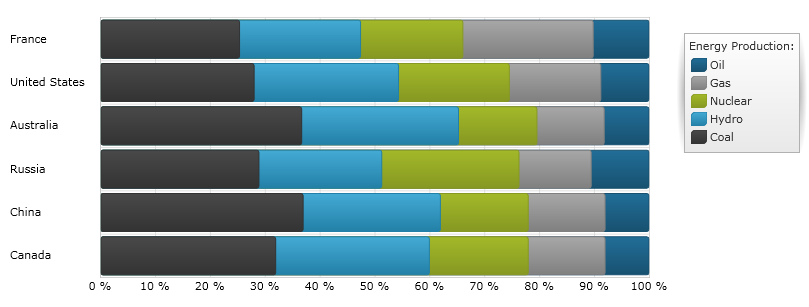

////

|metadata|
{
    "name": "igchartview-stacked-100-bar-series",
    "controlName": ["IGChartView"],
    "tags": ["Charting","How Do I"],
    "guid": "7fb2645b-ca84-4db0-9dda-5e54aee6839e",  
    "buildFlags": [],
    "createdOn": "2013-02-06T14:18:50.1921737Z"
}
|metadata|
////

= Stacked 100 Bar Series

== Topic Overview

=== Purpose

This topic provides a conceptual overview of the  _IGChartView_™ control’s Stacked 100 Bar series and demonstrates how to add it to the chart view using a code example.

=== In this topic

This topic contains the following sections:

* <<_Ref324841248, Introduction >>

** <<_Ref328076501,Stacked 100 Bar series summary>>
** <<_Ref326327824,Data requirements>>
** <<_Ref219345947,Data rendering rules>>

* <<_Ref328076508,Adding a Stacked 100 Bar Series to the  _IGChartView_   – Code Example>>

** <<_Ref326327832,Description>>
** <<_Ref328076518,Prerequisites>>
** <<_Ref326327837,Code>>

* <<_Ref324841253, Related Content >>

[[_Ref324841248]]
== Introduction

[[_Ref328076501]]

=== Stacked 100 Bar series summary

Belonging to a group of link:igchartview-category-series.html[Category Series], Stacked 100 Bar series renders using a collection of rectangles stacked next to each other. Each stacked fragment in the collection represents one visual element in each stack, and can contain both positive and negative values with all positive values grouped on the positive side of the x-axis, and all negative values grouped on the negative side of the x-axis. The Stacked 100 Bar series is identical to the link:igchartview-stacked-bar-series.html[Stacked Bar Series] in all aspects except in their treatment of the values on x-axis. Instead of presenting a direct representation of the data, the Stacked 100 Bar series presents the data in terms of percent of the sum of all values in a data point. In addition, the Stacked 100 Bar series uses the same concepts of data plotting as link:igchartview-stacked-100-column-series.html[Stacked 100 Column Series], but data points are stacked along the horizontal line (x-axis) rather than along the vertical line (y-axis). In other words, the Stacked 100 Bar series renders like the link:igchartview-stacked-100-column-series.html[Stacked 100 Column Series], but with 90 degrees clockwise rotation.

[[_Ref326327824]]

=== Data requirements

While the  _IGChartView_   control allows for easy binding to your own data model, make sure to supply the appropriate data amounts and types required by that series. Failing to do so causes the  _IGChartView_   to appear blank.

*Required –*  to render data, the bound data model must contain at least one numeric field, and may contain an optional string for labels. It is recommended that the data model contain two or more numeric data fields so that each point of the Stacked 100 Bar series has two or more stacked fragments.

[[_Ref219345947]]

=== Data rendering rules

The Stacked 100 Bar series renders data using the following rules:

* An  _IGStackedFragmentSeries_   needs to be added to the `series` collection property of the  _IGStacked100BarSeries_   for every numeric column in the data model that you want rendered
* Each row in the data model represents singularly stacked bar. Sections are created based on the columns in the data model that are mapped to the `valueProperty` of  _IGStackedFragmentSeries_   objects
* When rendering the second value in the row, its value is added to the points of the previous values in that row. Therefore, each point going upwards on the chart is a cumulative sum of the values at that point.
* The data values do not need to be percentages, as the sum of the data values in the row is used to calculate the percentage applicable to each section of the bar
* The string or date time column mapped to the `label` property of data mapping on the y-axis is used as the category labels. If the data mapping for `label` is not specified, default labels are used
* Category labels appear on the y-axis while data values appear on the x-axis
* When rendering, multiple series of the  _IGStacked100BarSeries_   type renders in clusters, with each cluster representing a data point. The first  _IGStacked100BarSeries_   in the `series` collection of the  _IGChartView_   control renders as a bar on the bottom of the cluster with each subsequent series rendered stacked on top of the previous series.

[[_Ref324842387]]
[[_Ref328076508]]
== Adding a Stacked 100 Bar Series to the  _IGChartView_   – Code Example

[[_Ref326327832]]

=== Description

The code below uses the link:igchartview-data-source-helpers.html[IGStackedSeriesDataSourceHelper] to supply randomly generated data to a Stacked 100 Bar series firstly by adding to the  _IGChartView_   instance, and then adding the  _IGChartView_   as a subview of the current UIView.

[[_Ref328076518]]

=== Prerequisites

This code example requires the inclusion of the  _Chart_   framework, detail about how to add this framework is available in the link:igchartview-adding-the-chart-framework-file.html[Adding the Chart Framework File] topic.

[[_Ref326327837]]

=== Code

*In C#:*

[source,csharp]
----
public class DataModel : NSObject
{
      [Export("Label")]
      public string Label { get; set; }
      [Export("Value1")]
      public float Value1 { get; set; }
      [Export("Value2")]
      public float Value2 { get; set; }
      [Export("Value3")]
      public float Value3 { get; set; }
}
//...
IGChartView _chartView;
IGStackedSeriesDataSourceHelper _stackedChartDataSourceHelper;
IGLegend _legend;
List<NSObject> _data;
void PopulateData()
{
      _data = new List<NSObject>();
      for (int i = 0; i < 10; i++) {
            DataModel item = new DataModel();
            item.Value1 = new Random((int)DateTime.Now.Ticks).Next(100);
            item.Value2 = new Random((int)DateTime.Now.Ticks).Next(100);
            item.Value3 = new Random((int)DateTime.Now.Ticks).Next(100);
            item.Label = string.Format ("Label {0}", i);
            _data.Add(item);
      }      
}
public override void ViewDidLoad ()
{
      this.PopulateData();
      RectangleF bounds = new RectangleF(0, 0, this.View.Frame.Size.Width, this.View.Frame.Size.Height);
      _chartView = new IGChartView(bounds);
      _chartView.BackgroundColor = UIColor.White;
      _stackedChartDataSourceHelper = new IGStackedSeriesDataSourceHelper(_data.ToArray(), NSArray.FromObjects("Value1", "Value2", "Value3"));
      _chartView.AddStackedSeries(new Class(typeof(IGStacked100BarSeries)), "series", _stackedChartDataSourceHelper, "xAxis", "yAxis");
      (this.View).AddSubview(_chartView);
      _legend = new IGLegend(IGChartLegendType.IGChartLegendTypeSeries);
      _legend.Frame = new RectangleF(20, 20, 100, 100);
      _chartView.Legend = _legend;
      (this.View).AddSubview(_legend);
}
----

*In Objective-C:*

[source,csharp]
----
@interface DataModel : NSObject
@property (nonatomic, retain) NSString *label;
@property (nonatomic) float value1;
@property (nonatomic) float value2;
@property (nonatomic) float value3;
@end
@interface igViewController : UIViewController
{
    IGChartView *_chartView;
    IGStackedSeriesDataSourceHelper *_stackedChartDataSourceHelper;
    IGLegend *_legend;
    NSMutableArray *_data;
}
@end
@implementation DataModel
@synthesize value1, value2, value3;
@end
@implementation igViewController
-(void)populateData
{
    _data = [[NSMutableArray alloc]init];
    for (int i=0; i<10; i++)
    {
        DataModel *item = [[DataModel alloc]init];
        item.value1 = arc4random() % 100;
        item.value2 = arc4random() % 100;
        item.value3 = arc4random() % 100;
        item.label = [NSString stringWithFormat:@"Label %d", i];
        [_data addObject:item];
    }
}
-(void)viewDidLoad
{
    [self populateData];
    CGRect bounds = CGRectMake(0, 0, self.view.frame.size.width, self.view.frame.size.height);
    _chartView = [[IGChartView alloc] initWithFrame:bounds];
    _chartView.backgroundColor = [UIColor whiteColor];
    _stackedChartDataSourceHelper = [[IGStackedSeriesDataSourceHelper alloc]initWithData:_data fields:@"value1", @"value2", @"value3", nil];
    [_chartView addStackedSeriesForType:[IGStacked100BarSeries class] usingKey:@"series" withDataSource:_stackedChartDataSourceHelper firstAxisKey:@"xAxis" secondAxisKey:@"yAxis"];    
    [self.view addSubview:_chartView];
    _legend = [[IGLegend alloc] initWithLegendType:IGChartLegendTypeSeries];
    [_legend setFrame:CGRectMake(20, 20, 100, 100)];
    _chartView.legend = _legend;
    [self.view addSubview:_legend];
}
@end
----

[[_Ref324841253]]
== Related Content

=== Topics

The following topic provides additional information related to this topic.

[options="header", cols="a,a"]
|====
|Topic|Purpose

|[[_Hlk328076609]] 

link:igchartview-chart-series.html[Chart Series]
|This collection of topics explains each of the individual charts supported by the _IGChartView_ control.

|====