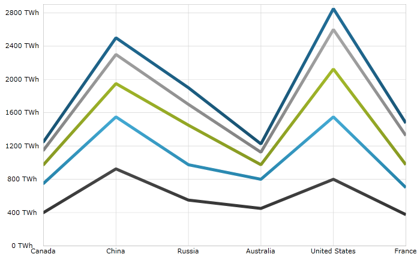

////

|metadata|
{
    "name": "igchartview-stacked-line-series",
    "controlName": ["IGChartView"],
    "tags": ["Charting","How Do I"],
    "guid": "e2717a17-bd57-4044-a4de-c780e75a7e6e",  
    "buildFlags": [],
    "createdOn": "2013-02-06T14:12:49.759134Z"
}
|metadata|
////

= Stacked Line Series

== Topic Overview

=== Purpose

This topic provides a conceptual overview of the Stacked Line series in the  _IGChartView_™ control and demonstrates adding it to the chart views using a code example.

=== In this topic

This topic contains the following sections:

* <<_Ref324841248, Introduction >>

** <<_Ref328076501,Stacked Line series summary>>
** <<_Ref326327824,Data requirements>>
** <<_Ref219345947,Data rendering rules>>

* <<_Ref328076508,Adding a Stacked Line Series to the  _IGChartView_   – Code Example>>

** <<_Ref326327832,Description>>
** <<_Ref328076518,Prerequisites>>
** <<_Ref326327837,Code>>

* <<_Ref324841253, Related Content >>

[[_Ref324841248]]
== Introduction

[[_Ref328076501]]

=== Stacked Line series summary

Stacked Line series belongs to a group of link:igchartview-category-series.html[Category Series] and renders using a collection of points connected by line segments that are stacked on top of each other. Each stacked fragment in the collection represents one visual element in each stack. Each stack can contain both positive and negative value, with positive values grouped on the positive side of the y-axis, and all negative values grouped on the negative side of the y-axis.

[[_Ref326327824]]

=== Data requirements

While the  _IGChartView_   control allows for easy binding to your own data model, make sure to supply the appropriate data amounts and types required by that series. Failing to do so causes the  _IGChartView_   to appear blank.

*Required –*  The bound data model must contain at least one numeric field, for rendering Stacked Line data and may contain an optional string for labels. For optimal viewing, we recommend using a data model containing two or more numeric data fields so that each point of the Stacked Line series has two or more stacked fragments.

[[_Ref219345947]]

=== Data rendering rules

The Stacked Line series renders data using the following rules:

* Every numeric column in the data model that you want rendered needs an  _IGStackedFragmentSeries_   added to the `series` collection property of the  _IGStackedLineSeries_  .
* Each row in the data model represents a single stacked area polygon. Created based on the columns in the data model, sections map to the  _IGStackedFragmentSeries_   object’s `valueProperty`.
* When rendering the second value in the row its value is added to the points of the previous values in that row. Therefore, each point going upwards on the chart is a cumulative sum of the values up to that point.
* Category labels are derived using the mapped string field of the `label` property of data mapping on the x-axis. If the data mapping for `label` is not specified, default labels are used.
* Category labels render on the x-axis. Data values render on the y-axis.
* When rendering multiple series of the Stacked Line series type in layers, with each successive series rendered in front of the previous one in the `series` collection of the  _IGChartView_   control.

[[_Ref324842387]]
[[_Ref328076508]]
== Adding a Stacked Line Series to the  _IGChartView_   – Code Example

[[_Ref326327832]]

=== Description

The code below uses the link:igchartview-data-source-helpers.html[IGStackedSeriesDataSourceHelper] to supply randomly generated data to a Stacked Line series firstly adding to the  _IGChartView_   instance, and then adding the  _IGChartView_   as a subview of the current  _UIView_  .

[[_Ref328076518]]

=== Prerequisites

This code example requires the inclusion of the  _Chart_   framework, detail about how to add this framework are available in the link:igchartview-adding-the-chart-framework-file.html[Adding the Chart Framework File] topic.

[[_Ref326327837]]

=== Code

*In C#:*

[source,csharp]
----
public class DataModel : NSObject
{
      [Export("Label")]
      public string Label { get; set; }
      [Export("Value1")]
      public float Value1 { get; set; }
      [Export("Value2")]
      public float Value2 { get; set; }
      [Export("Value3")]
      public float Value3 { get; set; }
}
//...
IGChartView _chartView;
IGStackedSeriesDataSourceHelper _stackedChartDataSourceHelper;
IGLegend _legend;
List<NSObject> _data;
void PopulateData()
{
      _data = new List<NSObject>();
      for (int i = 0; i < 10; i++) {
            DataModel item = new DataModel();
            item.Value1 = new Random((int)DateTime.Now.Ticks).Next(100);
            item.Value2 = new Random((int)DateTime.Now.Ticks).Next(100);
            item.Value3 = new Random((int)DateTime.Now.Ticks).Next(100);
            item.Label = string.Format ("Label {0}", i);
            _data.Add(item);
      }      
}
public override void ViewDidLoad ()
{
      this.PopulateData();
      RectangleF bounds = new RectangleF(0, 0, this.View.Frame.Size.Width, this.View.Frame.Size.Height);
      _chartView = new IGChartView(bounds);
      _chartView.BackgroundColor = UIColor.White;
      _stackedChartDataSourceHelper = new IGStackedSeriesDataSourceHelper(_data.ToArray(), NSArray.FromObjects("Value1", "Value2", "Value3"));
      _chartView.AddStackedSeries(new Class(typeof(IGStackedLineSeries)), "series", _stackedChartDataSourceHelper, "xAxis", "yAxis");
      (this.View).AddSubview(_chartView);
      _legend = new IGLegend(IGChartLegendType.IGChartLegendTypeSeries);
      _legend.Frame = new RectangleF(20, 20, 100, 100);
      _chartView.Legend = _legend;
      (this.View).AddSubview(_legend);
}
----

*In Objective-C:*

[source,csharp]
----
@interface DataModel : NSObject
@property (nonatomic, retain) NSString *label;
@property (nonatomic) float value1;
@property (nonatomic) float value2;
@property (nonatomic) float value3;
@end
@interface igViewController : UIViewController
{
    IGChartView *_chartView;
    IGStackedSeriesDataSourceHelper *_stackedChartDataSourceHelper;
    IGLegend *_legend;
    NSMutableArray *_data;
}
@end
@implementation DataModel
@synthesize value1, value2, value3;
@end
@implementation igViewController
-(void)populateData
{
    _data = [[NSMutableArray alloc]init];
    for (int i=0; i<10; i++)
    {
        DataModel *item = [[DataModel alloc]init];
        item.value1 = arc4random() % 100;
        item.value2 = arc4random() % 100;
        item.value3 = arc4random() % 100;
        item.label = [NSString stringWithFormat:@"Label %d", i];
        [_data addObject:item];
    }
}
-(void)viewDidLoad
{
    [self populateData];
    CGRect bounds = CGRectMake(0, 0, self.view.frame.size.width, self.view.frame.size.height);
    _chartView = [[IGChartView alloc] initWithFrame:bounds];
    _chartView.backgroundColor = [UIColor whiteColor];
    _stackedChartDataSourceHelper = [[IGStackedSeriesDataSourceHelper alloc]initWithData:_data fields:@"value1", @"value2", @"value3", nil];
    [_chartView addStackedSeriesForType:[IGStackedLineSeries class] usingKey:@"series" withDataSource:_stackedChartDataSourceHelper firstAxisKey:@"xAxis" secondAxisKey:@"yAxis"];    
    [self.view addSubview:_chartView];
    _legend = [[IGLegend alloc] initWithLegendType:IGChartLegendTypeSeries];
    [_legend setFrame:CGRectMake(20, 20, 100, 100)];
    _chartView.legend = _legend;
    [self.view addSubview:_legend];
}
@end
----

[[_Ref324841253]]
== Related Content

=== Topics

The following topic provides additional information related to this topic.

[options="header", cols="a,a"]
|====
|Topic|Purpose

|[[_Hlk328076609]] 

link:igchartview-chart-series.html[Chart Series]
|This collection of topics explains each of the individual charts supported by the _IGChartView_ control.

|====